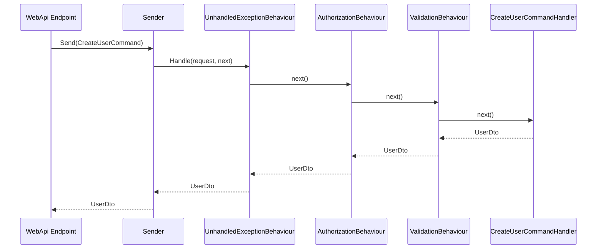
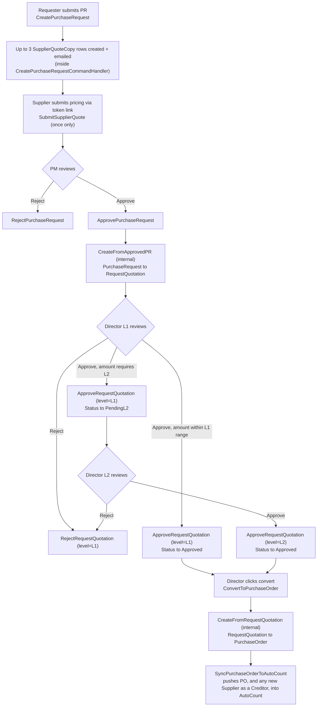

# PFP.Application

**Application layer of the PFP.Procurement system.** CQRS + Repository architecture, organized as vertical feature slices, with a self-hosted lightweight mediator for request dispatch.

| | |
|---|---|
| Project | `PFP.Application` |
| Depends on | `PFP.Domain` |
| Depended on by | `PFP.Infrastructure`, `PFP.WebApi` (not yet created) |
| Status | Foundation complete; `Users` module implemented; remaining 8 feature modules scaffolded only |
| Audience | Backend maintainers, incoming contributors |

Enum definitions (`Role`, `PRStatus`, etc.) are documented in `PFP.Domain/Domain.md` and are not repeated here. The HTTP API contract (routes, request/response bodies, status codes) is a `PFP.WebApi` concern, not this layer's — it is documented in `pfp_project/DATA-MODEL.md` today and will move to `PFP.WebApi`'s own document once that project exists.

---

## Table of Contents

1. [Position in the Architecture](#1-position-in-the-architecture)
2. [Directory Structure](#2-directory-structure)
3. [Folder Responsibilities](#3-folder-responsibilities)
4. [Coding Conventions](#4-coding-conventions)
5. [Architectural Decisions](#5-architectural-decisions)
6. [Request Lifecycle](#6-request-lifecycle)
7. [Feature Module Catalog](#7-feature-module-catalog)
8. [End-to-End Business Flow](#8-end-to-end-business-flow)
9. [Adding a New Use Case](#9-adding-a-new-use-case)
10. [Implementation Status](#10-implementation-status)
11. [Known Deviations](#11-known-deviations)
12. [Project Dependencies](#12-project-dependencies)

---

## 1. Position in the Architecture

```
PFP.WebApi (not yet created)  →  PFP.Application  →  PFP.Domain
                                        ↑
                                PFP.Infrastructure (not yet created;
                                implements the interfaces defined here)
```

- **`PFP.Domain`** — entities, enums, and marker interfaces only. Zero framework dependencies; has no knowledge of `PFP.Application`.
- **`PFP.Application`** (this project) — depends on `PFP.Domain`. Defines the capabilities required from the outside world (persistence, password hashing, email) as interfaces, without implementing them.
- **`PFP.Infrastructure`** (not yet created) — depends on `PFP.Application`. Provides concrete implementations (EF Core, SMTP, AutoCount API client).
- **`PFP.WebApi`** (not yet created) — depends on both. Endpoints do nothing but forward requests: `sender.Send(new XxxCommand(...))`.

This inversion of dependencies means the business logic in `PFP.Application` can be exercised in isolation — a test can supply a fake `IUserRepository` and run a Handler without a database.

---

## 2. Directory Structure

```
PFP.Application/
├── PFP.Application.csproj
├── DependencyInjection.cs
│
├── Abstractions/
│   ├── Messaging/
│   │   ├── IRequest.cs
│   │   ├── IRequestHandler.cs
│   │   ├── IPipelineBehavior.cs
│   │   ├── RequestHandlerDelegate.cs
│   │   └── ISender.cs
│   ├── Persistence/
│   │   ├── IUserRepository.cs
│   │   ├── ISupplierRepository.cs
│   │   ├── IItemRepository.cs
│   │   ├── IApprovalSettingRepository.cs
│   │   ├── IPurchaseRequestRepository.cs
│   │   ├── ISupplierQuoteRepository.cs
│   │   ├── IRequestQuotationRepository.cs
│   │   ├── IPurchaseOrderRepository.cs
│   │   └── IUnitOfWork.cs
│   └── Services/
│       ├── ICurrentUserService.cs
│       ├── IPasswordHasher.cs
│       ├── IDocumentNumberGenerator.cs
│       └── IEmailService.cs
│
├── Internal/
│   └── Messaging/
│       ├── RequestHandlerBase.cs
│       ├── RequestHandlerWrapper.cs
│       └── Sender.cs
│
├── Common/
│   ├── Authorization/
│   │   └── RequireRoleAttribute.cs
│   ├── Behaviours/
│   │   ├── UnhandledExceptionBehaviour.cs
│   │   ├── AuthorizationBehaviour.cs
│   │   └── ValidationBehaviour.cs
│   ├── Exceptions/
│   │   ├── NotFoundException.cs
│   │   ├── ForbiddenException.cs
│   │   ├── UnauthorizedException.cs
│   │   ├── AlreadySubmittedException.cs
│   │   ├── ValidationException.cs
│   │   ├── BusinessRuleException.cs
│   │   └── IntegrationException.cs
│   └── Results/
│       └── Result.cs
│
├── Integrations/
│   └── AutoCount/
│       ├── IAutoCountService.cs
│       ├── AutoCountItemDto.cs
│       ├── AutoCountSupplierDto.cs
│       ├── AutoCountPurchaseOrderRequest.cs
│       └── AutoCountCreditorRequest.cs
│
└── Features/
    ├── Auth/
    │   └── Commands/{Login, ChangePassword}/
    ├── Users/
    │   ├── UserDto.cs
    │   ├── Commands/{CreateUser, UpdateUserRole, ActivateUser, DeactivateUser}/
    │   └── Queries/{GetUsers, GetUsersById}/
    ├── Suppliers/
    │   ├── SupplierDto.cs
    │   ├── Commands/{CreateSupplier, InviteSupplier, CompleteSupplierRegistration, SyncSuppliersFromAutoCount}/
    │   └── Queries/{GetSuppliers, GetSupplierById, GetSupplierQuoteHistory}/
    ├── Items/
    │   ├── ItemDto.cs
    │   ├── Commands/SyncItemsFromAutoCount/
    │   └── Queries/{GetItems, GetItemById}/
    ├── ApprovalSettings/
    │   ├── ApprovalSettingDto.cs
    │   ├── Commands/UpdateApprovalSettings/
    │   └── Queries/GetApprovalSettings/
    ├── PurchaseRequests/
    │   ├── PurchaseRequestDto.cs
    │   ├── Commands/{CreatePurchaseRequest, ApprovePurchaseRequest, RejectPurchaseRequest}/
    │   └── Queries/{GetPurchaseRequests, GetPurchaseRequestById}/
    ├── SupplierQuotes/
    │   ├── SupplierQuoteDto.cs
    │   ├── Commands/SubmitSupplierQuote/
    │   └── Queries/GetSupplierQuoteByToken/
    ├── RequestQuotations/
    │   ├── RequestQuotationDto.cs
    │   ├── Commands/{CreateFromApprovedPR, ApproveRequestQuotation, RejectRequestQuotation, ConvertToPurchaseOrder}/
    │   └── Queries/{GetRequestQuotations, GetRequestQuotationById}/
    └── PurchaseOrders/
        ├── PurchaseOrderDto.cs
        ├── Commands/{CreateFromRequestQuotation, SyncPurchaseOrderToAutoCount}/
        └── Queries/{GetPurchaseOrders, GetPurchaseOrderById}/
```

---

## 3. Folder Responsibilities

### `Abstractions/` — contracts only, no implementations

| Subfolder | Responsibility |
|---|---|
| `Messaging/` | The request-dispatch contract: how a request travels from the caller to the Handler that processes it. |
| `Persistence/` | Data-access contracts. One repository per aggregate root, not per entity — child entities (`PurchaseRequestItem`, `RQApproval`, etc.) are always queried and mutated through the repository of the aggregate root they belong to. |
| `Services/` | External capabilities unrelated to persistence: current-user context, password hashing, document-number generation, email delivery. |

### `Internal/Messaging/` — implementation of the `Abstractions/Messaging` contracts

Kept in a separate physical location from `Abstractions/Messaging` so that consumers browsing the public contracts (reflection-based handler resolution, behaviour-chain assembly) are not exposed to implementation detail.

### `Common/` — cross-cutting concerns shared by every Command/Query

| Item | Responsibility |
|---|---|
| `Authorization/RequireRoleAttribute.cs` | Declarative metadata only — no executable logic. Attached to a Command/Query type to state which role(s) may invoke it. |
| `Behaviours/` | The executable pipeline steps: exception logging, authorization, validation. Registration order (`Unhandled → Authorization → Validation`) determines the nesting order at runtime. |
| `Exceptions/` | Seven business exception types, each mapped to a specific HTTP status code. |
| `Results/Result.cs` | An alternative to exceptions for operations where failure is a normal, expected outcome rather than a reason to abort the request (see the corresponding section below). |

### `Integrations/AutoCount/` — AutoCount integration boundary

Separated from `Abstractions/Services` because this is a full external-system boundary, not a simple utility service. DTO naming follows one rule: **`Dto` suffix = data flowing in from AutoCount (pull); `Request` suffix = data flowing out to AutoCount (push).**

### `Features/` — where business logic is implemented

One folder per module, each split into `Commands/` and `Queries/`, each use case in its own subfolder. Domain entities are anemic (data only, no behaviour); state-machine rules, business validation, and orchestration across repositories/services all live in the Handlers here.

---

## 4. Coding Conventions

| Situation | Convention | Rationale |
|---|---|---|
| Command / Query / Dto | `record`, not `class` | Immutable data carriers; `record` provides value equality by default. |
| Handler / Validator / Repository implementation | `class`, not `record` | These are behaviour, not data. |
| A type with no intended subclasses | `sealed` | States intent explicitly; consistent with the rest of the codebase. |
| Handler dependency injection | Primary constructor: `Handler(IXxxRepository repo, ...)` | Removes constructor/field boilerplate. |
| Mutating an existing entity | Load via `GetByIdAsync`, mutate the properties, call `SaveChangesAsync` — no `Update()` method | EF Core's change tracker generates the correct `UPDATE` statement automatically; an explicit `Update()` is easy to misuse as a full-entity overwrite. |
| Single-entity read that may later be mutated | No `.AsNoTracking()` | Keeps the entity tracked so it can be saved without a second round trip. |
| List read for display only | `.AsNoTracking()` | No tracking overhead needed for read-only Query paths. |
| The request should not proceed (not found / forbidden / rule violation) | `throw` the matching type in `Common/Exceptions` | Caught by `UnhandledExceptionBehaviour` and, later, the WebApi exception middleware. |
| The operation is valid but may legitimately succeed or fail (currently only AutoCount push) | Return `Result<T>`, do not throw | Failure here is a normal business outcome, not a reason to abort the request. |
| A Command/Query requires a fixed role | `[RequireRole(Role.XXX)]` on the type | `AuthorizationBehaviour` enforces it; the Handler contains no authorization code. |
| The permitted role is data-driven (e.g. RQ approval depends on `ApprovalSetting.ApproverRole`) | No attribute — check inside the Handler | `[RequireRole]` arguments are fixed at compile time and cannot express a runtime lookup. |
| Internal-only Commands invoked solely via `ISender` from another Handler (e.g. `CreateFromApprovedPR`) | Do not call `SaveChangesAsync` | Only the outermost Handler triggered directly by an Endpoint commits, so multiple operations land in a single database transaction. |
| One Handler invoking another use case | Inject `ISender`, call `sender.Send(new XxxCommand(...))` | Never instantiate or inject a concrete Handler directly — this keeps the call inside the pipeline (validation, authorization) instead of bypassing it. |

---

## 5. Architectural Decisions

**A self-hosted mediator instead of the MediatR package.**
MediatR requires a commercial license for paid use as of v13. This project uses only `IRequest`, `IRequestHandler`, `IPipelineBehavior`, and `ISender` — none of MediatR's publish/subscribe or streaming features are needed. The self-hosted implementation caches resolved handler types in a `ConcurrentDictionary` to avoid repeated reflection.

**One repository per aggregate root, not per entity.**
Child entities are always read and written through the aggregate root that owns them; a dedicated repository per child entity would add indirection without a corresponding use case.

**`Result<T>` is reserved for the AutoCount push operations; every other failure path uses exceptions.**
The distinguishing question is whether the failure means the request should not have proceeded. Not-found, forbidden, and business-rule violations are all "this request should stop" — exceptions. An AutoCount push failure leaves the underlying `PurchaseOrder` in a valid state (the sync simply did not complete); that is a normal business outcome, which `Result<T>` lets the caller branch on without raising an exception.

---

## 6. Request Lifecycle

Example: `CreateUser`, on the happy path.



`Sender` resolves (or retrieves from cache) the handler chain for this request type before dispatching. A failure at `AuthorizationBehaviour` or `ValidationBehaviour` short-circuits the chain right there — the arrow never reaches `CreateUserCommandHandler`, and an exception propagates back up through `Sender` to the Endpoint instead of a `UserDto`.

---

## 7. Feature Module Catalog

| Module | Commands | Queries |
|---|---|---|
| **Auth** | `Login`, `ChangePassword` | — |
| **Users** | `CreateUser`, `UpdateUserRole`, `ActivateUser`, `DeactivateUser` | `GetUsers`, `GetUserById` |
| **Suppliers** | `CreateSupplier`, `InviteSupplier`, `CompleteSupplierRegistration`, `SyncSuppliersFromAutoCount` | `GetSuppliers`, `GetSupplierById`, `GetSupplierQuoteHistory` |
| **Items** | `SyncItemsFromAutoCount` | `GetItems`, `GetItemById` |
| **ApprovalSettings** | `UpdateApprovalSettings` | `GetApprovalSettings` |
| **PurchaseRequests** | `CreatePurchaseRequest`, `ApprovePurchaseRequest`, `RejectPurchaseRequest` | `GetPurchaseRequests`, `GetPurchaseRequestById` |
| **SupplierQuotes** | `SubmitSupplierQuote` | `GetSupplierQuoteByToken` |
| **RequestQuotations** | `CreateFromApprovedPR` *(internal)*, `ApproveRequestQuotation`, `RejectRequestQuotation`, `ConvertToPurchaseOrder` | `GetRequestQuotations`, `GetRequestQuotationById` |
| **PurchaseOrders** | `CreateFromRequestQuotation` *(internal)*, `SyncPurchaseOrderToAutoCount` | `GetPurchaseOrders`, `GetPurchaseOrderById` |

Commands marked *(internal)* are never invoked directly by an Endpoint: `CreateFromApprovedPR` is triggered only from within `ApprovePurchaseRequestCommandHandler`, and `CreateFromRequestQuotation` only from within `ConvertToPurchaseOrderCommandHandler`. Clients should not call these directly.

---

## 8. End-to-End Business Flow

The Scope Document's "Full Flow" section, mapped onto the actual Command names from the table above — this is the diagram to hand someone who knows the business process but not yet the codebase, or vice versa.



The branch at the first diamond (`J`: approved at L1 alone, going straight to `ConvertToPurchaseOrder`) reflects the current design's assumption that a small enough amount can skip L2. Whether that assumption is correct, or every `RequestQuotation` must pass through both tiers regardless of amount, is the open question tracked in `PFP.Domain/Domain.md`'s state machine notes for `RQStatus` — this diagram will need a small correction if that question resolves the other way.

---

## 9. Adding a New Use Case

Worked example: adding an "archive purchase request" operation.

1. **Determine the authorization model.** Fixed role → `[RequireRole(Role.XXX)]` on the Command. Data-driven role → no attribute; check inside the Handler.
2. **Create a folder** under the module's `Commands/`, e.g. `Features/PurchaseRequests/Commands/ArchivePurchaseRequest/`.
3. **Define the Command** — a `record` declaring the required inputs, implementing `IRequest<PurchaseRequestDto>` (choose the return type based on what the caller needs back).
4. **Add a Validator if the Command carries a body** — `ArchivePurchaseRequestCommandValidator : AbstractValidator<ArchivePurchaseRequestCommand>`. Omit it for parameterless, id-only operations.
5. **Write the Handler** — inject the required repositories/services, load the entity, enforce business rules (`throw` the matching `Common/Exceptions` type on violation), mutate state, call `SaveChangesAsync`, and return the Dto.
6. **No manual registration required.** `DependencyInjection.cs` discovers new `IRequestHandler<,>` implementations via assembly reflection, and `AddValidatorsFromAssembly` discovers new Validators the same way.
7. **Once `PFP.WebApi` exists**, wire it into the corresponding `Endpoints/XxxEndpoints.cs` with `sender.Send(new ArchivePurchaseRequestCommand(...))`.

---

## 10. Implementation Status

| Component | Status |
|---|---|
| `Abstractions/` (Messaging + Persistence + Services) | Fully defined |
| `Internal/Messaging/` (Sender + Wrapper) | Implemented, builds successfully |
| `Common/` (Authorization + Behaviours + Exceptions + Results) | Implemented |
| `Integrations/AutoCount/` | Interface and four DTOs defined |
| `Features/Users/` | Implemented (`CreateUser`, `UpdateUserRole`, `ActivateUser`, `DeactivateUser`, `GetUserById`, `GetUsers`) |
| `Features/` — remaining 8 modules | Command/Query scaffolding only; Handler logic not yet written |
| `PFP.Infrastructure` | Project created; `DbContext` and two of fourteen `Configuration` files implemented — see `PFP.Infrastructure/Infrastructure.md` for the current detail |
| `PFP.WebApi` (Endpoints, `Program.cs` wiring) | Not yet created |

No HTTP layer exists yet — `PFP.WebApi` has not been created — so nothing in this project can be invoked over HTTP today, regardless of what `pfp_project/DATA-MODEL.md`'s API route table says is planned. The only feature with a fully working chain from repository interface to Handler is `Users`.

---

## 11. Known Deviations

Discrepancies between the originally recorded design (`DATA-MODEL.md`) and the actual implementation, found while cross-checking this document against the real source files.

| # | Area | Original design | Actual implementation | Status |
|---|---|---|---|---|
| 1 | `CreateUserCommand.Department` | Optional — only meaningful for the `Requester` role | `string`, required for every role | Open — decide whether to relax the field to optional or formally adopt the current required behavior |

This table will grow as further modules move from scaffold to implementation and get cross-checked the same way.

---

## 12. Project Dependencies

- `ProjectReference` → `PFP.Domain`
- NuGet: `FluentValidation`, `FluentValidation.DependencyInjectionExtensions`
  (`Microsoft.Extensions.DependencyInjection.Abstractions` and `Microsoft.Extensions.Logging.Abstractions` are implicitly available under .NET 11 and do not require an explicit reference.)
