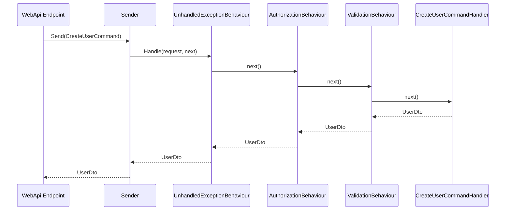
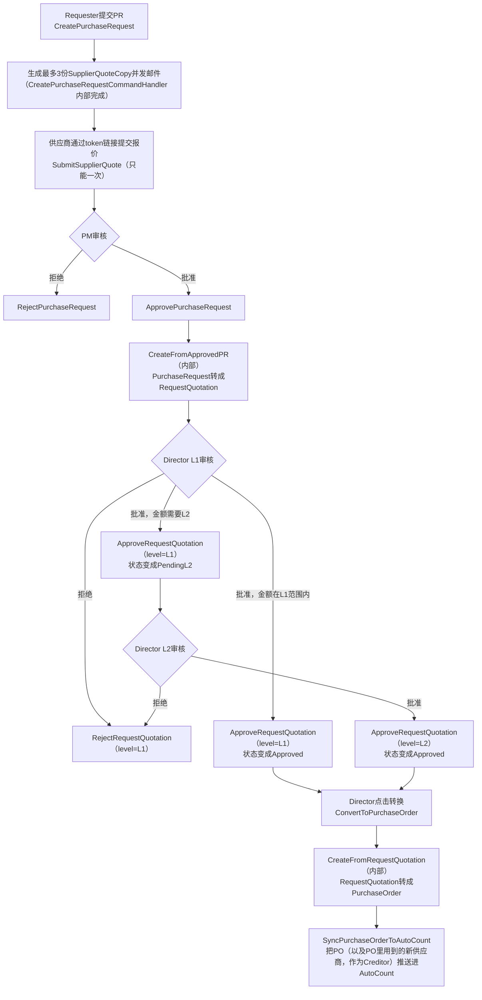

# PFP.Application

**PFP.Procurement采购系统的Application层。** CQRS + Repository架构，按业务功能垂直切片组织，用自建的轻量Mediator做请求分发。

| | |
|---|---|
| 项目 | `PFP.Application` |
| 依赖 | `PFP.Domain` |
| 被谁依赖 | `PFP.Infrastructure`、`PFP.WebApi`（均未建立） |
| 状态 | 基础设施部分已完成；`Users`模块已实现；其余8个模块仅有骨架 |
| 读者 | 后端维护者、前端对接人员、后续接手的开发者 |

本文档为英文版`Application.md`的中文对照版本，内容保持一致。枚举定义（`Role`、`PRStatus`等）记录在`PFP.Domain/Domain.zh.md`，本文档不重复。

### 文档约定

| 标记 | 含义 |
|---|---|
| 已实现 | 已对照本仓库真实源码核对过 |
| 设计目标 | 对应的`Command`/`Query`目前仍是空壳，下面列出的字段来自已核对过的Scope需求记录，实现时可能变化 |

---

## 目录

1. [在整体架构中的位置](#1-在整体架构中的位置)
2. [完整目录结构](#2-完整目录结构)
3. [各文件夹职责](#3-各文件夹职责)
4. [编码规范](#4-编码规范)
5. [架构决策](#5-架构决策)
6. [请求生命周期](#6-请求生命周期)
7. [API接口清单](#7-api接口清单)
8. [错误响应格式](#8-错误响应格式)
9. [Features模块清单](#9-features模块清单)
10. [端到端业务流程](#10-端到端业务流程)
11. [如何新增一个用例](#11-如何新增一个用例)
12. [实现状态](#12-实现状态)
13. [已知偏差](#13-已知偏差)
14. [项目依赖](#14-项目依赖)

---

## 1. 在整体架构中的位置

```
PFP.WebApi (未建立)  ->  PFP.Application  ->  PFP.Domain
                               ^
                       PFP.Infrastructure (未建立，
                       将来实现这里定义的接口)
```

- **`PFP.Domain`** —— 只有实体、枚举、标记接口。零框架依赖，不知道`PFP.Application`的存在。
- **`PFP.Application`**（本项目）—— 依赖`PFP.Domain`。把需要外部世界提供的能力（持久化、密码哈希、邮件）定义成接口，不实现它们。
- **`PFP.Infrastructure`**（未建立）—— 依赖`PFP.Application`。提供具体实现（EF Core、SMTP、AutoCount API客户端）。
- **`PFP.WebApi`**（未建立）—— 依赖以上两者。Endpoint只做请求转发：`sender.Send(new XxxCommand(...))`。

这种依赖反转让`PFP.Application`的业务逻辑可以独立测试——给`IUserRepository`一个假的实现，Handler该怎么跑还是怎么跑，不需要真的连数据库。

---

## 2. 完整目录结构

```
PFP.Application/
├── PFP.Application.csproj
├── DependencyInjection.cs
│
├── Abstractions/
│   ├── Messaging/
│   │   ├── IRequest.cs
│   │   ├── IRequestHandler.cs
│   │   ├── IPipelineBehavior.cs
│   │   ├── RequestHandlerDelegate.cs
│   │   └── ISender.cs
│   ├── Persistence/
│   │   ├── IUserRepository.cs
│   │   ├── ISupplierRepository.cs
│   │   ├── IItemRepository.cs
│   │   ├── IApprovalSettingRepository.cs
│   │   ├── IPurchaseRequestRepository.cs
│   │   ├── ISupplierQuoteRepository.cs
│   │   ├── IRequestQuotationRepository.cs
│   │   ├── IPurchaseOrderRepository.cs
│   │   └── IUnitOfWork.cs
│   └── Services/
│       ├── ICurrentUserService.cs
│       ├── IPasswordHasher.cs
│       ├── IDocumentNumberGenerator.cs
│       └── IEmailService.cs
│
├── Internal/
│   └── Messaging/
│       ├── RequestHandlerBase.cs
│       ├── RequestHandlerWrapper.cs
│       └── Sender.cs
│
├── Common/
│   ├── Authorization/
│   │   └── RequireRoleAttribute.cs
│   ├── Behaviours/
│   │   ├── UnhandledExceptionBehaviour.cs
│   │   ├── AuthorizationBehaviour.cs
│   │   └── ValidationBehaviour.cs
│   ├── Exceptions/
│   │   ├── NotFoundException.cs
│   │   ├── ForbiddenException.cs
│   │   ├── UnauthorizedException.cs
│   │   ├── AlreadySubmittedException.cs
│   │   ├── ValidationException.cs
│   │   ├── BusinessRuleException.cs
│   │   └── IntegrationException.cs
│   └── Results/
│       └── Result.cs
│
├── Integrations/
│   └── AutoCount/
│       ├── IAutoCountService.cs
│       ├── AutoCountItemDto.cs
│       ├── AutoCountSupplierDto.cs
│       ├── AutoCountPurchaseOrderRequest.cs
│       └── AutoCountCreditorRequest.cs
│
└── Features/
    ├── Auth/
    │   └── Commands/{Login, ChangePassword}/
    ├── Users/
    │   ├── UserDto.cs
    │   ├── Commands/{CreateUser, UpdateUserRole, ActivateUser, DeactivateUser}/
    │   └── Queries/{GetUsers, GetUsersById}/
    ├── Suppliers/
    │   ├── SupplierDto.cs
    │   ├── Commands/{CreateSupplier, InviteSupplier, CompleteSupplierRegistration, SyncSuppliersFromAutoCount}/
    │   └── Queries/{GetSuppliers, GetSupplierById, GetSupplierQuoteHistory}/
    ├── Items/
    │   ├── ItemDto.cs
    │   ├── Commands/SyncItemsFromAutoCount/
    │   └── Queries/{GetItems, GetItemById}/
    ├── ApprovalSettings/
    │   ├── ApprovalSettingDto.cs
    │   ├── Commands/UpdateApprovalSettings/
    │   └── Queries/GetApprovalSettings/
    ├── PurchaseRequests/
    │   ├── PurchaseRequestDto.cs
    │   ├── Commands/{CreatePurchaseRequest, ApprovePurchaseRequest, RejectPurchaseRequest}/
    │   └── Queries/{GetPurchaseRequests, GetPurchaseRequestById}/
    ├── SupplierQuotes/
    │   ├── SupplierQuoteDto.cs
    │   ├── Commands/SubmitSupplierQuote/
    │   └── Queries/GetSupplierQuoteByToken/
    ├── RequestQuotations/
    │   ├── RequestQuotationDto.cs
    │   ├── Commands/{CreateFromApprovedPR, ApproveRequestQuotation, RejectRequestQuotation, ConvertToPurchaseOrder}/
    │   └── Queries/{GetRequestQuotations, GetRequestQuotationById}/
    └── PurchaseOrders/
        ├── PurchaseOrderDto.cs
        ├── Commands/{CreateFromRequestQuotation, SyncPurchaseOrderToAutoCount}/
        └── Queries/{GetPurchaseOrders, GetPurchaseOrderById}/
```

---

## 3. 各文件夹职责

### `Abstractions/` —— 只定义契约，不实现

| 子文件夹 | 职责 |
|---|---|
| `Messaging/` | 请求分发契约：一个请求怎么从调用方流转到处理它的Handler。 |
| `Persistence/` | 数据访问契约。每个聚合根一个Repository，不是每个实体一个——子实体（`PurchaseRequestItem`、`RQApproval`等）永远通过它所属聚合根的Repository查询和修改。 |
| `Services/` | 跟持久化无关的外部能力：当前登录者上下文、密码哈希、单据编号生成、邮件发送。 |

### `Internal/Messaging/` —— `Abstractions/Messaging`契约的具体实现

物理上跟`Abstractions/Messaging`分开存放，让浏览公开契约的人（反射查找Handler、拼装Behaviour链）不会被实现细节干扰。

### `Common/` —— 所有Command/Query共用的横切关注点

| 项目 | 职责 |
|---|---|
| `Authorization/RequireRoleAttribute.cs` | 纯声明式元数据，不含可执行逻辑。贴在Command/Query类型上，表达哪些角色能调用它。 |
| `Behaviours/` | 真正执行的pipeline步骤：异常记录、权限检查、输入校验。注册顺序（`Unhandled -> Authorization -> Validation`）决定运行时的嵌套顺序。 |
| `Exceptions/` | 七种业务异常，每种映射到一个明确的HTTP状态码。 |
| `Results/Result.cs` | 异常之外的另一种失败表达方式，用在"失败是正常预期结果、不是请求该被中止的理由"的场景（见第5节）。 |

### `Integrations/AutoCount/` —— 对接AutoCount系统的专用边界

跟`Abstractions/Services`分开存放，因为这是一整套外部系统边界，不是简单的工具类服务。DTO命名遵循一条规则：**`Dto`后缀代表AutoCount的数据流进来（pull），`Request`后缀代表我们的数据流出去（push）。**

### `Features/` —— 业务逻辑的实现位置

每个模块一个文件夹，拆成`Commands/`和`Queries/`，每个用例一个子文件夹。Domain层的实体是贫血模型（只有数据没有行为）；状态机规则、业务校验、跨Repository/Service的编排，全部写在这里的Handler中。

---

## 4. 编码规范

| 场景 | 规范 | 理由 |
|---|---|---|
| Command / Query / Dto | 用`record`，不用`class` | 这些是不可变的数据容器，`record`默认提供值相等比较。 |
| Handler / Validator / Repository实现 | 用`class`，不用`record` | 这些是行为，不是数据。 |
| 不需要被继承的类型 | 加`sealed` | 明确表达意图，跟仓库其余部分保持一致。 |
| Handler的依赖注入 | 用主构造函数`Handler(IXxxRepository repo, ...)` | 省掉手写构造函数/字段的样板代码。 |
| 修改一个已存在的实体 | `GetByIdAsync`查出来、直接改属性、调`SaveChangesAsync`——不写`Update()`方法 | EF Core的变更追踪会自动生成正确的`UPDATE`语句；显式`Update()`容易被误用成整个实体全字段覆盖。 |
| 单条查询、以后可能要修改 | 不加`.AsNoTracking()` | 保持实体被追踪，改完能直接存。 |
| 列表查询，纯展示用 | 加`.AsNoTracking()` | 只读的Query路径不需要追踪开销。 |
| 请求不该继续往下走（找不到/没权限/违反业务规则） | `throw`对应的`Common/Exceptions`类型 | 被`UnhandledExceptionBehaviour`及以后的WebApi异常中间件统一捕获。 |
| 操作本身合法，只是结果有成功/失败两种可能（目前只有AutoCount push） | 返回`Result<T>`，不要`throw` | 这里的失败是正常业务结局，不是中止请求的理由。 |
| 需要固定角色才能调用 | 类型上贴`[RequireRole(Role.XXX)]` | 由`AuthorizationBehaviour`强制执行，Handler本身不含权限判断代码。 |
| 允许调用的角色是数据驱动的（比如RQ审批看`ApprovalSetting.ApproverRole`） | 不贴Attribute，在Handler内部判断 | `[RequireRole]`的参数编译期就固定，无法表达运行时查表。 |
| 内部专用、只被其他Handler通过`ISender`调用的Command（比如`CreateFromApprovedPR`） | 自己不调`SaveChangesAsync` | 只有被Endpoint直接触发的最外层Handler最后统一提交一次，让多个操作落在同一次数据库事务里。 |
| Handler之间互相调用 | 注入`ISender`，`sender.Send(new XxxCommand(...))` | 不要直接实例化或注入具体Handler类型——这样调用才会经过管道（校验、权限）。 |

---

## 5. 架构决策

**自建轻量Mediator，不用MediatR套件。**
MediatR从v13起商业用途需要付费授权。这个项目只用到`IRequest`、`IRequestHandler`、`IPipelineBehavior`、`ISender`，用不上MediatR的发布订阅、流式请求这些功能。自建实现用`ConcurrentDictionary`缓存解析过的Handler类型，避免重复反射。

**每个聚合根一个Repository，不是每个实体一个。**
子实体永远通过它所属的聚合根被查询和修改；给每个子实体单独开一个Repository只会增加间接层，没有对应的实际用例。

**`Result<T>`只用在AutoCount的push操作上，其余失败路径全用异常。**
判断标准是：这次失败是不是意味着这个请求本不该继续走下去。找不到、没权限、违反业务规则——都是"这个请求该停下来"，用异常。AutoCount push失败之后，底层的`PurchaseOrder`仍然处于合法状态（只是同步没完成）——这是正常的业务结局，`Result<T>`让调用方可以在不抛异常的情况下分支处理。

---

## 6. 请求生命周期

以`CreateUser`的正常路径为例：



`Sender`会先解析出（或从缓存取出）这个请求类型对应的Handler调用链，再发起调用。`AuthorizationBehaviour`或`ValidationBehaviour`任何一层失败，链条会当场短路——箭头不会走到`CreateUserCommandHandler`，异常会顺着`Sender`一路传回Endpoint，而不是返回`UserDto`。

---

## 7. API接口清单

本节记录`PFP.WebApi`最终会暴露的接口契约。`PFP.WebApi`目前还不存在，下面列出的接口现在都无法通过HTTP调用。标记含义见文档开头的"文档约定"。

### Auth（免登录）—— 设计目标

| Method | Path | Body | 返回 |
|---|---|---|---|
| POST | `/auth/login` | `{email, password}` | `AuthResultDto`（`accountType`区分`"Internal"` / `"Supplier"`） |
| POST | `/auth/change-password` | `{oldPassword, newPassword}` | `204` |

### Users（需要`HeadOfPurchase`）—— 已实现

| Method | Path | Body | 返回 |
|---|---|---|---|
| GET | `/users` | — | `UserDto[]` |
| GET | `/users/{id}` | — | `UserDto` |
| POST | `/users` | `{name, email, role, department, password}` | `UserDto`（201） |
| POST | `/users/{id}/activate` | — | `UserDto` |
| POST | `/users/{id}/deactivate` | — | `UserDto` |
| PATCH | `/users/{id}` | `{role}` | `UserDto` |

> 参见第12节"已知偏差"——`department`在当前实现里是必填的，不是可选的。

### Suppliers —— 设计目标

| Method | Path | Body | 返回 | 权限 |
|---|---|---|---|---|
| GET | `/suppliers` | — | `SupplierDto[]` | 内部登录 |
| GET | `/suppliers/{id}` | — | `SupplierDto` | 内部登录 |
| POST | `/suppliers` | `{name, email, contact?}` | `SupplierDto`（201） | PurchaseManager / HeadOfPurchase |
| POST | `/suppliers/sync-autocount` | — | `SupplierDto[]` | PurchaseManager / HeadOfPurchase |
| POST | `/suppliers/{id}/invite` | — | `SupplierDto` | PurchaseManager / HeadOfPurchase |
| GET | `/suppliers/register/{registrationToken}` | — | `{name, email}` | 免登录 |
| POST | `/suppliers/register/{registrationToken}` | `{contact?, password}` | `SupplierDto` | 免登录 |
| GET | `/suppliers/me/quotes` | — | `SupplierQuoteCopyDto[]` | 供应商登录态 |

### Items —— 设计目标

| Method | Path | Body | 返回 | 权限 |
|---|---|---|---|---|
| GET | `/items` | — | `ItemDto[]` | 内部登录 |
| GET | `/items/{id}` | — | `ItemDto` | 内部登录 |
| POST | `/items/sync-autocount` | — | `ItemDto[]` | PurchaseManager / HeadOfPurchase |

### Approval Settings —— 设计目标

| Method | Path | Body | 返回 | 权限 |
|---|---|---|---|---|
| GET | `/approval-settings` | — | `ApprovalSettingDto[]` | 内部登录 |
| PUT | `/approval-settings` | `{settings:[{level,approverRole,minAmount,maxAmount}]}` | `ApprovalSettingDto[]` | HeadOfPurchase |

### Purchase Requests —— 设计目标

| Method | Path | Body | 返回 | 权限 |
|---|---|---|---|---|
| POST | `/purchase-requests` | `{department, items:[{itemCode,description,uom,qty,location?}], supplierIds(1-3)}` | `PurchaseRequestDto`（201） | Requester |
| GET | `/purchase-requests` | — | `PurchaseRequestDto[]` | 内部登录（`Requester`只看自己发起的） |
| GET | `/purchase-requests/{id}` | — | `PurchaseRequestDto` | 同上 |
| POST | `/purchase-requests/{id}/approve` | `{selectedSupplierCopyId, remark?}` | `RequestQuotationDto` | PurchaseManager |
| POST | `/purchase-requests/{id}/reject` | `{remark?}` | `PurchaseRequestDto` | PurchaseManager |

### Supplier Quotes（免登录，token访问）—— 设计目标

| Method | Path | Body | 返回 |
|---|---|---|---|
| GET | `/supplier-quotes/{token}` | — | `SupplierQuoteViewDto` |
| POST | `/supplier-quotes/{token}/submit` | `{items:[{purchaseRequestItemId,unitPrice}], remark?}` | `SubmitSupplierQuoteResultDto`（重复提交返回409） |

### Request Quotations —— 设计目标

| Method | Path | Body | 返回 | 权限 |
|---|---|---|---|---|
| GET | `/request-quotations` | — | `RequestQuotationDto[]` | 内部登录 |
| GET | `/request-quotations/{id}` | — | `RequestQuotationDto` | 内部登录 |
| POST | `/request-quotations/{id}/approve` | `{level, remark?}` | `RequestQuotationDto` | 动态——按`ApprovalSetting.ApproverRole`判定 |
| POST | `/request-quotations/{id}/reject` | `{level, remark?}` | `RequestQuotationDto` | 同上 |
| POST | `/request-quotations/{id}/convert-to-po` | — | `PurchaseOrderDto`（重复调用409） | DirectorL1 / DirectorL2 |

### Purchase Orders —— 设计目标

| Method | Path | Body | 返回 | 权限 |
|---|---|---|---|---|
| GET | `/purchase-orders` | — | `PurchaseOrderDto[]` | 内部登录 |
| GET | `/purchase-orders/{id}` | — | `PurchaseOrderDto` | 内部登录 |
| POST | `/purchase-orders/{id}/sync-autocount` | — | `PurchaseOrderDto`（已同步再调用返回409） | PurchaseManager / HeadOfPurchase |

### 文档端点

| Path | 说明 |
|---|---|
| `/openapi/v1.json` | 原始OpenAPI文档 |
| `/scalar/v1` | Scalar交互式文档和测试界面 |

---

## 8. 错误响应格式

`Common/Exceptions/`里的每个异常都会被WebApi异常中间件（未建立）捕获、转成对应的HTTP状态码：

| 异常 | 状态码 | 触发场景 |
|---|---|---|
| `UnauthorizedException` | 401 | 未登录调用需要登录态的接口 |
| `ForbiddenException` | 403 | 已登录，但角色不允许这个操作 |
| `NotFoundException` | 404 | 查询的id不存在 |
| `AlreadySubmittedException` | 409 | 重复提交（比如供应商报价交过一次又交一次） |
| `ValidationException` | 400 | 请求体格式不对（必填字段缺失或格式错误） |
| `BusinessRuleException` | 400 | 违反业务规则（比如Email已被注册） |
| `IntegrationException` | 502 | 外部系统（AutoCount）调用失败 |

`ValidationException`的响应体带一个按字段名分组的`errors`字典，方便客户端逐字段展示：

```json
{
  "errors": {
    "Email": ["'Email' is not a valid email address."],
    "Password": ["'Password' must be at least 8 characters."]
  }
}
```

其它异常类型的响应体格式（是否采用标准的`ProblemDetails`）尚未最终确定，会在`ExceptionHandlingMiddleware.cs`真正写的时候定下来。

---

## 9. Features模块清单

| 模块 | Commands | Queries |
|---|---|---|
| **Auth** | `Login`、`ChangePassword` | — |
| **Users** | `CreateUser`、`UpdateUserRole`、`ActivateUser`、`DeactivateUser` | `GetUsers`、`GetUserById` |
| **Suppliers** | `CreateSupplier`、`InviteSupplier`、`CompleteSupplierRegistration`、`SyncSuppliersFromAutoCount` | `GetSuppliers`、`GetSupplierById`、`GetSupplierQuoteHistory` |
| **Items** | `SyncItemsFromAutoCount` | `GetItems`、`GetItemById` |
| **ApprovalSettings** | `UpdateApprovalSettings` | `GetApprovalSettings` |
| **PurchaseRequests** | `CreatePurchaseRequest`、`ApprovePurchaseRequest`、`RejectPurchaseRequest` | `GetPurchaseRequests`、`GetPurchaseRequestById` |
| **SupplierQuotes** | `SubmitSupplierQuote` | `GetSupplierQuoteByToken` |
| **RequestQuotations** | `CreateFromApprovedPR`（内部专用）、`ApproveRequestQuotation`、`RejectRequestQuotation`、`ConvertToPurchaseOrder` | `GetRequestQuotations`、`GetRequestQuotationById` |
| **PurchaseOrders** | `CreateFromRequestQuotation`（内部专用）、`SyncPurchaseOrderToAutoCount` | `GetPurchaseOrders`、`GetPurchaseOrderById` |

标"内部专用"的两个Command从不被Endpoint直接调用——`CreateFromApprovedPR`只在`ApprovePurchaseRequestCommandHandler`内部被触发，`CreateFromRequestQuotation`只在`ConvertToPurchaseOrderCommandHandler`内部被触发。客户端不应该直接调用这两个。

---

## 10. 端到端业务流程

把Scope文档"Full Flow"那一节，对照上面那张表映射到真实的Command名字——这张图适合拿给"懂业务流程但还不熟悉代码"的人看，反过来给"熟悉代码但还没理清业务全貌"的人看也一样合适。



第一个判断分支之后的`J`（只经过L1批准、金额够小、直接跳去`ConvertToPurchaseOrder`）反映的是目前设计的一个假设：金额足够小可以跳过L2。这个假设对不对，还是不管金额大小所有`RequestQuotation`都必须走完两级，是记录在`PFP.Domain/Domain.zh.md`状态机说明里、针对`RQStatus`的一个开放问题——如果这个问题最后往另一个方向确认，这张图需要跟着小改一下。

---

## 11. 如何新增一个用例

以新增"归档PR"操作为例：

1. **确定权限模型**——固定角色用`[RequireRole(Role.XXX)]`贴在Command上；数据驱动的角色不贴Attribute，在Handler内部判断。
2. **在对应模块的`Commands/`下新建文件夹**，比如`Features/PurchaseRequests/Commands/ArchivePurchaseRequest/`。
3. **定义Command**——一个`record`，声明所需的输入字段，实现`IRequest<PurchaseRequestDto>`（返回类型看这个操作该给调用方什么反馈）。
4. **如果Command带请求体就写Validator**——`ArchivePurchaseRequestCommandValidator : AbstractValidator<ArchivePurchaseRequestCommand>`；纯粹按id操作、没有请求体可以省略。
5. **写Handler**——注入需要的Repository/Service，查出实体，执行业务规则校验（不满足就`throw`对应的`Common/Exceptions`类型），修改状态，调`SaveChangesAsync`，返回Dto。
6. **不需要手动注册**——`DependencyInjection.cs`的反射扫描会自动发现新的`IRequestHandler<,>`实现，`AddValidatorsFromAssembly`也会自动发现新的Validator。
7. **等`PFP.WebApi`建立之后**，在对应的`Endpoints/XxxEndpoints.cs`里加一行`sender.Send(new ArchivePurchaseRequestCommand(...))`。

---

## 12. 实现状态

| 部分 | 状态 |
|---|---|
| `Abstractions/`（Messaging + Persistence + Services） | 已完整定义 |
| `Internal/Messaging/`（Sender + Wrapper） | 已实现，编译通过 |
| `Common/`（Authorization + Behaviours + Exceptions + Results） | 已实现 |
| `Integrations/AutoCount/` | 接口和四个DTO已定义 |
| `Features/Users/` | 已实现（`CreateUser`、`UpdateUserRole`、`ActivateUser`、`DeactivateUser`、`GetUserById`、`GetUsers`） |
| `Features/`其余8个模块 | 只有Command/Query骨架，Handler逻辑尚未编写 |
| `PFP.Infrastructure` | 项目已建立；`DbContext`和14个`Configuration`文件里的2个已实现——具体进度见`PFP.Infrastructure/Infrastructure.zh.md` |
| `PFP.WebApi`（Endpoints、`Program.cs`接线） | 尚未建立 |

**给前端的提醒**：第7节的API接口清单是目标契约，不代表现在能调通。`PFP.WebApi`还不存在，目前没有任何HTTP层，本文档里的接口现在都无法被调用。唯一从Repository接口到Handler完整跑通的功能是`Users`。

---

## 13. 已知偏差

原始设计记录（`DATA-MODEL.md`）和实际实现之间的差异，是在对照真实源码核对本文档时发现的。

| 编号 | 位置 | 原始设计 | 实际实现 | 状态 |
|---|---|---|---|---|
| 1 | `CreateUserCommand.Department` | 可选——只有`Requester`角色需要 | `string`类型，所有角色都必填 | 待定——需要决定是把字段改回可选，还是正式采纳目前的必填行为 |

随着后续模块从骨架进入实现、并逐一对照核实，这张表会持续增加条目。

---

## 14. 项目依赖

- `ProjectReference` -> `PFP.Domain`
- NuGet：`FluentValidation`、`FluentValidation.DependencyInjectionExtensions`
  （`Microsoft.Extensions.DependencyInjection.Abstractions`和`Microsoft.Extensions.Logging.Abstractions`在.NET 11下已隐式可用，不需要显式引用。）
