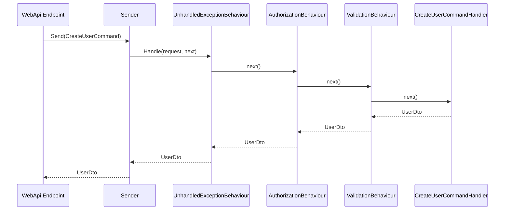
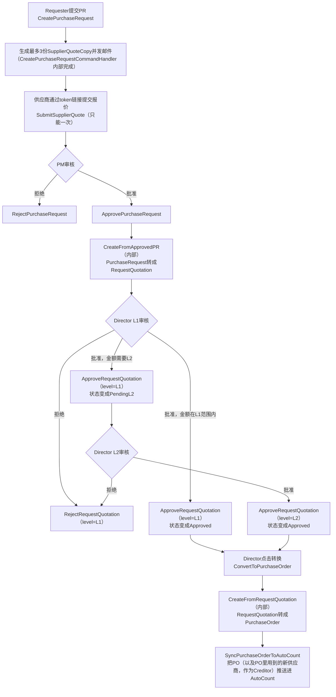

# PFP.Application

**PFP.Procurement采购系统的Application层。** CQRS + Repository架构，按业务功能垂直切片组织，用自建的轻量Mediator做请求分发。

| | |
|---|---|
| 项目 | `PFP.Application` |
| 依赖 | `PFP.Domain` |
| 被谁依赖 | `PFP.Infrastructure`（已实现）、`PFP.Host`（已存在，DI已接好，还没有Endpoint） |
| 状态 | 基础设施部分已完成；`Users`和`Settings/EmailSettings`两个模块已实现；其余7个模块仅有骨架 |
| 读者 | 后端维护者、后续接手的开发者 |

本文档为英文版`Application.md`的中文对照版本，内容保持一致。枚举定义（`Role`、`PRStatus`等）记录在`PFP.Domain/Domain.zh.md`，本文档不重复。HTTP API契约（路由、请求/响应体、状态码）是`PFP.Host`层的事，不属于这一层——现在记录在`pfp_project/DATA-MODEL.md`，等`PFP.Host`的Endpoint建起来之后会搬到它自己的文档里。

---

## 目录

1. [在整体架构中的位置](#1-在整体架构中的位置)
2. [完整目录结构](#2-完整目录结构)
3. [各文件夹职责](#3-各文件夹职责)
4. [编码规范](#4-编码规范)
5. [架构决策](#5-架构决策)
6. [请求生命周期](#6-请求生命周期)
7. [Features模块清单](#7-features模块清单)
8. [端到端业务流程](#8-端到端业务流程)
9. [如何新增一个用例](#9-如何新增一个用例)
10. [实现状态](#10-实现状态)
11. [已知偏差](#11-已知偏差)
12. [项目依赖](#12-项目依赖)

---

## 1. 在整体架构中的位置

```
PFP.Host (已存在，还没有Endpoint)  ->  PFP.Application  ->  PFP.Domain
                                            ^
                                    PFP.Infrastructure (已实现，
                                    实现了这里定义的接口)
```

- **`PFP.Domain`** —— 只有实体、枚举、标记接口。零框架依赖，不知道`PFP.Application`的存在。
- **`PFP.Application`**（本项目）—— 依赖`PFP.Domain`。把需要外部世界提供的能力（持久化、密码哈希、邮件）定义成接口，不实现它们。
- **`PFP.Infrastructure`** —— 依赖`PFP.Application`。提供具体实现（EF Core、通过`IEmailSettingsRepository`/`ISecretProtector`实现的SMTP、AutoCount API客户端——现在是`MockAutoCountService`）。完整细节见`PFP.Infrastructure/Doc_Ref/Infrastructure.zh.md`。
- **`PFP.Host`** —— 依赖以上两者，两者都已经接进它的DI容器（`AddApplicationServices()`、`AddInfrastructureServices()`，另外启动时还会调`SeedInfrastructureAsync()`）。它现在还没有的是Endpoint或Controller——`Program.cs`里没有任何路由映射到`sender.Send(new XxxCommand(...))`，所以哪怕下面每一层都能编译、能跑、背后也是真实数据库，现在这个项目里没有一样东西能通过HTTP被调用。

这种依赖反转让`PFP.Application`的业务逻辑可以独立测试——给`IUserRepository`一个假的实现，Handler该怎么跑还是怎么跑，不需要真的连数据库。

---

## 2. 完整目录结构

```
PFP.Application/
├── PFP.Application.csproj
├── DependencyInjection.cs
│
├── Abstractions/
│   ├── Messaging/
│   │   ├── IRequest.cs
│   │   ├── IRequestHandler.cs
│   │   ├── IPipelineBehavior.cs
│   │   ├── RequestHandlerDelegate.cs
│   │   └── ISender.cs
│   ├── Persistence/
│   │   ├── IUserRepository.cs
│   │   ├── ISupplierRepository.cs
│   │   ├── IItemRepository.cs
│   │   ├── IApprovalSettingRepository.cs
│   │   ├── IPurchaseRequestRepository.cs
│   │   ├── ISupplierQuoteRepository.cs
│   │   ├── IRequestQuotationRepository.cs
│   │   ├── IPurchaseOrderRepository.cs
│   │   ├── IEmailSettingsRepository.cs
│   │   └── IUnitOfWork.cs
│   └── Services/
│       ├── ICurrentUserService.cs
│       ├── IPasswordHasher.cs
│       ├── ITokenService.cs
│       ├── ISecretProtector.cs
│       ├── IDocumentNumberGenerator.cs
│       └── IEmailService.cs
│
├── Internal/
│   └── Messaging/
│       ├── RequestHandlerBase.cs
│       ├── RequestHandlerWrapper.cs
│       └── Sender.cs
│
├── Common/
│   ├── Authorization/
│   │   └── RequireRoleAttribute.cs
│   ├── Behaviours/
│   │   ├── UnhandledExceptionBehaviour.cs
│   │   ├── AuthorizationBehaviour.cs
│   │   └── ValidationBehaviour.cs
│   ├── Exceptions/
│   │   ├── NotFoundException.cs
│   │   ├── ForbiddenException.cs
│   │   ├── UnauthorizedException.cs
│   │   ├── AlreadySubmittedException.cs
│   │   ├── ValidationException.cs
│   │   ├── BusinessRuleException.cs
│   │   └── IntegrationException.cs
│   └── Results/
│       └── Result.cs
│
├── Integrations/
│   └── AutoCount/
│       ├── IAutoCountService.cs
│       ├── AutoCountItemDto.cs
│       ├── AutoCountSupplierDto.cs
│       ├── AutoCountPurchaseOrderRequest.cs
│       └── AutoCountCreditorRequest.cs
│
└── Features/
    ├── Auth/
    │   └── Commands/{Login, ChangePassword}/
    ├── Users/
    │   ├── UserDto.cs
    │   ├── Commands/{CreateUser, UpdateUserRole, ActivateUser, DeactivateUser}/
    │   └── Queries/{GetUsers, GetUsersById}/
    ├── Suppliers/
    │   ├── SupplierDto.cs
    │   ├── Commands/{CreateSupplier, InviteSupplier, CompleteSupplierRegistration, SyncSuppliersFromAutoCount}/
    │   └── Queries/{GetSuppliers, GetSupplierById, GetSupplierQuoteHistory}/
    ├── Items/
    │   ├── ItemDto.cs
    │   ├── Commands/SyncItemsFromAutoCount/
    │   └── Queries/{GetItems, GetItemById}/
    ├── ApprovalSettings/
    │   ├── ApprovalSettingDto.cs
    │   ├── Commands/UpdateApprovalSettings/
    │   └── Queries/GetApprovalSettings/
    ├── Settings/
    │   └── EmailSettings/
    │       ├── EmailSettingsDto.cs
    │       ├── Commands/UpdateEmailSettings/
    │       └── Queries/GetEmailSettings/
    ├── PurchaseRequests/
    │   ├── PurchaseRequestDto.cs
    │   ├── Commands/{CreatePurchaseRequest, ApprovePurchaseRequest, RejectPurchaseRequest}/
    │   └── Queries/{GetPurchaseRequests, GetPurchaseRequestById}/
    ├── SupplierQuotes/
    │   ├── SupplierQuoteDto.cs
    │   ├── Commands/SubmitSupplierQuote/
    │   └── Queries/GetSupplierQuoteByToken/
    ├── RequestQuotations/
    │   ├── RequestQuotationDto.cs
    │   ├── Commands/{CreateFromApprovedPR, ApproveRequestQuotation, RejectRequestQuotation, ConvertToPurchaseOrder}/
    │   └── Queries/{GetRequestQuotations, GetRequestQuotationById}/
    └── PurchaseOrders/
        ├── PurchaseOrderDto.cs
        ├── Commands/{CreateFromRequestQuotation, SyncPurchaseOrderToAutoCount}/
        └── Queries/{GetPurchaseOrders, GetPurchaseOrderById}/
```

---

## 3. 各文件夹职责

### `Abstractions/` —— 只定义契约，不实现

| 子文件夹 | 职责 |
|---|---|
| `Messaging/` | 请求分发契约：一个请求怎么从调用方流转到处理它的Handler。 |
| `Persistence/` | 数据访问契约。每个聚合根一个Repository，不是每个实体一个——子实体（`PurchaseRequestItem`、`RQApproval`等）永远通过它所属聚合根的Repository查询和修改。`IEmailSettingsRepository`是唯一的例外：`EmailSettings`不是Scope文档采购主流程里的业务聚合根，它是一张系统配置单例表（跟`ApprovalSetting`一个道理），有Repository的原因也跟`ApprovalSetting`一样——见`PFP.Infrastructure/Doc_Ref/Repositories.zh.md`。 |
| `Services/` | 跟持久化无关的外部能力：当前登录者上下文、密码哈希、签发JWT（`ITokenService`）、密钥加密（`ISecretProtector`）、单据编号生成、邮件发送。 |

### `Internal/Messaging/` —— `Abstractions/Messaging`契约的具体实现

物理上跟`Abstractions/Messaging`分开存放，让浏览公开契约的人（反射查找Handler、拼装Behaviour链）不会被实现细节干扰。

### `Common/` —— 所有Command/Query共用的横切关注点

| 项目 | 职责 |
|---|---|
| `Authorization/RequireRoleAttribute.cs` | 纯声明式元数据，不含可执行逻辑。贴在Command/Query类型上，表达哪些角色能调用它。 |
| `Behaviours/` | 真正执行的pipeline步骤：异常记录、权限检查、输入校验。注册顺序（`Unhandled -> Authorization -> Validation`）决定运行时的嵌套顺序。 |
| `Exceptions/` | 七种业务异常，每种映射到一个明确的HTTP状态码。 |
| `Results/Result.cs` | 异常之外的另一种失败表达方式，用在"失败是正常预期结果、不是请求该被中止的理由"的场景（见第5节）。 |

### `Integrations/AutoCount/` —— 对接AutoCount系统的专用边界

跟`Abstractions/Services`分开存放，因为这是一整套外部系统边界，不是简单的工具类服务。DTO命名遵循一条规则：**`Dto`后缀代表AutoCount的数据流进来（pull），`Request`后缀代表我们的数据流出去（push）。**

### `Features/` —— 业务逻辑的实现位置

每个模块一个文件夹，拆成`Commands/`和`Queries/`，每个用例一个子文件夹。Domain层的实体是贫血模型（只有数据没有行为）；状态机规则、业务校验、跨Repository/Service的编排，全部写在这里的Handler中。

---

## 4. 编码规范

| 场景 | 规范 | 理由 |
|---|---|---|
| Command / Query / Dto | 用`record`，不用`class` | 这些是不可变的数据容器，`record`默认提供值相等比较。 |
| Handler / Validator / Repository实现 | 用`class`，不用`record` | 这些是行为，不是数据。 |
| 不需要被继承的类型 | 加`sealed` | 明确表达意图，跟仓库其余部分保持一致。 |
| Handler的依赖注入 | 用主构造函数`Handler(IXxxRepository repo, ...)` | 省掉手写构造函数/字段的样板代码。 |
| 修改一个已存在的实体 | `GetByIdAsync`查出来、直接改属性、调`SaveChangesAsync`——不写`Update()`方法 | EF Core的变更追踪会自动生成正确的`UPDATE`语句；显式`Update()`容易被误用成整个实体全字段覆盖。 |
| 单条查询、以后可能要修改 | 不加`.AsNoTracking()` | 保持实体被追踪，改完能直接存。 |
| 列表查询，纯展示用 | 加`.AsNoTracking()` | 只读的Query路径不需要追踪开销。 |
| 请求不该继续往下走（找不到/没权限/违反业务规则） | `throw`对应的`Common/Exceptions`类型 | 被`UnhandledExceptionBehaviour`及以后的WebApi异常中间件统一捕获。 |
| 操作本身合法，只是结果有成功/失败两种可能（目前只有AutoCount push） | 返回`Result<T>`，不要`throw` | 这里的失败是正常业务结局，不是中止请求的理由。 |
| 需要固定角色才能调用 | 类型上贴`[RequireRole(Role.XXX)]` | 由`AuthorizationBehaviour`强制执行，Handler本身不含权限判断代码。 |
| 允许调用的角色是数据驱动的（比如RQ审批看`ApprovalSetting.ApproverRole`） | 不贴Attribute，在Handler内部判断 | `[RequireRole]`的参数编译期就固定，无法表达运行时查表。 |
| 内部专用、只被其他Handler通过`ISender`调用的Command（比如`CreateFromApprovedPR`） | 自己不调`SaveChangesAsync` | 只有被Endpoint直接触发的最外层Handler最后统一提交一次，让多个操作落在同一次数据库事务里。 |
| Handler之间互相调用 | 注入`ISender`，`sender.Send(new XxxCommand(...))` | 不要直接实例化或注入具体Handler类型——这样调用才会经过管道（校验、权限）。 |

---

## 5. 架构决策

**自建轻量Mediator，不用MediatR套件。**
MediatR从v13起商业用途需要付费授权。这个项目只用到`IRequest`、`IRequestHandler`、`IPipelineBehavior`、`ISender`，用不上MediatR的发布订阅、流式请求这些功能。自建实现用`ConcurrentDictionary`缓存解析过的Handler类型，避免重复反射。

**每个聚合根一个Repository，不是每个实体一个。**
子实体永远通过它所属的聚合根被查询和修改；给每个子实体单独开一个Repository只会增加间接层，没有对应的实际用例。

**`Result<T>`只用在AutoCount的push操作上，其余失败路径全用异常。**
判断标准是：这次失败是不是意味着这个请求本不该继续走下去。找不到、没权限、违反业务规则——都是"这个请求该停下来"，用异常。AutoCount push失败之后，底层的`PurchaseOrder`仍然处于合法状态（只是同步没完成）——这是正常的业务结局，`Result<T>`让调用方可以在不抛异常的情况下分支处理。

---

## 6. 请求生命周期

以`CreateUser`的正常路径为例：



`Sender`会先解析出（或从缓存取出）这个请求类型对应的Handler调用链，再发起调用。`AuthorizationBehaviour`或`ValidationBehaviour`任何一层失败，链条会当场短路——箭头不会走到`CreateUserCommandHandler`，异常会顺着`Sender`一路传回Endpoint，而不是返回`UserDto`。

---

## 7. Features模块清单

| 模块 | Commands | Queries |
|---|---|---|
| **Auth** | `Login`、`ChangePassword` | — |
| **Users** | `CreateUser`、`UpdateUserRole`、`ActivateUser`、`DeactivateUser` | `GetUsers`、`GetUserById` |
| **Suppliers** | `CreateSupplier`、`InviteSupplier`、`CompleteSupplierRegistration`、`SyncSuppliersFromAutoCount` | `GetSuppliers`、`GetSupplierById`、`GetSupplierQuoteHistory` |
| **Items** | `SyncItemsFromAutoCount` | `GetItems`、`GetItemById` |
| **ApprovalSettings** | `UpdateApprovalSettings` | `GetApprovalSettings` |
| **Settings/EmailSettings** | `UpdateEmailSettings` | `GetEmailSettings` |
| **PurchaseRequests** | `CreatePurchaseRequest`、`ApprovePurchaseRequest`、`RejectPurchaseRequest` | `GetPurchaseRequests`、`GetPurchaseRequestById` |
| **SupplierQuotes** | `SubmitSupplierQuote` | `GetSupplierQuoteByToken` |
| **RequestQuotations** | `CreateFromApprovedPR`（内部专用）、`ApproveRequestQuotation`、`RejectRequestQuotation`、`ConvertToPurchaseOrder` | `GetRequestQuotations`、`GetRequestQuotationById` |
| **PurchaseOrders** | `CreateFromRequestQuotation`（内部专用）、`SyncPurchaseOrderToAutoCount` | `GetPurchaseOrders`、`GetPurchaseOrderById` |

标"内部专用"的两个Command从不被Endpoint直接调用——`CreateFromApprovedPR`只在`ApprovePurchaseRequestCommandHandler`内部被触发，`CreateFromRequestQuotation`只在`ConvertToPurchaseOrderCommandHandler`内部被触发。客户端不应该直接调用这两个。

---

## 8. 端到端业务流程

把Scope文档"Full Flow"那一节，对照上面那张表映射到真实的Command名字——这张图适合拿给"懂业务流程但还不熟悉代码"的人看，反过来给"熟悉代码但还没理清业务全貌"的人看也一样合适。



第一个判断分支之后的`J`（只经过L1批准、金额够小、直接跳去`ConvertToPurchaseOrder`）反映的是目前设计的一个假设：金额足够小可以跳过L2。这个假设对不对，还是不管金额大小所有`RequestQuotation`都必须走完两级，是记录在`PFP.Domain/Domain.zh.md`状态机说明里、针对`RQStatus`的一个开放问题——如果这个问题最后往另一个方向确认，这张图需要跟着小改一下。

---

## 9. 如何新增一个用例

以新增"归档PR"操作为例：

1. **确定权限模型**——固定角色用`[RequireRole(Role.XXX)]`贴在Command上；数据驱动的角色不贴Attribute，在Handler内部判断。
2. **在对应模块的`Commands/`下新建文件夹**，比如`Features/PurchaseRequests/Commands/ArchivePurchaseRequest/`。
3. **定义Command**——一个`record`，声明所需的输入字段，实现`IRequest<PurchaseRequestDto>`（返回类型看这个操作该给调用方什么反馈）。
4. **如果Command带请求体就写Validator**——`ArchivePurchaseRequestCommandValidator : AbstractValidator<ArchivePurchaseRequestCommand>`；纯粹按id操作、没有请求体可以省略。
5. **写Handler**——注入需要的Repository/Service，查出实体，执行业务规则校验（不满足就`throw`对应的`Common/Exceptions`类型），修改状态，调`SaveChangesAsync`，返回Dto。
6. **不需要手动注册**——`DependencyInjection.cs`的反射扫描会自动发现新的`IRequestHandler<,>`实现，`AddValidatorsFromAssembly`也会自动发现新的Validator。
7. **等`PFP.Host`有了Endpoint层之后**，在对应的`Endpoints/XxxEndpoints.cs`里加一行`sender.Send(new ArchivePurchaseRequestCommand(...))`。

---

## 10. 实现状态

| 部分 | 状态 |
|---|---|
| `Abstractions/`（Messaging + Persistence + Services） | 已完整定义，包括跟SMTP设置页面一起加进来的`IEmailSettingsRepository`/`ISecretProtector`/`ITokenService` |
| `Internal/Messaging/`（Sender + Wrapper） | 已实现，编译通过 |
| `Common/`（Authorization + Behaviours + Exceptions + Results） | 已实现 |
| `Integrations/AutoCount/` | 接口和四个DTO已定义；`PFP.Infrastructure`现在用`MockAutoCountService`支撑它，不是真实的HTTP客户端 |
| `Features/Users/` | 已实现（`CreateUser`、`UpdateUserRole`、`ActivateUser`、`DeactivateUser`、`GetUserById`、`GetUsers`） |
| `Features/Settings/EmailSettings/` | 已实现（`UpdateEmailSettings`、`GetEmailSettings`）——补上了Scope文档要求的、客户能自己配置的SMTP设置页面这个缺口；见`PFP.Infrastructure/Doc_Ref/Infrastructure.zh.md`第1节 |
| `Features/`其余7个模块 | 只有Command/Query骨架，Handler逻辑尚未编写 |
| `PFP.Infrastructure` | 已完整实现——9个Repository、15个`Configuration`文件全部就绪，`DependencyInjection.cs`已接好，种子数据已经对照真实的SQL Server LocalDB数据库核对过。完整细节见`PFP.Infrastructure/Doc_Ref/Infrastructure.zh.md`。 |
| `PFP.Host`（Endpoints、`Program.cs`接线） | 项目已存在、也能跑起来——`AddApplicationServices()`、`AddInfrastructureServices()`、`SeedInfrastructureAsync()`都在启动时被调用，实际运行过、对照真实数据库确认过。但还没有任何Endpoint或Controller——没有一条路由映射到`ISender`。 |

不是因为`PFP.Host`不存在才没有HTTP层——它是存在的，也真的能跑起来——而是因为它还没有任何Endpoint或Controller接到`ISender`上。所以不管`pfp_project/DATA-MODEL.md`那份API路由表里写的是什么，这个项目现在没有任何东西能通过HTTP被调用。目前从Repository接口到Handler完整跑通的功能是`Users`和`Settings/EmailSettings`。

---

## 11. 已知偏差

原始设计记录（`DATA-MODEL.md`）和实际实现之间的差异，是在对照真实源码核对本文档时发现的。

| 编号 | 位置 | 原始设计 | 实际实现 | 状态 |
|---|---|---|---|---|
| 1 | `CreateUserCommand.Department` | 可选——只有`Requester`角色需要 | `string`类型，所有角色都必填 | 待定——需要决定是把字段改回可选，还是正式采纳目前的必填行为 |

随着后续模块从骨架进入实现、并逐一对照核实，这张表会持续增加条目。

**对照真实源码核对`Features/`时发现并修复的脚手架bug**（不是设计偏差——纯粹是生成脚手架时的复制粘贴错误，跟`DATA-MODEL.md`没关系）：

- `ApprovalSettingDto.cs`的命名空间原来写成`PFP.Application.Features.Items`，应该是`...Features.ApprovalSettings`。
- `CreatePurchaseRequestCommand.cs`、`CreatePurchaseRequestCommandHandler.cs`、`CreatePurchaseRequestCommandValidator.cs`三个文件的命名空间原来都写成`...Commands.ApprovePurchaseRequest`，应该是`...Commands.CreatePurchaseRequest`。
- `CreateSupplierCommand.cs`的命名空间原来写成`...Features.Users.Commands.ActivateUser`，应该是`...Features.Suppliers.Commands.CreateSupplier`。

这几个都没有导致编译失败（C#不要求命名空间跟文件夹路径对应），但只要有人开始在这些文件里写真代码、或者任何地方按命名空间约定去找类型，就会踩坑。三个都已经修复；是把`Features/`下每个文件声明的命名空间跟它的文件夹路径逐一比对扫出来的。

---

## 12. 项目依赖

- `ProjectReference` -> `PFP.Domain`
- NuGet：`FluentValidation`、`FluentValidation.DependencyInjectionExtensions`
  （`Microsoft.Extensions.DependencyInjection.Abstractions`和`Microsoft.Extensions.Logging.Abstractions`在.NET 11下已隐式可用，不需要显式引用。）
