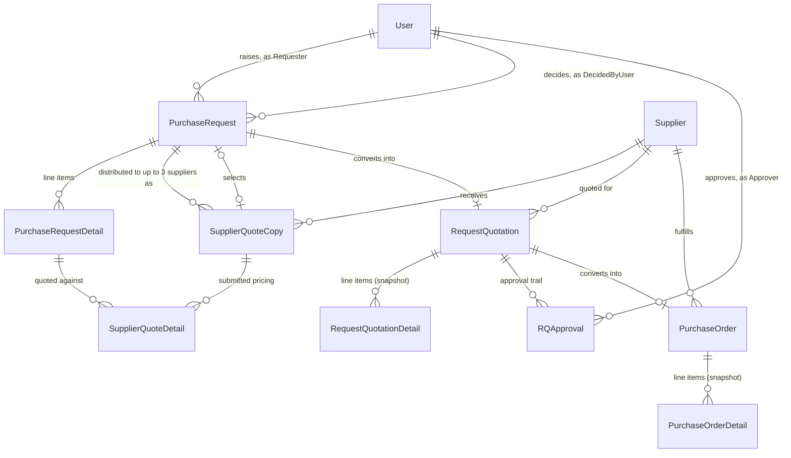
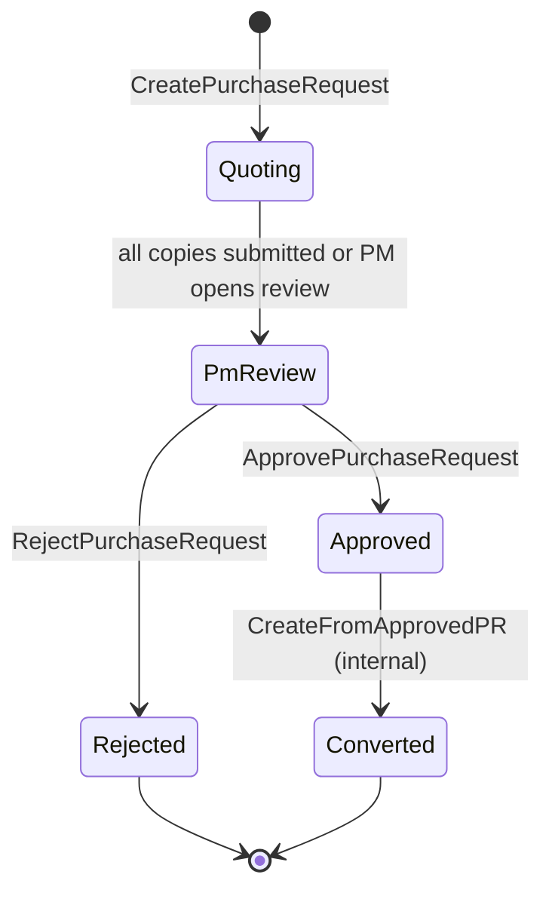
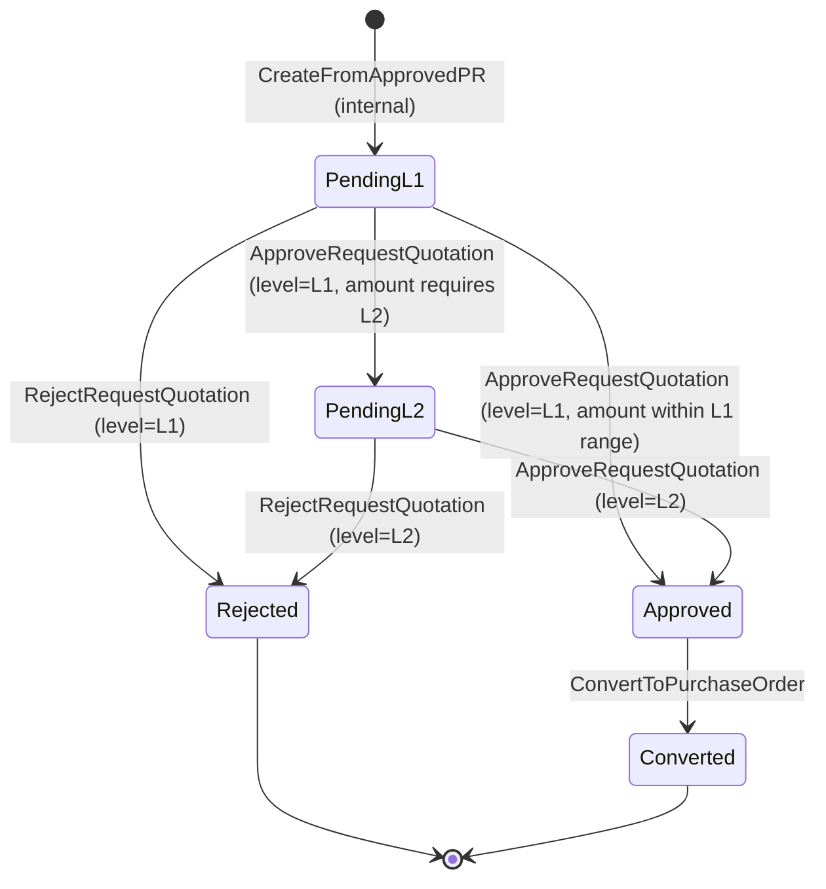
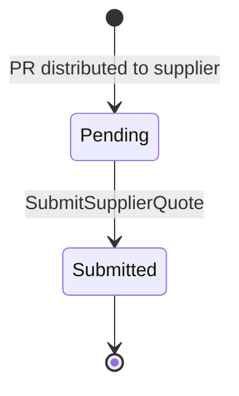
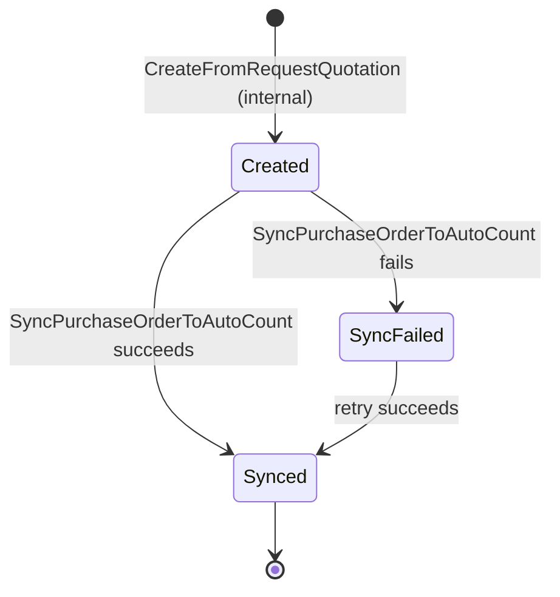

# PFP.Domain

**Domain layer of the PFP.Procurement system.** Pure data structures — no framework references, no NuGet packages, no knowledge of `PFP.Application`, `PFP.Infrastructure`, or `PFP.WebApi`.

| | |
|---|---|
| Project | `PFP.Domain` |
| Depends on | Nothing |
| Depended on by | `PFP.Application` (and, transitively, everything above it) |
| Status | 15 entities, 9 enums, 6 marker interfaces — all present and building |
| Audience | Backend maintainers, frontend integrators, incoming contributors |

Application-layer architecture (Behaviours, Repositories, request pipeline) is documented separately in `PFP.Application/Application.md` and is not repeated here.

---

## Table of Contents

1. [Design Principles](#1-design-principles)
2. [Entity Relationship Diagram](#2-entity-relationship-diagram)
3. [Directory Structure](#3-directory-structure)
4. [Enum Reference](#4-enum-reference)
5. [Entity Reference](#5-entity-reference)
6. [State Machines](#6-state-machines)
7. [Marker Interfaces](#7-marker-interfaces)
8. [Known Issues](#8-known-issues)

---

## 1. Design Principles

- **Anemic model.** Every entity is data only — no methods, no embedded business rules. A state-machine rule such as "can a `PurchaseRequest` move from `Quoting` to `PmReview`" is not implemented on the entity; it lives in the corresponding Handler under `PFP.Application/Features/`.
- **Zero framework dependency.** No EF Core, no ORM, no web-framework reference. This keeps the layer reusable across any consumer and unit-testable without a database.
- **Marker interfaces.** Capabilities such as "has an integer id" or "is exposed via a Dto" are expressed through empty-bodied interfaces (`IEntity`, `IExposableEntity`) rather than `is`-checks scattered through calling code.

---

## 2. Entity Relationship Diagram

The same relational entities as `PFP.Infrastructure/Infrastructure.md`'s diagram, but in purely business terms — no delete behavior, no persistence detail. See that document if you need the EF Core / SQL Server side of these same relationships.



`Item` (material master data), `Counter` (document number sequence generator), `ApprovalSetting` (2-row approval configuration), and `EmailSettings` (single-row SMTP configuration) have no foreign-key relationship to anything else and are omitted — `Item` is only referenced by string code snapshot (`PurchaseRequestDetail.ItemCode`), not a real foreign key.

Both `PurchaseRequest -> RequestQuotation` and `RequestQuotation -> PurchaseOrder` are drawn above as "1 to 0-or-1" (`||--o|`) and that is now also what the C# navigation properties are typed as — this was an open Known Issue in earlier versions of this document (both were previously typed as collections); it is resolved, and `PFP.Infrastructure`'s applied migration additionally enforces both at the database level with `UNIQUE` indexes (see `Infrastructure.md` Section 3).

---

## 3. Directory Structure

```
PFP.Domain/
├── PFP.Domain.csproj
├── Entities/
│   ├── Commons/
│   │   ├── Users/User.cs
│   │   └── Suppliers/Supplier.cs
│   ├── Items/Item.cs
│   ├── PurchaseRequests/
│   │   ├── PurchaseRequest.cs
│   │   └── PurchaseRequestDetail.cs
│   ├── SupplierQuoteCopys/
│   │   ├── SupplierQuoteCopy.cs
│   │   └── SupplierQuoteDetail.cs
│   ├── RequestQuotations/
│   │   ├── RequestQuotation.cs
│   │   ├── RequestQuotationDetail.cs
│   │   └── RQApproval.cs
│   ├── PurchaseOrders/
│   │   ├── PurchaseOrder.cs
│   │   └── PurchaseOrderDetail.cs
│   ├── ApprovalSetting.cs
│   ├── Counter.cs
│   └── EmailSettings.cs
├── Enums/
│   ├── Role.cs
│   ├── PRStatus.cs
│   ├── CopyStatus.cs
│   ├── RQStatus.cs
│   ├── ApprovalLevel.cs
│   ├── ApprovalAction.cs
│   ├── POStatus.cs
│   ├── SupplierAccountStatus.cs
│   └── DocumentType.cs
└── Interface/
    ├── IEntity.cs
    ├── IExposableEntity.cs
    ├── IBaseEntity.cs
    ├── IBaseExposableEntity.cs
    ├── Auditables/ICreationAuditable.cs
    └── Concurrency/IConcurrencyAware.cs
```

> There is no `Department.cs` in `Enums/`. `Department` is not currently modeled as an enum anywhere in this project — see "Known Issues" (below), item 6.

---

## 4. Enum Reference

Enum values serialize to JSON as strings (e.g. `"role": "HeadOfPurchase"`), not integers.

| Enum | Values | Used on |
|---|---|---|
| `Role` | `Requester`, `PurchaseManager`, `DirectorL1`, `DirectorL2`, `HeadOfPurchase` | `User.Role`, `ApprovalSetting.ApproverRole` |
| `PRStatus` | `Quoting`, `PmReview`, `Approved`, `Rejected`, `Converted` | `PurchaseRequest.Status` |
| `CopyStatus` | `Pending`, `Submitted` | `SupplierQuoteCopy.Status` -- one-way, non-reversible |
| `RQStatus` | `PendingL1`, `PendingL2`, `Approved`, `Rejected`, `Converted` | `RequestQuotation.Status` |
| `ApprovalLevel` | `L1`, `L2` | `RQApproval.Level`, `ApprovalSetting.Level` |
| `ApprovalAction` | `Approved`, `Rejected` | `RQApproval.Action` |
| `POStatus` | `Created`, `Synced`, `SyncFailed` | `PurchaseOrder.Status` |
| `SupplierAccountStatus` | `Invited`, `Registered`, `Suspended` | `Supplier.AccountStatus` |
| `DocumentType` | `PurchaseRequest`, `RequestQuotation`, `PurchaseOrder` | `IDocumentNumberGenerator` (Application layer); not typically consumed by clients |

---

## 5. Entity Reference

### `User` — internal account

| Field | Type |
|---|---|
| Id | int |
| Name | string |
| Email | string |
| Role | Role |
| Department | string (required) |
| IsActive | bool, default `true` |
| PasswordHash | string |
| PurchaseRequests | ICollection\<PurchaseRequest\> (as Requester) |
| RQApprovals | ICollection\<RQApproval\> (as Approver) |

### `Supplier` — supplier account

| Field | Type |
|---|---|
| Id | int |
| Name | string |
| Email | string |
| Contact | string? |
| InAutoCount | bool |
| CreditorCode | string? — AutoCount creditor code, used as the sync-matching key |
| AccountStatus | SupplierAccountStatus, default `Invited` |
| RegistrationToken | string? |
| RegisteredAt | DateTime? |
| PasswordHash | string? |
| RequestQuotations | ICollection\<RequestQuotation\> |
| PurchaseOrders | ICollection\<PurchaseOrder\> |

### `Item` — material master data

| Field | Type |
|---|---|
| Id | int |
| Code | string — unique, AutoCount sync-matching key |
| Name | string |
| Uom | string |
| RefPrice | decimal |

### `PurchaseRequest`

| Field | Type |
|---|---|
| Id | int |
| DocNo | string |
| RequesterId | int |
| Requester | User |
| Department | string |
| Status | PRStatus, default `Quoting` |
| PmRemarks | string? |
| SelectedSupplierCopyId | int? |
| SelectedSupplierCopy | SupplierQuoteCopy? |
| CreditorCode / CreditorName | string? |
| CreatedAt / DecidedAt | DateTime |
| DecidedByUserId | int? |
| DecidedByUser | User? |
| RowVersion | byte[] |
| Items | ICollection\<PurchaseRequestDetail\> |
| SupplierQuoteCopies | ICollection\<SupplierQuoteCopy\> |
| RequestQuotations | RequestQuotation? — a request converts into at most one quotation |

### `PurchaseRequestDetail`

| Field | Type |
|---|---|
| Id | int |
| PurchaseRequestId | int |
| PurchaseRequest | PurchaseRequest |
| ItemCode | string |
| Description | string? |
| Location | string? |
| Uom | string |
| Qty | decimal |
| QuotedBy | ICollection\<SupplierQuoteDetail\> |

### `SupplierQuoteCopy` — per-supplier RFQ distribution

| Field | Type |
|---|---|
| Id | int |
| PurchaseRequestId / PurchaseRequest | int / PurchaseRequest |
| SupplierId / Supplier | int / Supplier |
| Token | string — unguessable access credential |
| Status | Copystatus, default `Pending` |
| Remarks | string? |
| TotalAmount | decimal |
| SentAt | DateTime |
| SubmittedAt | DateTime? |
| QuotedDetail | ICollection\<SupplierQuoteDetail\> |

### `SupplierQuoteDetail` — submitted quote line

| Field | Type |
|---|---|
| Id | int |
| SupplierQuoteCopyId / SupplierQuoteCopy | int / SupplierQuoteCopy |
| PurchaseRequestItemId / PurchaseRequestDetail | int / PurchaseRequestDetail |
| UnitPrice | decimal |

### `RequestQuotation`

| Field | Type |
|---|---|
| Id | int |
| DocNo | string |
| PurchaseRequestId / PurchaseRequest | int / PurchaseRequest |
| SupplierId / Supplier | int / Supplier |
| TotalAmount | decimal |
| Status | RQStatus |
| RequiresL2 | bool |
| CreatedAt | DateTime |
| RowVersion | byte[] |
| Items | ICollection\<RequestQuotationDetail\> |
| Approvals | ICollection\<RQApproval\> |
| PurchaseOrder | PurchaseOrder? — a quotation converts into at most one order |

### `RequestQuotationDetail` — snapshot

| Field | Type |
|---|---|
| Id | int |
| RequestQuotationId / RequestQuotation | int / RequestQuotation |
| ItemCode / Description / Uom | string |
| Qty / UnitPrice | decimal |

### `RQApproval` — approval/rejection audit record

| Field | Type |
|---|---|
| Id | int |
| RequestQuotationId / RequestQuotation | int / RequestQuotation |
| Level | ApprovalLevel |
| ApproverId / Approver | int / User |
| Action | ApprovalAction |
| Remark | string? |
| Timestamp | DateTime |

### `PurchaseOrder`

| Field | Type |
|---|---|
| Id | int |
| DocNo | string |
| RequestQuotationId / RequestQuotation | int / RequestQuotation (1:1) |
| SupplierId / Supplier | int / Supplier |
| IsNewSupplier | bool |
| TotalAmount | decimal |
| Status | POStatus |
| CreatedAt | DateTime |
| SyncedAt | DateTime? |
| AutoCountPORef / AutoCountCreditorRef | string? |
| SyncError | string? |
| SyncAttempts | int |
| RowVersion | byte[] |
| Items | ICollection\<PurchaseOrderDetail\> |

### `PurchaseOrderDetail` — snapshot

| Field | Type |
|---|---|
| Id | int |
| PurchaseOrderId | int |
| PurchaseOrder | PurchaseOrder |
| ItemCode / Description / Uom | string |
| Qty / UnitPrice | decimal |

### `ApprovalSetting` — exactly two records (L1, L2)

| Field | Type |
|---|---|
| Level | ApprovalLevel (primary key) |
| ApproverRole | Role |
| MinAmount | decimal |
| MaxAmount | decimal? |

### `Counter` — document-number sequence generator

| Field | Type |
|---|---|
| Name | string (primary key — `"PR"` / `"RQ"` / `"PO"`) |
| Seq | int |

### `EmailSettings` — single-row SMTP configuration

Backs the client-configurable "settings page" the Scope Document's Out-of-Scope clause requires ("Email SMTP setup is not included; only the settings page ... is provided"). See `Infrastructure.md` Section 1 for the full feature (`ISecretProtector`, encryption) and `Application.md` for the `Features/Settings/EmailSettings/` Command/Query pair that exposes it.

| Field | Type |
|---|---|
| Id | int (primary key, always `1` — a single row) |
| Host | string |
| Port | int |
| Username | string |
| EncryptedPassword | string — never plaintext; protected via `ISecretProtector` at the Application/Infrastructure boundary, not by this entity |
| FromEmail | string |
| FromName | string |

---

## 6. State Machines

The four `Status` enums each drive a state machine enforced by `PFP.Application/Features/` Handlers, not by the entities themselves (per the anemic-model principle in Section 1). These diagrams describe the intended transitions; nothing here is enforced automatically just because the diagram says so — every arrow corresponds to a specific Handler.

### `PurchaseRequest.Status` (`PRStatus`)



### `RequestQuotation.Status` (`RQStatus`)



Whether every `RequestQuotation` must pass through both `PendingL1` and `PendingL2`, or whether a small enough amount can go straight from `PendingL1` to `Approved`, is an open question raised against the Scope Document — see `Application.md`'s End-to-End Business Flow section, which flags the same branch.

### `SupplierQuoteCopy.Status` (`Copystatus`)



One-way, non-reversible — a supplier is only allowed to submit once (Scope Document, Full Flow item 3).

### `PurchaseOrder.Status` (`POStatus`)



`SyncAttempts` and `SyncError` on `PurchaseOrder` are updated every time the `SyncFailed -> Synced` retry path is taken.

---

## 7. Marker Interfaces

| Interface | Definition | Implemented by |
|---|---|---|
| `IEntity` | `int Id { get; }` | Most entities, including `EmailSettings` (its `Id` is fixed at `1`, but it is still a real `int Id`, unlike the two exceptions). `ApprovalSetting` (keyed by `Level`) and `Counter` (keyed by `Name`) do not implement it. |
| `IExposableEntity` | Empty — marks "mapped to a Dto for output" | All entities except `Counter`. |
| `IBaseEntity` | `IEntity` + `ICreationAuditable` | Entities that also track a creation timestamp. |
| `IBaseExposableEntity` | `IBaseEntity` + `IExposableEntity` | Same set as above. |
| `ICreationAuditable` (`Auditables/`) | `DateTime CreatedAt { get; }` | Entities with a creation timestamp. |
| `IConcurrencyAware` (`Concurrency/`) | `byte[] RowVersion { get; set; }` | `PurchaseRequest`, `RequestQuotation`, `PurchaseOrder` — the three core document entities requiring optimistic concurrency control. |

These interfaces let `PFP.Application` write generic infrastructure code — e.g. a `GetOrThrowAsync<T>` helper constrained to `T : IEntity`, or an optimistic-concurrency retry helper constrained to `T : IConcurrencyAware` — without writing that logic per entity type.

---

## 8. Known Issues

Discrepancies found while cross-checking this document against the real source files. None currently prevent the solution from building; they are listed here so they are not rediscovered independently and so they can be prioritized deliberately.

| # | Location | Issue | Impact |
|---|---|---|---|
| 1 | `PurchaseRequest.RequesterId` | Resolved — previously misnamed `RequestedId`; now matches the paired navigation property `Requester`. | — |
| 2 | `SupplierQuoteDetail` navigation | Resolved — the property is now correctly named `PurchaseRequestDetail` and typed `PurchaseRequestDetail`, matching the paired `PurchaseRequestItemId` foreign key (was previously named `purchaseRequest`, typed `PurchaseRequest`). | — |
| 3 | `RequestQuotation.PurchaseOrder` | Resolved — now a single `PurchaseOrder?`, not a collection; `Infrastructure.md`'s applied migration additionally enforces the 1:1 cardinality at the database level with a `UNIQUE` index on `PurchaseOrder.RequestQuotationId`. | — |
| 4 | `Enums/CopyStatus.cs` | Resolved — correctly `CopyStatus` (PascalCase); the previous lowercase-`s` spelling has been fixed. | — |
| 5 | `ApprovalSetting.Level` | Resolved — correctly PascalCase now. | — |
| 6 | `User.Department`, `PurchaseRequest.Department` | Still open. Both are plain `string`; there is no `Department` enum in this project despite `Department` appearing as a documented business concept in the original scope reconciliation. | If a frontend expects a fixed set of department values, the backend currently performs no such validation. |
| 7 | `Supplier.Id` | Resolved — now a plain `int Id`, consistent with `User.Id`/`PurchaseRequest.Id`; no longer forces every `new Supplier { ... }` construction to explicitly assign an identity value. | — |
| 8 | `PurchaseRequest.RequestQuotations` | Resolved — now a single `RequestQuotation?`, not a collection; `Infrastructure.md`'s applied migration additionally enforces the 1:0-or-1 cardinality at the database level with a `UNIQUE` index on `RequestQuotation.PurchaseRequestId`. | — |

Item 6 is the only one still open, and is lower-risk than the others were (it's a modeling choice, not a bug) — decide whether `Department` should become an enum once the client confirms the fixed set of departments (Scope Document Assumptions section).
