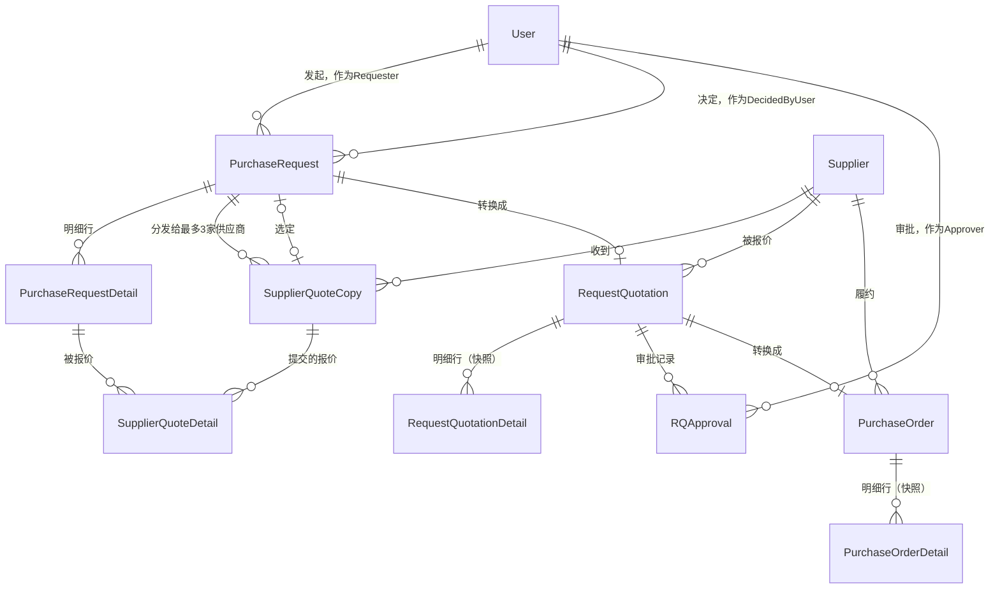
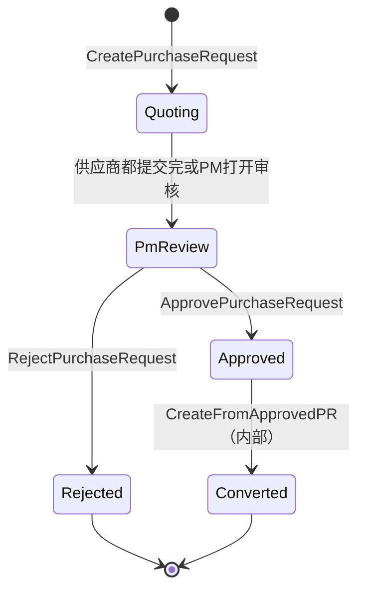
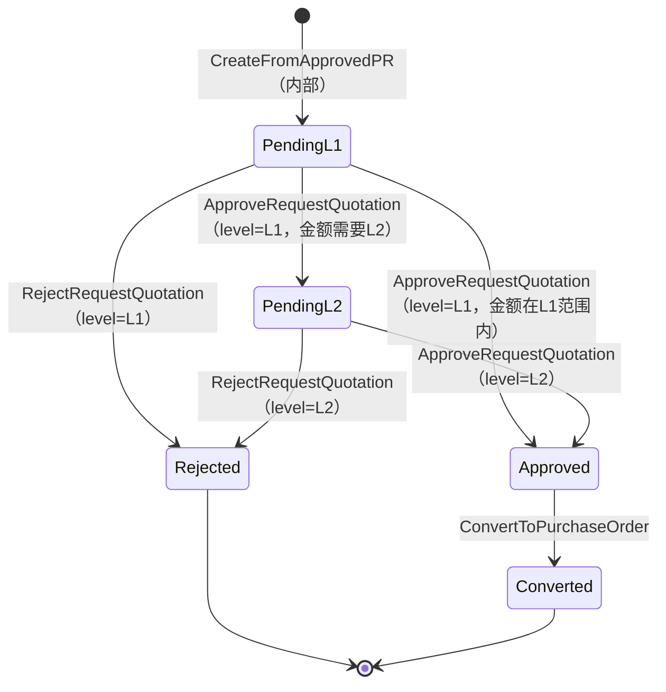
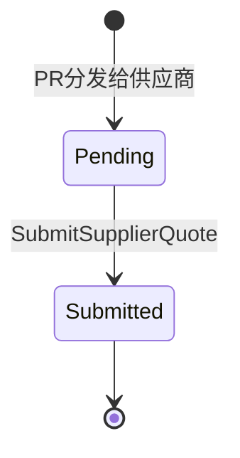
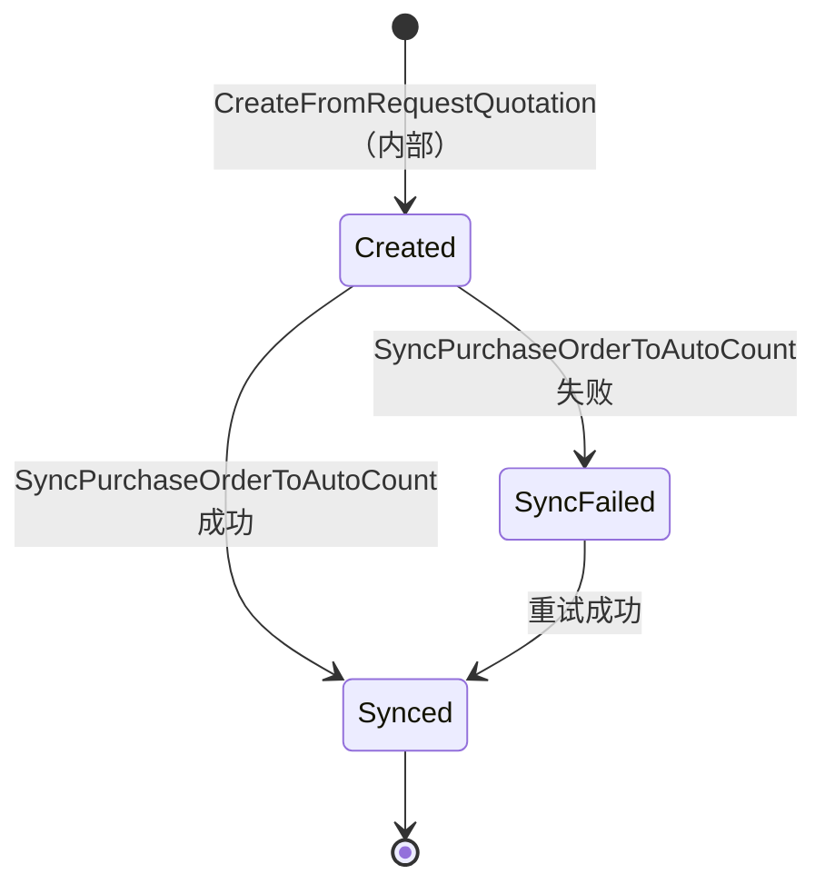

# PFP.Domain

**PFP.Procurement采购系统的Domain层。** 纯数据结构——不引用任何框架、不引用任何NuGet包，不知道`PFP.Application`、`PFP.Infrastructure`、`PFP.WebApi`的存在。

| | |
|---|---|
| 项目 | `PFP.Domain` |
| 依赖 | 无 |
| 被谁依赖 | `PFP.Application`（以及间接地，它之上的所有项目） |
| 状态 | 15个实体、9个枚举、6个标记接口——全部存在且编译通过 |
| 读者 | 后端维护者、前端对接人员、后续接手的开发者 |

本文档为英文版`Domain.md`的中文对照版本，内容保持一致。Application层的架构说明（Behaviour、Repository、请求管道）记录在`PFP.Application/Application.zh.md`，本文档不重复。

---

## 目录

1. [设计原则](#1-设计原则)
2. [实体关系图](#2-实体关系图)
3. [完整目录结构](#3-完整目录结构)
4. [枚举速查](#4-枚举速查)
5. [实体清单](#5-实体清单)
6. [状态机](#6-状态机)
7. [标记接口](#7-标记接口)
8. [已知问题](#8-已知问题)

---

## 1. 设计原则

- **贫血模型（Anemic Model）。** 每个实体只有属性，没有方法，不内嵌任何业务规则。类似"`PurchaseRequest`能不能从`Quoting`变成`PmReview`"这种状态机规则，不写在实体上，而是写在`PFP.Application/Features/`下对应的Handler里。
- **零框架依赖。** 不引用EF Core，不引用任何ORM或Web框架的包。这让这一层可以被任何上层复用，也可以脱离数据库单独做单元测试。
- **标记接口（Marker Interface）。** 诸如"有一个int类型的id"、"会被映射成Dto对外暴露"这类能力，用空方法体的接口（`IEntity`、`IExposableEntity`）表达，而不是在调用代码里到处写`is`判断。

---

## 2. 实体关系图

跟`PFP.Infrastructure/Infrastructure.zh.md`里那张图是同样的关系型实体，但这里是纯业务视角——不带删除行为、不带持久化细节。要看这些关系在EF Core/SQL Server层面具体怎么处理，去那份文档。



`Item`（物料主数据）、`Counter`（单据编号生成器）、`ApprovalSetting`（两行的审批配置）、`EmailSettings`（单行的SMTP配置）跟其它任何东西都没有外键关系，图上省略——`Item`只是被字符串编码快照引用（`PurchaseRequestDetail.ItemCode`），不是真正的外键。

`PurchaseRequest -> RequestQuotation`和`RequestQuotation -> PurchaseOrder`这两条现在都画成"1对0或1"（`||--o|`），C#导航属性现在也是这么定义的——这在本文档更早的版本里是一个开放的已知问题（两边都曾经是集合类型）；现在已经解决，而且`PFP.Infrastructure`已经应用的迁移还在数据库层面用`UNIQUE`索引额外强制了这两条约束（见`Infrastructure.zh.md`第3节）。

---

## 3. 完整目录结构

```
PFP.Domain/
├── PFP.Domain.csproj
├── Entities/
│   ├── Commons/
│   │   ├── Users/User.cs
│   │   └── Suppliers/Supplier.cs
│   ├── Items/Item.cs
│   ├── PurchaseRequests/
│   │   ├── PurchaseRequest.cs
│   │   └── PurchaseRequestDetail.cs
│   ├── SupplierQuoteCopys/
│   │   ├── SupplierQuoteCopy.cs
│   │   └── SupplierQuoteDetail.cs
│   ├── RequestQuotations/
│   │   ├── RequestQuotation.cs
│   │   ├── RequestQuotationDetail.cs
│   │   └── RQApproval.cs
│   ├── PurchaseOrders/
│   │   ├── PurchaseOrder.cs
│   │   └── PurchaseOrderDetail.cs
│   ├── ApprovalSetting.cs
│   ├── Counter.cs
│   └── EmailSettings.cs
├── Enums/
│   ├── Role.cs
│   ├── PRStatus.cs
│   ├── CopyStatus.cs
│   ├── RQStatus.cs
│   ├── ApprovalLevel.cs
│   ├── ApprovalAction.cs
│   ├── POStatus.cs
│   ├── SupplierAccountStatus.cs
│   └── DocumentType.cs
└── Interface/
    ├── IEntity.cs
    ├── IExposableEntity.cs
    ├── IBaseEntity.cs
    ├── IBaseExposableEntity.cs
    ├── Auditables/ICreationAuditable.cs
    └── Concurrency/IConcurrencyAware.cs
```

> `Enums/`里没有`Department.cs`——`Department`目前在整个项目里都没有对应的枚举类型，详见"已知问题"第6条。

---

## 4. 枚举速查

枚举值序列化成JSON时是字符串（比如`"role": "HeadOfPurchase"`），不是数字。

| 枚举 | 可选值 | 用在哪 |
|---|---|---|
| `Role` | `Requester`、`PurchaseManager`、`DirectorL1`、`DirectorL2`、`HeadOfPurchase` | `User.Role`、`ApprovalSetting.ApproverRole` |
| `PRStatus` | `Quoting`、`PmReview`、`Approved`、`Rejected`、`Converted` | `PurchaseRequest.Status` |
| `CopyStatus` | `Pending`、`Submitted` | `SupplierQuoteCopy.Status`——一次性，不可逆 |
| `RQStatus` | `PendingL1`、`PendingL2`、`Approved`、`Rejected`、`Converted` | `RequestQuotation.Status` |
| `ApprovalLevel` | `L1`、`L2` | `RQApproval.Level`、`ApprovalSetting.Level` |
| `ApprovalAction` | `Approved`、`Rejected` | `RQApproval.Action` |
| `POStatus` | `Created`、`Synced`、`SyncFailed` | `PurchaseOrder.Status` |
| `SupplierAccountStatus` | `Invited`、`Registered`、`Suspended` | `Supplier.AccountStatus` |
| `DocumentType` | `PurchaseRequest`、`RequestQuotation`、`PurchaseOrder` | `IDocumentNumberGenerator`（Application层）内部使用，前端一般不会直接接触 |

---

## 5. 实体清单

### `User`——内部账号

| 字段 | 类型 |
|---|---|
| Id | int |
| Name | string |
| Email | string |
| Role | Role |
| Department | string（必填） |
| IsActive | bool，默认`true` |
| PasswordHash | string |
| PurchaseRequests | ICollection\<PurchaseRequest\>（作为Requester发起的） |
| RQApprovals | ICollection\<RQApproval\>（作为Approver审批过的） |

### `Supplier`——供应商账号

| 字段 | 类型 |
|---|---|
| Id | int |
| Name | string |
| Email | string |
| Contact | string? |
| InAutoCount | bool |
| CreditorCode | string?——AutoCount债权人编号，同步匹配键 |
| AccountStatus | SupplierAccountStatus，默认`Invited` |
| RegistrationToken | string? |
| RegisteredAt | DateTime? |
| PasswordHash | string? |
| RequestQuotations | ICollection\<RequestQuotation\> |
| PurchaseOrders | ICollection\<PurchaseOrder\> |

### `Item`——物料主数据

| 字段 | 类型 |
|---|---|
| Id | int |
| Code | string——唯一，AutoCount同步匹配键 |
| Name | string |
| Uom | string |
| RefPrice | decimal |

### `PurchaseRequest`

| 字段 | 类型 |
|---|---|
| Id | int |
| DocNo | string |
| RequesterId | int |
| Requester | User |
| Department | string |
| Status | PRStatus，默认`Quoting` |
| PmRemarks | string? |
| SelectedSupplierCopyId | int? |
| SelectedSupplierCopy | SupplierQuoteCopy? |
| CreditorCode / CreditorName | string? |
| CreatedAt / DecidedAt | DateTime |
| DecidedByUserId | int? |
| DecidedByUser | User? |
| RowVersion | byte[] |
| Items | ICollection\<PurchaseRequestDetail\> |
| SupplierQuoteCopies | ICollection\<SupplierQuoteCopy\> |
| RequestQuotations | RequestQuotation?——一张PR最多转出一张RQ |

### `PurchaseRequestDetail`

| 字段 | 类型 |
|---|---|
| Id | int |
| PurchaseRequestId | int |
| PurchaseRequest | PurchaseRequest |
| ItemCode | string |
| Description | string? |
| Location | string? |
| Uom | string |
| Qty | decimal |
| QuotedBy | ICollection\<SupplierQuoteDetail\> |

### `SupplierQuoteCopy`——PR分发给每个供应商的独立副本

| 字段 | 类型 |
|---|---|
| Id | int |
| PurchaseRequestId / PurchaseRequest | int / PurchaseRequest |
| SupplierId / Supplier | int / Supplier |
| Token | string——不可猜测的访问凭证 |
| Status | Copystatus，默认`Pending` |
| Remarks | string? |
| TotalAmount | decimal |
| SentAt | DateTime |
| SubmittedAt | DateTime? |
| QuotedDetail | ICollection\<SupplierQuoteDetail\> |

### `SupplierQuoteDetail`——供应商实际提交的报价明细

| 字段 | 类型 |
|---|---|
| Id | int |
| SupplierQuoteCopyId / SupplierQuoteCopy | int / SupplierQuoteCopy |
| PurchaseRequestItemId / PurchaseRequestDetail | int / PurchaseRequestDetail |
| UnitPrice | decimal |

### `RequestQuotation`

| 字段 | 类型 |
|---|---|
| Id | int |
| DocNo | string |
| PurchaseRequestId / PurchaseRequest | int / PurchaseRequest |
| SupplierId / Supplier | int / Supplier |
| TotalAmount | decimal |
| Status | RQStatus |
| RequiresL2 | bool |
| CreatedAt | DateTime |
| RowVersion | byte[] |
| Items | ICollection\<RequestQuotationDetail\> |
| Approvals | ICollection\<RQApproval\> |
| PurchaseOrder | PurchaseOrder?——一张RQ最多转出一张PO |

### `RequestQuotationDetail`——快照式存储

| 字段 | 类型 |
|---|---|
| Id | int |
| RequestQuotationId / RequestQuotation | int / RequestQuotation |
| ItemCode / Description / Uom | string |
| Qty / UnitPrice | decimal |

### `RQApproval`——每一次审批/拒绝的留痕记录

| 字段 | 类型 |
|---|---|
| Id | int |
| RequestQuotationId / RequestQuotation | int / RequestQuotation |
| Level | ApprovalLevel |
| ApproverId / Approver | int / User |
| Action | ApprovalAction |
| Remark | string? |
| Timestamp | DateTime |

### `PurchaseOrder`

| 字段 | 类型 |
|---|---|
| Id | int |
| DocNo | string |
| RequestQuotationId / RequestQuotation | int / RequestQuotation（1对1） |
| SupplierId / Supplier | int / Supplier |
| IsNewSupplier | bool |
| TotalAmount | decimal |
| Status | POStatus |
| CreatedAt | DateTime |
| SyncedAt | DateTime? |
| AutoCountPORef / AutoCountCreditorRef | string? |
| SyncError | string? |
| SyncAttempts | int |
| RowVersion | byte[] |
| Items | ICollection\<PurchaseOrderDetail\> |

### `PurchaseOrderDetail`——快照式存储

| 字段 | 类型 |
|---|---|
| Id | int |
| PurchaseOrderId | int |
| PurchaseOrder | PurchaseOrder |
| ItemCode / Description / Uom | string |
| Qty / UnitPrice | decimal |

### `ApprovalSetting`——只有L1/L2两条记录

| 字段 | 类型 |
|---|---|
| Level | ApprovalLevel（主键） |
| ApproverRole | Role |
| MinAmount | decimal |
| MaxAmount | decimal? |

### `Counter`——单据编号生成器

| 字段 | 类型 |
|---|---|
| Name | string（主键，"PR" / "RQ" / "PO"） |
| Seq | int |

### `EmailSettings`——单行SMTP配置

支撑客户能自己配置的那个"设置页面"，Scope文档"Out of Scope"那条明确要求提供它（"不包含SMTP的配置工作，只提供设置页面"）。完整功能见`Infrastructure.zh.md`第1节（`ISecretProtector`、加密），暴露它的`Features/Settings/EmailSettings/`那对Command/Query见`Application.zh.md`。

| 字段 | 类型 |
|---|---|
| Id | int（主键，永远是`1`——单行） |
| Host | string |
| Port | int |
| Username | string |
| EncryptedPassword | string——从来不是明文；在Application/Infrastructure的边界上通过`ISecretProtector`加密，不是这个实体自己负责的事 |
| FromEmail | string |
| FromName | string |

---

## 6. 状态机

四个`Status`枚举各自驱动一套状态机，靠`PFP.Application/Features/`下的Handler强制执行，不是实体自己（呼应第1节的贫血模型原则）。下面的图描述的是设计意图，不会因为图这么画就自动生效——每一条箭头都对应一个具体的Handler。

### `PurchaseRequest.Status`（`PRStatus`）



### `RequestQuotation.Status`（`RQStatus`）



每张`RequestQuotation`是不是都必须走完`PendingL1`和`PendingL2`两级，还是金额够小可以从`PendingL1`直接到`Approved`，这是对着Scope文档提出的一个开放问题——详见`Application.zh.md`"端到端业务流程"那一节，那张图上标出了同一个分支。

### `SupplierQuoteCopy.Status`（`Copystatus`）



单向，不可逆——供应商只允许提交一次（Scope文档Full Flow第3条）。

### `PurchaseOrder.Status`（`POStatus`）



`PurchaseOrder`上的`SyncAttempts`和`SyncError`，每走一次`SyncFailed -> Synced`这条重试路径都会更新。

---

## 7. 标记接口

| 接口 | 定义 | 谁实现 |
|---|---|---|
| `IEntity` | `int Id { get; }` | 大部分实体，包括`EmailSettings`（它的`Id`固定是`1`，但依然是一个真正的`int Id`，跟下面那两个例外不一样）。`ApprovalSetting`（主键是`Level`）和`Counter`（主键是`Name`）不实现它。 |
| `IExposableEntity` | 空接口，标记"会被映射成Dto对外返回" | 除`Counter`外的所有实体。 |
| `IBaseEntity` | `IEntity` + `ICreationAuditable`的组合 | 需要记录创建时间的实体。 |
| `IBaseExposableEntity` | `IBaseEntity` + `IExposableEntity`的组合 | 同上一组。 |
| `ICreationAuditable`（`Auditables/`） | `DateTime CreatedAt { get; }` | 有创建时间的实体。 |
| `IConcurrencyAware`（`Concurrency/`） | `byte[] RowVersion { get; set; }` | `PurchaseRequest`、`RequestQuotation`、`PurchaseOrder`——需要乐观并发控制的三个核心单据实体。 |

这套接口让`PFP.Application`层可以写通用的基础设施代码——比如一个约束`T : IEntity`的`GetOrThrowAsync<T>`辅助方法，或者一个约束`T : IConcurrencyAware`的乐观并发重试辅助逻辑，不需要针对每个实体类型各写一份。

---

## 8. 已知问题

对照真实源码核对本文档时发现的问题。这些问题目前都不影响编译，记录在这里是为了不被重复发现，也方便以后有计划地处理。

| 编号 | 位置 | 问题 | 影响 |
|---|---|---|---|
| 1 | `PurchaseRequest.RequesterId` | 已解决——之前误写成`RequestedId`，现在已经跟配对的导航属性`Requester`对上了。 | — |
| 2 | `SupplierQuoteDetail`导航属性 | 已解决——现在正确命名为`PurchaseRequestDetail`，类型也是`PurchaseRequestDetail`，跟配对的外键`PurchaseRequestItemId`对上了（以前叫`purchaseRequest`，类型是`PurchaseRequest`）。 | — |
| 3 | `RequestQuotation.PurchaseOrder` | 已解决——现在是单个`PurchaseOrder?`，不是集合；`Infrastructure.zh.md`里已经应用的迁移还在`PurchaseOrder.RequestQuotationId`上加了`UNIQUE`索引，在数据库层面额外强制了这条1对1约束。 | — |
| 4 | `Enums/CopyStatus.cs` | 已解决——现在正确是`CopyStatus`（PascalCase）；之前小写"s"的拼写已经改对。 | — |
| 5 | `ApprovalSetting.Level` | 已解决——现在是正确的PascalCase。 | — |
| 6 | `User.Department`、`PurchaseRequest.Department` | 还没解决。两处都是普通`string`；尽管`Department`在最初的Scope核对记录里是一个明确的业务概念，这个项目里目前没有对应的枚举。 | 如果前端假设Department是固定取值集合，后端目前不会做这种校验。 |
| 7 | `Supplier.Id` | 已解决——现在是普通`int Id`，跟`User.Id`/`PurchaseRequest.Id`一致；每次`new Supplier { ... }`不再被强制要求显式赋值这个本应是数据库自增生成的字段。 | — |
| 8 | `PurchaseRequest.RequestQuotations` | 已解决——现在是单个`RequestQuotation?`，不是集合；`Infrastructure.zh.md`里已经应用的迁移还在`RequestQuotation.PurchaseRequestId`上加了`UNIQUE`索引，在数据库层面额外强制了这条1对0或1约束。 | — |

第6条是现在唯一还没解决的，而且风险比其它几条更低（这是个建模选择，不是bug）——等客户确认部门的固定取值集合之后（Scope文档Assumptions那节），再决定`Department`要不要改成枚举。
