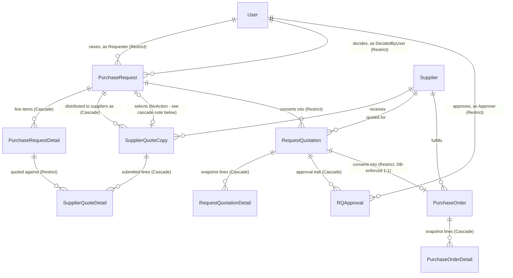

# PFP.Infrastructure

**Infrastructure layer of the PFP.Procurement system.** Implements the persistence, integration, and cross-cutting service contracts defined by `PFP.Application`, using EF Core 9 on Microsoft SQL Server.

| | |
|---|---|
| Project | `PFP.Infrastructure` |
| Depends on | `PFP.Application` (and, transitively, `PFP.Domain`) |
| Depended on by | `PFP.Host` (not yet wired) |
| Status | Folder scaffold complete; 3 of ~30 files have real content |
| Audience | Anyone picking up this project for the first time |

Application-layer architecture is documented in `PFP.Application/Application.md`; Domain entities and enums in `PFP.Domain/Domain.md`; the detailed design for every `IEntityTypeConfiguration<T>` in this project's own `Configurations.md`. This document is the entry point — start here, then follow the cross-references.

---

## Table of Contents

1. [Services This Project Provides](#1-services-this-project-provides)
2. [Position in the Architecture](#2-position-in-the-architecture)
3. [Entity Relationship Diagram](#3-entity-relationship-diagram)
4. [Directory Structure](#4-directory-structure)
5. [Folder Responsibilities](#5-folder-responsibilities)
6. [Database and Local Environment](#6-database-and-local-environment)
7. [Persistence Conventions](#7-persistence-conventions)
8. [Implementation Status](#8-implementation-status)
9. [Known Issues](#9-known-issues)
10. [Project Dependencies](#10-project-dependencies)

---

## 1. Services This Project Provides

Everything below is a capability `PFP.Application` declared as an interface, that this project is responsible for making real. This is the fastest way to answer "what does Infrastructure actually do for the rest of the system":

| Capability | Interface (in `PFP.Application`) | Where it lives here | What it does |
|---|---|---|---|
| Read/write each of the 9 aggregate roots | `IUserRepository`, `ISupplierRepository`, `IItemRepository`, `IApprovalSettingRepository`, `IPurchaseRequestRepository`, `ISupplierQuoteRepository`, `IRequestQuotationRepository`, `IPurchaseOrderRepository` | `Persistence/Repositories/` | Each wraps `ApplicationDbContext`; the two repositories for entities with child collections (`PurchaseRequest`, `RequestQuotation`) eager-load them with `.Include()`. |
| Commit a unit of work across one or more repositories atomically | `IUnitOfWork` | `Persistence/UnitOfWork.cs` | A single `SaveChangesAsync()` forwarded to the underlying `DbContext`. |
| The database schema itself | — | `Persistence/Database/ApplicationDbContext.cs`, `Persistence/Configurations/` | 14 `DbSet<T>`, one `IEntityTypeConfiguration<T>` per entity. See `Configurations.md` for the full per-entity design. |
| Seed data required for the system to function | — | `Persistence/Seed/ApplicationDbContextSeed.cs` | Populates the two mandatory `ApprovalSetting` rows (`L1`, `L2`). |
| Pull/push integration with AutoCount | `IAutoCountService` | `Integrations/AutoCount/` | `MockAutoCountService` (registered today) fabricates data; `AutoCountService` (placeholder) will hold the real HTTP client once AutoCount's API is documented. |
| Sending email | `IEmailService` | `Email/SmtpEmailService.cs` | SMTP delivery. Server credentials are entered by the client through a settings page, not hardcoded here (see `Application.md` for that tracked gap). |
| Knowing who the current caller is | `ICurrentUserService` | `Identity/CurrentUserService.cs` | Reads `UserId` / `SupplierId` / `Role` / `IsAuthenticated` from the active session. |
| Generating sequential document numbers (`PR-2026-0001`, etc.) | `IDocumentNumberGenerator` | *not yet created* | Planned under `Services/SequentialDocumentNumberGenerator.cs` — see the corresponding section. |
| Hashing passwords | `IPasswordHasher` | *not this project* | Implemented in `PFP.Application` itself — it is a pure function with no I/O, so it does not need infrastructure-layer isolation. Mentioned here only so nobody goes looking for it in the wrong project. |

---

## 2. Position in the Architecture

```
PFP.Host (not yet wired)  ->  PFP.Infrastructure  ->  PFP.Application  ->  PFP.Domain
```

`PFP.Infrastructure` is the only project in the solution allowed to reference EF Core, a database provider, or any other concrete external-system SDK. It implements every interface declared under `PFP.Application/Abstractions/` and `PFP.Application/Integrations/`, and exposes a single `AddInfrastructureServices()` extension method for `PFP.Host` to call at startup.

---

## 3. Entity Relationship Diagram

All 14 entities and how they relate, with the delete behavior each relationship is designed to use (see `Configurations.md` for the reasoning behind each one). `ApprovalSetting` and `Counter` have no foreign-key relationships to anything and are omitted.



Two things this diagram makes visible that are easy to miss reading the entities one at a time:

- **`PurchaseRequest` and `SupplierQuoteCopy` reference each other.** `SupplierQuoteCopy.PurchaseRequestId` is the "owned by" direction (cascades). `PurchaseRequest.SelectedSupplierCopyId` is a back-reference to whichever copy ended up selected, and **must not** cascade in the same direction — SQL Server refuses to create two cascade paths between the same two tables. See `Configurations.md` Section 1 for the full explanation.
- **Two relationships drawn here as "1 to many" are business rules meant to be "1 to 0-or-1"**: `PurchaseRequest -> RequestQuotation` and `RequestQuotation -> PurchaseOrder`. The current C# navigation properties are typed as collections; `Configurations.md` tracks this under `PurchaseOrder`'s design (a unique index on `RequestQuotationId` enforces the RQ→PO cardinality at the database level regardless of the C# type) and flags the PR→RQ case as an open question. Do not assume every `o{` in this diagram means "genuinely unbounded" — check `Configurations.md` before writing the corresponding `Configuration` file.

---

## 4. Directory Structure

```
PFP.Infrastructure/
├── PFP.Infrastructure.csproj
├── DependencyInjection.cs                          NOT YET CREATED
│
├── Persistence/
│   ├── Database/
│   │   ├── ApplicationDbContext.cs
│   │   └── ApplicationDbContextFactory.cs
│   ├── Seed/
│   │   └── ApplicationDbContextSeed.cs
│   ├── Configurations/
│   │   ├── Commons/
│   │   │   ├── Users/UserConfiguration.cs
│   │   │   └── Suppliers/SupplierConfiguration.cs
│   │   ├── Items/ItemConfiguration.cs
│   │   ├── PurchaseRequests/
│   │   │   ├── PurchaseRequestConfiguration.cs
│   │   │   └── PurchaseRequestDetailConfiguration.cs
│   │   ├── SupplierQuotes/
│   │   │   ├── SupplierQuoteCopyConfiguration.cs
│   │   │   └── SupplierQuoteDetailConfiguration.cs
│   │   ├── RequestQuotations/
│   │   │   ├── RequestQuotationConfiguration.cs
│   │   │   ├── RequestQuotationDetailConfiguration.cs
│   │   │   └── RQApprovalConfiguration.cs
│   │   ├── PurchaseOrders/
│   │   │   ├── PurchaseOrderConfiguration.cs
│   │   │   └── PurchaseOrderDetailConfiguration.cs
│   │   ├── ApprovalSettingConfiguration.cs
│   │   ├── CounterConfiguration.cs
│   │   └── DatabaseValueConverter.cs
│   ├── Repositories/
│   │   ├── UserRepository.cs
│   │   ├── SupplierRepository.cs
│   │   ├── ItemRepository.cs
│   │   ├── ApprovalSettingRepository.cs
│   │   ├── PurchaseRequestRepository.cs
│   │   ├── SupplierQuoteRepository.cs
│   │   ├── RequestQuotationRepository.cs
│   │   └── PurchaseOrderRepository.cs
│   └── UnitOfWork.cs
│
├── Integrations/
│   └── AutoCount/
│       ├── AutoCountService.cs
│       └── MockAutoCountService.cs
│
├── Email/
│   └── SmtpEmailService.cs
│
├── Identity/
│   └── CurrentUserService.cs
│
├── Options/
│   ├── AutoCountApiOptions.cs
│   └── DatabaseOptions.cs
│
└── Properties/
    └── PublishProfiles.cs                          PLACEHOLDER — see Known Issues, item 5
```

There is no `Services/SequentialDocumentNumberGenerator.cs` yet and no `Migrations/` folder yet — see the corresponding section and the corresponding section.

---

## 5. Folder Responsibilities

### `Persistence/Database/`

- **`ApplicationDbContext.cs`** — the EF Core session. Exposes one `DbSet<T>` per entity and wires up `Configurations/` via `ApplyConfigurationsFromAssembly` in `OnModelCreating`.
- **`ApplicationDbContextFactory.cs`** — implements `IDesignTimeDbContextFactory<ApplicationDbContext>`. Only needed if `dotnet ef` is invoked directly from this project without `--startup-project ../PFP.Host`; the `--startup-project` approach in use here does not require it, but it is kept as a fallback.

### `Persistence/Seed/ApplicationDbContextSeed.cs`

Populates the two mandatory `ApprovalSetting` rows (`L1`, `L2`) that the system cannot function without. Must be idempotent — safe to run against a database that already has the rows.

### `Persistence/Configurations/`

One `IEntityTypeConfiguration<T>` per entity, mirroring the grouping used in `PFP.Domain/Entities/`. Full design detail for every one of them — including the ones not yet written — is in this project's `Configurations.md`, not repeated here.

### `Persistence/Repositories/` and `Persistence/UnitOfWork.cs`

Implementations of the eight repository interfaces and `IUnitOfWork` declared in `PFP.Application/Abstractions/Persistence/`. See the corresponding section for the summary and the corresponding section for which repositories need `.Include()`.

### `Integrations/AutoCount/`

Mirrors `PFP.Application/Integrations/AutoCount/` on the Application side. `MockAutoCountService.cs` is what is actually registered today; `AutoCountService.cs` is a placeholder for the real client.

### `Email/SmtpEmailService.cs`

Implements `IEmailService` over SMTP.

### `Identity/CurrentUserService.cs`

Implements `ICurrentUserService`. The concrete session mechanism (cookie, token) is decided once `PFP.WebApi`'s authentication is designed.

### `Options/`

Strongly-typed configuration classes bound from `appsettings.json` via the Options pattern (`IOptions<T>`), not raw `IConfiguration` lookups scattered through the code.

---

## 6. Database and Local Environment

The project targets **Microsoft SQL Server**, not MySQL — this was a deliberate switch away from an earlier MySQL/Pomelo plan (see the corresponding section for why that combination was dropped). Reasons for choosing SQL Server:

- Microsoft's own `Microsoft.EntityFrameworkCore.SqlServer` provider ships in lockstep with EF Core itself — no third-party version lag to track.
- SQL Server has a native `rowversion` column type, which is exactly what EF Core's `.IsRowVersion()` was designed against. The three entities requiring optimistic concurrency (`PurchaseRequest`, `RequestQuotation`, `PurchaseOrder`) can use `byte[] RowVersion` + `.IsRowVersion()` directly, with no fallback design needed.

### Local development setup

| Requirement | How it is satisfied |
|---|---|
| SQL Server instance | SQL Server **LocalDB** (`MSSQLLocalDB`), bundled with Visual Studio. Start with `sqllocaldb start MSSQLLocalDB`. |
| Connection string | `PFP.Host/appsettings.json` → `ConnectionStrings:DefaultConnection` → `Server=(localdb)\MSSQLLocalDB;Database=PFP_Procurement;Trusted_Connection=True;TrustServerCertificate=True;` |
| `dotnet-ef` CLI tool | Must match the project's EF Core version: `dotnet tool update -g dotnet-ef --version 9.0.9` |
| Generating a migration | `dotnet ef migrations add <Name> --startup-project ../PFP.Host` (run from this project's directory) |
| Applying a migration | `dotnet ef database update --startup-project ../PFP.Host` |

The target database (`PFP_Procurement`) does not need to be created manually — `dotnet ef database update` creates it on first run.

---

## 7. Persistence Conventions

| Situation | Convention | Rationale |
|---|---|---|
| Enum-valued column | `.HasConversion<string>()` | Readable values in the database (`"HeadOfPurchase"` rather than `2`); immune to enum member reordering. |
| Nullable column that must be unique among its non-null values (e.g. `Supplier.CreditorCode`, `Supplier.RegistrationToken`) | Add `.HasFilter("[Column] IS NOT NULL")` to the unique index | SQL Server, unlike MySQL, treats multiple `NULL` values in a unique index as a constraint violation. A filtered index restricts uniqueness to rows that actually have a value. |
| Optimistic concurrency (`PurchaseRequest`, `RequestQuotation`, `PurchaseOrder`) | `byte[] RowVersion` + `.IsRowVersion()` | Maps directly onto SQL Server's native `rowversion` type; the database maintains the value automatically on every update. |
| Deleting a `User` or `Supplier` that has related history | `.OnDelete(DeleteBehavior.Restrict)` | Prevents an accidental delete from silently cascading through the procurement audit trail. |
| Two relationships between the same pair of tables (e.g. `PurchaseRequest` <-> `SupplierQuoteCopy`) | Exactly one direction may cascade | See the corresponding section — SQL Server rejects a second cascade path between the same two tables. |
| A repository's `GetByIdAsync` on an aggregate root with child collections | `.Include(...)` the child collections | The Handler expects the full aggregate; a partial load would silently produce empty collections. |

Full per-entity detail (table names, column lengths, exact indexes) is in `Configurations.md`.

---

## 8. Implementation Status

| Component | Status |
|---|---|
| `PFP.Infrastructure.csproj` | Configured: `net11.0`, EF Core 9.0.9 (Core, Design, SqlServer), `ProjectReference` to `PFP.Application` |
| `Persistence/Database/ApplicationDbContext.cs` | Implemented — all 14 `DbSet<T>` exposed, `ApplyConfigurationsFromAssembly` wired |
| `Persistence/Database/ApplicationDbContextFactory.cs` | Scaffold only |
| `UserConfiguration.cs`, `SupplierConfiguration.cs` | Implemented |
| Remaining 12 `Configuration` files | Scaffold only — design ready in `Configurations.md` |
| `Persistence/Repositories/` (8 files) + `UnitOfWork.cs` | Scaffold only — design ready (see conversation history / this document's Section 1) |
| `Persistence/Seed/ApplicationDbContextSeed.cs` | Scaffold only |
| `Integrations/AutoCount/*`, `Email/SmtpEmailService.cs`, `Identity/CurrentUserService.cs` | Scaffold only |
| `Options/AutoCountApiOptions.cs`, `Options/DatabaseOptions.cs` | Scaffold only |
| `DependencyInjection.cs` | Not created |
| `Services/SequentialDocumentNumberGenerator.cs` (implements `IDocumentNumberGenerator`) | Not created |
| `Migrations/` | Not created — no migration has been generated yet |

**For anyone about to run this project**: nothing is wired to dependency injection yet. `PFP.Host` cannot start the persistence layer until `DependencyInjection.cs` exists and is called from `Program.cs`.

---

## 9. Known Issues

Found while cross-checking this document against the real source files.

| # | Location | Issue |
|---|---|---|
| 1 | `ApplicationDbContext.SupplierQuoteCopies` / `PurchaseRequests` / `PurchaseRequestDetails` naming | Resolved — these were previously miscapitalized/misspelled; now correct. |
| 2 | `ApplicationDbContext` exposes a `DbSet<T>` for all 14 entities, including the 5 child entities | `Application.md` documents "one repository per aggregate root" specifically so that child entities are only ever reached through their aggregate root's repository. Exposing their `DbSet<T>` directly on the context lets any future code bypass that boundary. Worth deciding deliberately whether to keep these public `DbSet<T>` properties or make them `internal`. |
| 3 | `PFP.Infrastructure/DependencyInjection.cs` | Does not exist. Every implementation written into this project is currently unreachable from `PFP.Host` until this file is created and registers them. |
| 4 | `Properties/PublishProfiles.cs` | A plain scaffolded class, not a folder of `.pubxml` publish profiles as the name and location imply. Delete or replace when deployment is set up. |
| 5 | `PurchaseRequest.RequestQuotations` cardinality | See the corresponding section — likely should be 1:0-or-1, not 1:many; unconfirmed. |

Item 2 is an architectural decision that should be made before `Features/` handlers start depending on the current `DbSet<T>` surface. Item 3 blocks running the application at all. Item 4 is housekeeping. Item 5 needs a business-rule confirmation.

---

## 10. Project Dependencies

- `ProjectReference` -> `PFP.Application`
- NuGet: `Microsoft.EntityFrameworkCore` 9.0.9, `Microsoft.EntityFrameworkCore.Design` 9.0.9, `Microsoft.EntityFrameworkCore.SqlServer` 9.0.9
- Global tool: `dotnet-ef` 9.0.9 (must be kept in step with the EF Core package version above)
