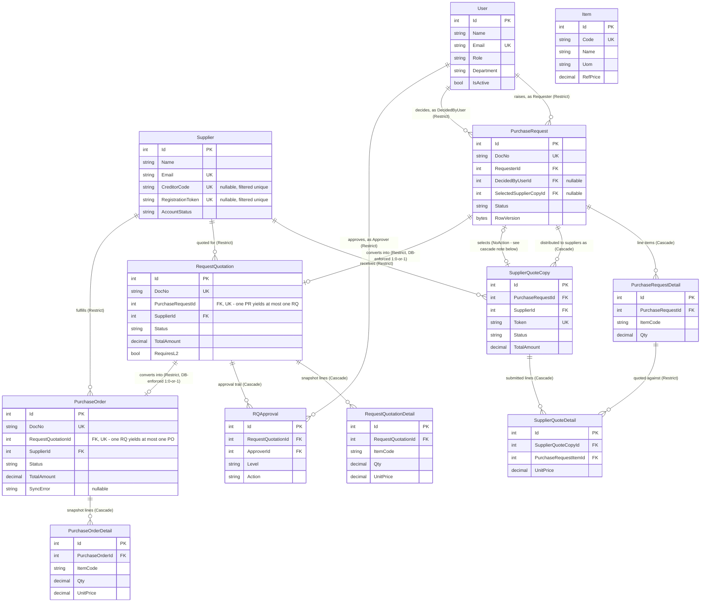

# PFP.Infrastructure

**Infrastructure layer of the PFP.Procurement system.** Implements the persistence, integration, and cross-cutting service contracts defined by `PFP.Application`, using EF Core 9 on Microsoft SQL Server.

| | |
|---|---|
| Project | `PFP.Infrastructure` |
| Depends on | `PFP.Application` (and, transitively, `PFP.Domain`) |
| Depended on by | `PFP.Host` |
| Status | Wired end-to-end: DI is registered from `PFP.Host/Program.cs`, all 14 `IEntityTypeConfiguration<T>` and all 8 repositories + `UnitOfWork` are implemented, and the `InitialCreate` migration is applied against a real SQL Server LocalDB database (`PFP_Procurement`). Remaining gaps: `AutoCountService` (real HTTP client), `ApplicationDbContextSeed`, `ApplicationDbContextFactory`, and `Properties/PublishProfiles.cs` are still scaffolds — see Section 8. |
| Audience | Anyone picking up this project for the first time |

Application-layer architecture is documented in `PFP.Application/Application.md`; Domain entities and enums in `PFP.Domain/Domain.md`; the detailed design for every `IEntityTypeConfiguration<T>` in this project's own `Configurations.md`; the detailed design for every repository in `Repositories.md`. This document is the entry point — start here, then follow the cross-references.

---

## Table of Contents

1. [Services This Project Provides](#1-services-this-project-provides)
2. [Position in the Architecture](#2-position-in-the-architecture)
3. [Entity Relationship Diagram](#3-entity-relationship-diagram)
4. [Directory Structure](#4-directory-structure)
5. [Folder Responsibilities](#5-folder-responsibilities)
6. [Database and Local Environment](#6-database-and-local-environment)
7. [Persistence Conventions](#7-persistence-conventions)
8. [Implementation Status](#8-implementation-status)
9. [Known Issues](#9-known-issues)
10. [Project Dependencies](#10-project-dependencies)

---

## 1. Services This Project Provides

Everything below is a capability `PFP.Application` declared as an interface, that this project is responsible for making real. This is the fastest way to answer "what does Infrastructure actually do for the rest of the system":

| Capability | Interface (in `PFP.Application`) | Where it lives here | What it does |
|---|---|---|---|
| Read/write each of the 9 aggregate roots | `IUserRepository`, `ISupplierRepository`, `IItemRepository`, `IApprovalSettingRepository`, `IPurchaseRequestRepository`, `ISupplierQuoteRepository`, `IRequestQuotationRepository`, `IPurchaseOrderRepository` | `Persistence/Repositories/` | Each wraps `ApplicationDbContext`; the repositories for entities with child collections (`PurchaseRequest`, `RequestQuotation`, `PurchaseOrder`) eager-load them with `.Include()`. See `Repositories.md` for the full per-repository design. |
| Commit a unit of work across one or more repositories atomically | `IUnitOfWork` | `Persistence/UnitOfWork.cs` | A single `SaveChangesAsync()` forwarded to the underlying `DbContext`. |
| The database schema itself | — | `Persistence/Database/ApplicationDbContext.cs`, `Persistence/Configurations/` | 14 `DbSet<T>`, one `IEntityTypeConfiguration<T>` per entity, all implemented. See `Configurations.md` for the full per-entity design. |
| Seed data required for the system to function | — | `Persistence/Database/Seed/ApplicationDbContextSeed.cs` | **Not yet implemented** — still a scaffold. Needs to populate the two mandatory `ApprovalSetting` rows (`L1`, `L2`); see Known Issues, item 6. |
| Pull/push integration with AutoCount | `IAutoCountService` | `Integrations/AutoCount/` | `MockAutoCountService` (registered today) returns canned/empty data so every flow that depends on `IAutoCountService` runs locally without a live AutoCount connection. `AutoCountService` (placeholder) will hold the real HTTP client once AutoCount's actual API (endpoints, auth, payload shapes) is documented. |
| Sending email | `IEmailService` | `Email/SmtpEmailService.cs` | Implemented — SMTP delivery via `System.Net.Mail.SmtpClient`, configured through `EmailOptions`. Server credentials are supplied via `appsettings.json`/environment, not hardcoded. |
| Knowing who the current caller is | `ICurrentUserService` | `Identity/CurrentUserService.cs` | Implemented — reads `UserId` / `SupplierId` / `Role` / `IsAuthenticated` from JWT claims on the current `HttpContext`, via `IHttpContextAccessor`. |
| Hashing passwords | `IPasswordHasher` | `Identity/PasswordHasher.cs` | Implemented — wraps `Microsoft.AspNetCore.Identity.PasswordHasher<T>` (PBKDF2), from the lightweight `Microsoft.Extensions.Identity.Core` package. Uses a throwaway `object` as the generic type argument since the default algorithm never actually inspects the "user" parameter. |
| Issuing JWTs | `ITokenService` | `Identity/JwtTokenService.cs` | Implemented — builds a signed JWT (`HmacSha256`) carrying `UserId`/`SupplierId`/`Email`/`Role` claims, configured through `JwtOptions`. |
| Generating sequential document numbers (`PR-2026-00001`, etc.) | `IDocumentNumberGenerator` | `Persistence/DocumentNumbers/SequentialDocumentNumberGenerator.cs` | Implemented — atomic `UPDATE ... OUTPUT` against the `counters` table (raw SQL, bypassing the change tracker so it never flushes the calling Handler's own pending changes early). |

---

## 2. Position in the Architecture

```
PFP.Host  ->  PFP.Infrastructure  ->  PFP.Application  ->  PFP.Domain
```

`PFP.Infrastructure` is the only project in the solution allowed to reference EF Core, a database provider, or any other concrete external-system SDK. It implements every interface declared under `PFP.Application/Abstractions/` and `PFP.Application/Integrations/`, and exposes a single `AddInfrastructureServices(IConfiguration)` extension method, called from `PFP.Host/Program.cs` alongside `AddApplicationServices()`.

---

## 3. Entity Relationship Diagram

Generated directly from the applied `InitialCreate` migration (`Persistence/Migrations/`) against the real `PFP_Procurement` database — not from reading the entity classes by hand, so this reflects exactly what SQL Server actually enforces today, including delete behavior, uniqueness, and the two 1:0-or-1 relationships now confirmed by real unique indexes rather than assumed. `ApprovalSetting` (`approvalsettings`, keyed on `Level`) and `Counter` (`counters`, keyed on `Name`) have no foreign-key relationships to anything and are omitted from the diagram; see `Configurations.md` for their column detail.



Two things worth calling out explicitly, both confirmed against the real applied schema:

- **`PurchaseRequest` and `SupplierQuoteCopy` reference each other.** `SupplierQuoteCopy.PurchaseRequestId` is the "owned by" direction (`Cascade`). `PurchaseRequest.SelectedSupplierCopyId` is a back-reference to whichever copy ended up selected, and does **not** cascade in the same direction (`NoAction`) — SQL Server refuses to create two cascade paths between the same two tables. See `Configurations.md` Section 1 for the full explanation.
- **Both `PurchaseRequest -> RequestQuotation` and `RequestQuotation -> PurchaseOrder` are now real 1:0-or-1 relationships, database-enforced, not just a business-rule intention.** This was an open question in an earlier version of this document; it's resolved — both `PurchaseRequest.RequestQuotations` and `RequestQuotation.PurchaseOrder` are single nullable navigation properties in the C# entities, and the applied migration carries a `UNIQUE` index on both `requestquotations.PurchaseRequestId` and `purchaseorders.RequestQuotationId` (`IX_requestquotations_PurchaseRequestId`, `IX_purchaseorders_RequestQuotationId`), so SQL Server itself rejects a second row on either side, independent of whatever the application code does.

---

## 4. Directory Structure

```
PFP.Infrastructure/
├── PFP.Infrastructure.csproj
├── DependencyInjection.cs
│
├── Persistence/
│   ├── Database/
│   │   ├── ApplicationDbContext.cs
│   │   ├── ApplicationDbContextFactory.cs           SCAFFOLD — see Known Issues
│   │   └── Seed/
│   │       └── ApplicationDbContextSeed.cs           SCAFFOLD — see Known Issues, item 6
│   ├── Configurations/
│   │   ├── Commons/
│   │   │   ├── Users/UserConfiguration.cs
│   │   │   └── Suppliers/SupplierConfiguration.cs
│   │   ├── Items/ItemConfiguration.cs
│   │   ├── PurchaseRequests/
│   │   │   ├── PurchaseRequestConfiguration.cs
│   │   │   └── PurchaseRequestDetailConfiguration.cs
│   │   ├── SupplierQuotes/
│   │   │   ├── SupplierQuoteCopyConfiguration.cs
│   │   │   └── SupplierQuoteDetailConfiguration.cs
│   │   ├── RequestQuotations/
│   │   │   ├── RequestQuotationConfiguration.cs
│   │   │   ├── RequestQuotationDetailConfiguration.cs
│   │   │   └── RQApprovalConfiguration.cs
│   │   ├── PurchaseOrders/
│   │   │   ├── PurchaseOrderConfiguration.cs
│   │   │   └── PurchaseOrderDetailConfiguration.cs
│   │   ├── ApprovalSettingConfiguration.cs
│   │   ├── CounterConfiguration.cs
│   │   └── DatabaseValueConverter.cs
│   ├── Repositories/
│   │   ├── UserRepository.cs
│   │   ├── SupplierRepository.cs
│   │   ├── ItemRepository.cs
│   │   ├── ApprovalSettingRepository.cs
│   │   ├── PurchaseRequestRepository.cs
│   │   ├── SupplierQuoteRepository.cs
│   │   ├── RequestQuotationRepository.cs
│   │   └── PurchaseOrderRepository.cs
│   ├── DocumentNumbers/
│   │   └── SequentialDocumentNumberGenerator.cs
│   ├── Migrations/
│   │   ├── <timestamp>_InitialCreate.cs
│   │   ├── <timestamp>_InitialCreate.Designer.cs
│   │   └── ApplicationDbContextModelSnapshot.cs
│   └── UnitOfWork.cs
│
├── Integrations/
│   └── AutoCount/
│       ├── AutoCountService.cs                       SCAFFOLD — real client pending AutoCount API docs
│       └── MockAutoCountService.cs                   registered today, used by DependencyInjection.cs
│
├── Email/
│   └── SmtpEmailService.cs
│
├── Identity/
│   ├── CurrentUserService.cs
│   ├── PasswordHasher.cs
│   └── JwtTokenService.cs
│
├── Options/
│   ├── AutoCountApiOptions.cs
│   ├── EmailOptions.cs
│   └── JwtOptions.cs
│
└── Properties/
    └── PublishProfiles.cs                            PLACEHOLDER — see Known Issues, item 4
```

---

## 5. Folder Responsibilities

### `Persistence/Database/`

- **`ApplicationDbContext.cs`** — the EF Core session. Exposes one `DbSet<T>` per entity and wires up `Configurations/` via `ApplyConfigurationsFromAssembly` in `OnModelCreating`.
- **`ApplicationDbContextFactory.cs`** — still a scaffold. Would implement `IDesignTimeDbContextFactory<ApplicationDbContext>`, needed only if `dotnet ef` is invoked directly from this project without `--startup-project ../PFP.Host`. In practice the `--startup-project` approach (see Section 6) has been used successfully to generate and apply `InitialCreate` without this file, so it remains optional — kept as a documented gap, not a blocker.
- **`Database/Seed/ApplicationDbContextSeed.cs`** — still a scaffold. See Known Issues, item 6, for why this is a real (not just cosmetic) gap now that the database actually exists.

### `Persistence/Configurations/`

One `IEntityTypeConfiguration<T>` per entity, mirroring the grouping used in `PFP.Domain/Entities/` — all 14 implemented. Full design detail for every one of them is in this project's `Configurations.md`, not repeated here.

### `Persistence/Repositories/`, `Persistence/UnitOfWork.cs`, `Persistence/DocumentNumbers/`

Implementations of the eight repository interfaces, `IUnitOfWork`, and `IDocumentNumberGenerator` declared in `PFP.Application/Abstractions/`. All implemented. See `Repositories.md` for per-repository design, and Section 1 above for `SequentialDocumentNumberGenerator`'s atomic-increment approach.

### `Persistence/Migrations/`

Generated by `dotnet ef migrations add`, not hand-written. Currently one migration, `InitialCreate`, applied against `PFP_Procurement` on local SQL Server LocalDB.

### `Integrations/AutoCount/`

Mirrors `PFP.Application/Integrations/AutoCount/` on the Application side. `MockAutoCountService.cs` is what is actually registered today — it returns empty lists and canned `Result<string>.Success(...)` values so every Handler that depends on `IAutoCountService` can run without a live AutoCount connection. `AutoCountService.cs` is a placeholder for the real HTTP client; nothing about AutoCount's actual endpoints, authentication, or payload shapes is known yet beyond the generic `BaseUrl`/`Company`/`Username`/`Password` fields already on `AutoCountApiOptions`.

### `Email/SmtpEmailService.cs`

Implements `IEmailService` over `System.Net.Mail.SmtpClient`, configured through `EmailOptions` (`Host`, `Port`, `Username`, `Password`, `FromEmail`, `FromName`).

### `Identity/`

- **`CurrentUserService.cs`** — implements `ICurrentUserService` by reading claims off the current request's `HttpContext.User` via `IHttpContextAccessor`.
- **`PasswordHasher.cs`** — implements `IPasswordHasher` over `Microsoft.AspNetCore.Identity.PasswordHasher<T>`.
- **`JwtTokenService.cs`** — implements `ITokenService`, issuing the JWTs that `CurrentUserService` later reads claims from.

### `Options/`

Strongly-typed configuration classes bound from `appsettings.json` via the Options pattern (`IOptions<T>`), not raw `IConfiguration` lookups scattered through the code: `AutoCountApiOptions`, `EmailOptions`, `JwtOptions`. The database connection string is the one exception — it's read directly via `IConfiguration.GetConnectionString("DefaultConnection")` in `DependencyInjection.AddDatabase`, since it is consumed in exactly one place and an `Options` wrapper would add a layer of indirection with no reuse benefit.

---

## 6. Database and Local Environment

The project targets **Microsoft SQL Server**, not MySQL — this was a deliberate switch away from an earlier MySQL/Pomelo plan. Reasons for choosing SQL Server:

- Microsoft's own `Microsoft.EntityFrameworkCore.SqlServer` provider ships in lockstep with EF Core itself — no third-party version lag to track.
- SQL Server has a native `rowversion` column type, which is exactly what EF Core's `.IsRowVersion()` was designed against. The three entities requiring optimistic concurrency (`PurchaseRequest`, `RequestQuotation`, `PurchaseOrder`) use `byte[] RowVersion` + `.IsRowVersion()` directly, with no fallback design needed.

### Local development setup

| Requirement | How it is satisfied |
|---|---|
| SQL Server instance | SQL Server **LocalDB** (`MSSQLLocalDB`), bundled with Visual Studio. Start with `sqllocaldb start MSSQLLocalDB`. |
| Connection string | `PFP.Host/appsettings.json` → `ConnectionStrings:DefaultConnection` → `Server=(localdb)\MSSQLLocalDB;Database=PFP_Procurement;Trusted_Connection=True;TrustServerCertificate=True;` |
| `dotnet-ef` CLI tool | Must match the project's EF Core version: `dotnet tool update -g dotnet-ef --version 9.0.9` |
| `Microsoft.EntityFrameworkCore.Design` on the **startup** project | `dotnet ef` requires this package on whichever project `--startup-project` points at (`PFP.Host`), not only on the project holding the `DbContext`. Missing it fails with "doesn't reference Microsoft.EntityFrameworkCore.Design." Already added to `PFP.Host.csproj`. |
| Generating a migration | `dotnet ef migrations add <Name> --project PFP.Infrastructure --startup-project PFP.Host --output-dir Persistence/Migrations` |
| Applying a migration | `dotnet ef database update --project PFP.Infrastructure --startup-project PFP.Host` |

**Current status**: `InitialCreate` has been generated and applied. `PFP_Procurement` exists on the local LocalDB instance with all 14 tables, foreign keys, and indexes from Section 3's ERD. The database does not need to be recreated manually going forward — `dotnet ef database update` is idempotent and only applies migrations not yet recorded in `__EFMigrationsHistory`.

---

## 7. Persistence Conventions

| Situation | Convention | Rationale |
|---|---|---|
| Enum-valued column | `.HasConversion<string>()` | Readable values in the database (`"HeadOfPurchase"` rather than `2`); immune to enum member reordering. |
| Nullable column that must be unique among its non-null values (e.g. `Supplier.CreditorCode`, `Supplier.RegistrationToken`) | Add `.HasFilter("[Column] IS NOT NULL")` to the unique index | SQL Server, unlike MySQL, treats multiple `NULL` values in a unique index as a constraint violation. A filtered index restricts uniqueness to rows that actually have a value. |
| Optimistic concurrency (`PurchaseRequest`, `RequestQuotation`, `PurchaseOrder`) | `byte[] RowVersion` + `.IsRowVersion()` | Maps directly onto SQL Server's native `rowversion` type; the database maintains the value automatically on every update. |
| Deleting a `User` or `Supplier` that has related history | `.OnDelete(DeleteBehavior.Restrict)` | Prevents an accidental delete from silently cascading through the procurement audit trail. |
| Two relationships between the same pair of tables (e.g. `PurchaseRequest` <-> `SupplierQuoteCopy`) | Exactly one direction may cascade | SQL Server rejects a second cascade path between the same two tables. |
| A many-to-one relationship where the "one" side has a real collection navigation (e.g. `Supplier.PurchaseOrders`) | Pass it explicitly: `.WithMany(x => x.PurchaseOrders)`, never an unnamed `.WithMany()` | An unnamed `.WithMany()` when a real collection exists does not bind to it. EF Core instead auto-discovers a *second*, unconfigured relationship for that collection and creates a phantom shadow FK column (e.g. `SupplierId1`) alongside the real one. Found and fixed in `PurchaseOrderConfiguration.cs` and `RequestQuotationConfiguration.cs` while generating `InitialCreate` — EF's model-validation warnings named it directly. |
| A repository's `GetByIdAsync` on an aggregate root with child collections | `.Include(...)` the child collections | The Handler expects the full aggregate; a partial load would silently produce empty collections. |

Full per-entity detail (table names, column lengths, exact indexes) is in `Configurations.md`.

---

## 8. Implementation Status

| Component | Status |
|---|---|
| `PFP.Infrastructure.csproj` | Configured: `net11.0`, `FrameworkReference` to `Microsoft.AspNetCore.App` (for `IHttpContextAccessor`/`HttpContext`, and transitively provides `Microsoft.Extensions.Identity.Core`'s `PasswordHasher<T>`), EF Core 9.0.9 (Core, Design, SqlServer), `System.IdentityModel.Tokens.Jwt` 8.5.0, `ProjectReference` to `PFP.Application` |
| `Persistence/Database/ApplicationDbContext.cs` | Implemented — all 14 `DbSet<T>` exposed, `ApplyConfigurationsFromAssembly` wired |
| `Persistence/Database/ApplicationDbContextFactory.cs` | Scaffold only — unused; the `--startup-project` approach doesn't need it (see Section 6) |
| `Persistence/Database/Seed/ApplicationDbContextSeed.cs` | Scaffold only — see Known Issues, item 6 |
| All 14 `Configuration` files | Implemented |
| `Persistence/Repositories/` (8 files) + `UnitOfWork.cs` | Implemented — see `Repositories.md` |
| `Persistence/DocumentNumbers/SequentialDocumentNumberGenerator.cs` | Implemented |
| `Persistence/Migrations/` | `InitialCreate` generated and applied against `PFP_Procurement` |
| `Identity/CurrentUserService.cs`, `Identity/PasswordHasher.cs`, `Identity/JwtTokenService.cs` | Implemented |
| `Email/SmtpEmailService.cs` | Implemented |
| `Integrations/AutoCount/MockAutoCountService.cs` | Implemented, registered as `IAutoCountService` |
| `Integrations/AutoCount/AutoCountService.cs` | Scaffold only — pending AutoCount's real API contract |
| `Options/AutoCountApiOptions.cs`, `Options/EmailOptions.cs`, `Options/JwtOptions.cs` | Implemented |
| `DependencyInjection.cs` | Implemented — registers database, all repositories + `UnitOfWork`, identity services, email, document numbers, and AutoCount (currently the mock). Called from `PFP.Host/Program.cs` as `AddInfrastructureServices(builder.Configuration)`, alongside `AddHttpContextAccessor()`. |
| `Properties/PublishProfiles.cs` | Stray scaffold — see Known Issues, item 4 |

**For anyone about to run this project**: the solution builds and `PFP.Host` can start with the full persistence and identity stack wired up against a real database. Two things still limit what actually works end-to-end: (1) `ApplicationDbContextSeed` has not been implemented, so a fresh database has no `ApprovalSetting` rows yet, which several planned Handlers depend on; (2) most `Features/` Handler bodies in `PFP.Application` are themselves still empty scaffolds (see `Application.md`), so no HTTP endpoint does real work yet even though every layer beneath it compiles and is reachable.

---

## 9. Known Issues

Found while cross-checking this document against the real source files, and while generating/applying the first migration.

| # | Location | Issue |
|---|---|---|
| 1 | `ApplicationDbContext.SupplierQuoteCopies` / `PurchaseRequests` / `PurchaseRequestDetails` naming | Resolved — these were previously miscapitalized/misspelled; now correct. |
| 2 | `ApplicationDbContext` exposes a `DbSet<T>` for all 14 entities, including the 5 child entities | Still open. `Application.md` documents "one repository per aggregate root" specifically so that child entities are only ever reached through their aggregate root's repository. Exposing their `DbSet<T>` directly on the context lets any future code bypass that boundary. Worth deciding deliberately whether to keep these public `DbSet<T>` properties or make them `internal`. |
| 3 | `PFP.Infrastructure/DependencyInjection.cs` | Resolved, with a wrinkle worth recording: the file existed but was a mistaken duplicate of `PFP.Application/DependencyInjection.cs` (wrong namespace `PFP.Application`, wrong method `AddApplicationServices`) — would have caused an ambiguous-call compile error (CS0121) the moment `PFP.Host` referenced both projects. Replaced with the real `PFP.Infrastructure.DependencyInjection.AddInfrastructureServices`. |
| 4 | `Properties/PublishProfiles.cs` | Still open. A plain scaffolded class, not a folder of `.pubxml` publish profiles as the name and location imply. Delete or replace when deployment is set up. |
| 5 | `PurchaseRequest.RequestQuotations` / `RequestQuotation.PurchaseOrder` cardinality | Resolved — both are now single nullable navigation properties in the C# entities, and the applied migration carries real `UNIQUE` indexes enforcing 1:0-or-1 at the database level (`IX_requestquotations_PurchaseRequestId`, `IX_purchaseorders_RequestQuotationId`). See Section 3. |
| 6 | `ApplicationDbContextSeed.cs` is still an empty stub | The database now exists but has no seeded data. At minimum, needs the two mandatory `ApprovalSetting` rows (`L1`, `L2`) — several Handlers resolve `ApproverRole` through them. `SequentialDocumentNumberGenerator` also has a safety-net path for a missing `Counter` row, but seeding `PR`/`RQ`/`PO` rows here upfront would make that path dead code in practice rather than a real fallback. |
| 7 | `.WithMany()` with no argument, where the "one" side has a real collection navigation | Found and fixed. `PurchaseOrderConfiguration.cs` and `RequestQuotationConfiguration.cs` both configured their `Supplier` relationship with an unnamed `.WithMany()`, even though `Supplier.PurchaseOrders`/`Supplier.RequestQuotations` are real collections. EF Core's model validation caught it as a warning (`SupplierId1` shadow property created) during `dotnet ef migrations add`; fixed by pointing both at the real navigation. See Section 7's convention table. |
| 8 | `ItemConfiguration.cs` mapped to table `itmes` | Resolved — plain typo, caught while reading the generated `CREATE TABLE` SQL during migration application; fixed to `items` before the database was created, so no rename migration was needed. |

Item 2 is an architectural decision that should be made before more `Features/` handlers start depending on the current `DbSet<T>` surface. Item 4 is housekeeping. Item 6 blocks a genuinely fresh environment from working correctly (not just a cosmetic gap now that the database is real).

---

## 10. Project Dependencies

- `ProjectReference` -> `PFP.Application`
- `FrameworkReference` -> `Microsoft.AspNetCore.App` (needed for `IHttpContextAccessor`/`HttpContext` in `CurrentUserService`; also makes `Microsoft.Extensions.Identity.Core`'s `PasswordHasher<T>` available without a separate package reference)
- NuGet: `Microsoft.EntityFrameworkCore` 9.0.9, `Microsoft.EntityFrameworkCore.Design` 9.0.9, `Microsoft.EntityFrameworkCore.SqlServer` 9.0.9, `System.IdentityModel.Tokens.Jwt` 8.5.0
- Global tool: `dotnet-ef` 9.0.9 (must be kept in step with the EF Core package version above)
- Cross-project note: `PFP.Host.csproj` also needs its own `Microsoft.EntityFrameworkCore.Design` reference and a `ProjectReference` to `PFP.Infrastructure` — `dotnet ef` requires the Design package on the startup project specifically, not only on the project holding the `DbContext`. See Section 6.
