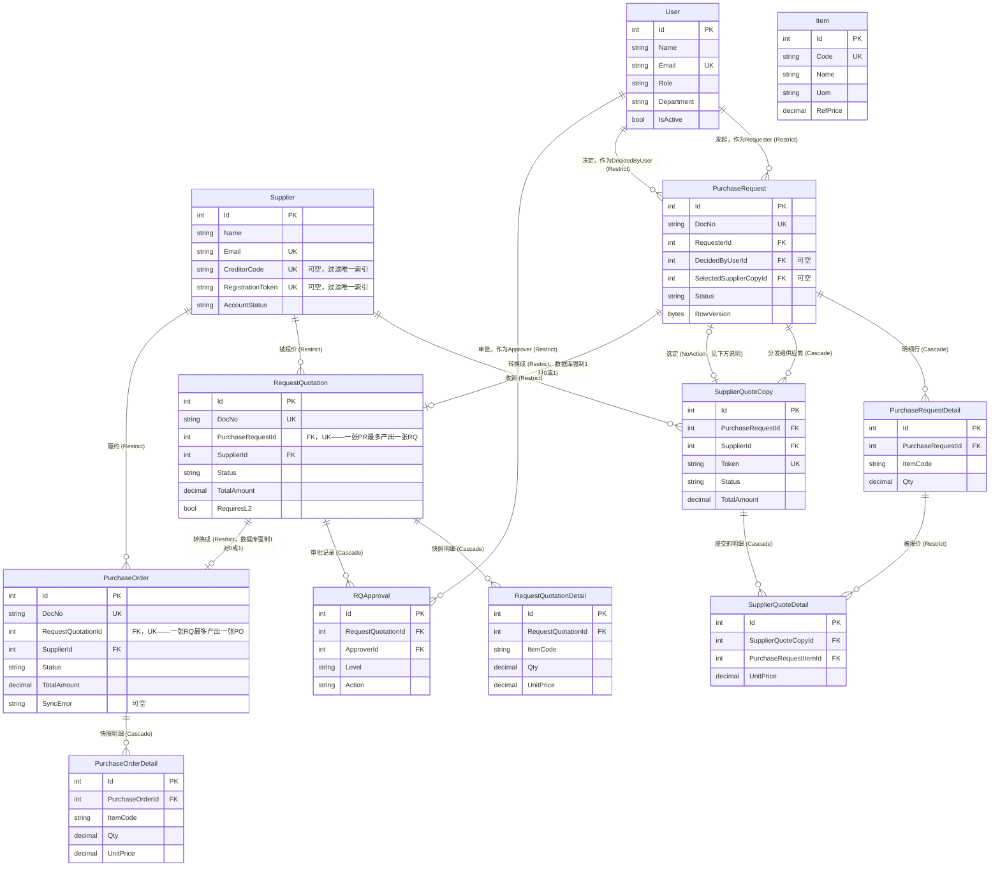

# PFP.Infrastructure

**PFP.Procurement采购系统的Infrastructure层。** 用EF Core 9 + Microsoft SQL Server，实现`PFP.Application`定义的持久化、外部集成、横切服务契约。

| | |
|---|---|
| 项目 | `PFP.Infrastructure` |
| 依赖 | `PFP.Application`（以及间接地，`PFP.Domain`） |
| 被谁依赖 | `PFP.Host` |
| 状态 | 已经端到端接通：`PFP.Host/Program.cs`已经注册DI，14个`IEntityTypeConfiguration<T>`和8个Repository+`UnitOfWork`全部实现，`InitialCreate`迁移已经应用到真实的SQL Server LocalDB数据库（`PFP_Procurement`）上。还剩下的缺口：`AutoCountService`（真实HTTP客户端）、`ApplicationDbContextSeed`、`ApplicationDbContextFactory`、`Properties/PublishProfiles.cs`还是空壳——见第8节。 |
| 读者 | 第一次接触这个项目的任何人 |

Application层的架构说明记录在`PFP.Application/Application.zh.md`；Domain实体和枚举记录在`PFP.Domain/Domain.zh.md`；每一个`IEntityTypeConfiguration<T>`的详细设计记录在本项目自己的`Configurations.zh.md`；每一个Repository的详细设计记录在`Repositories.zh.md`。这份文档是入口——从这里开始看，再跳去对应的详细文档。

---

## 目录

1. [这个项目提供的服务](#1-这个项目提供的服务)
2. [在整体架构中的位置](#2-在整体架构中的位置)
3. [实体关系图](#3-实体关系图)
4. [完整目录结构](#4-完整目录结构)
5. [各文件夹职责](#5-各文件夹职责)
6. [数据库和本地环境](#6-数据库和本地环境)
7. [持久化规范](#7-持久化规范)
8. [实现状态](#8-实现状态)
9. [已知问题](#9-已知问题)
10. [项目依赖](#10-项目依赖)

---

## 1. 这个项目提供的服务

下面每一行都是`PFP.Application`声明的一个能力接口，这个项目负责把它变成真的。想知道"Infrastructure到底给系统其余部分提供了什么"，看这张表最快：

| 能力 | 对应接口（定义在`PFP.Application`） | 在这个项目里的位置 | 具体做什么 |
|---|---|---|---|
| 读写9个聚合根 | `IUserRepository`、`ISupplierRepository`、`IItemRepository`、`IApprovalSettingRepository`、`IPurchaseRequestRepository`、`ISupplierQuoteRepository`、`IRequestQuotationRepository`、`IPurchaseOrderRepository` | `Persistence/Repositories/` | 每个都包一层`ApplicationDbContext`；带子集合的实体（`PurchaseRequest`、`RequestQuotation`、`PurchaseOrder`）对应的Repository用`.Include()`一起查出来。完整的逐Repository设计见`Repositories.zh.md`。 |
| 把多个Repository的改动原子性地一起提交 | `IUnitOfWork` | `Persistence/UnitOfWork.cs` | 一个`SaveChangesAsync()`，转发给底层`DbContext`。 |
| 数据库schema本身 | — | `Persistence/Database/ApplicationDbContext.cs`、`Persistence/Configurations/` | 14个`DbSet<T>`，每个实体一个`IEntityTypeConfiguration<T>`，全部已实现。完整的逐实体设计见`Configurations.zh.md`。 |
| 系统运行必须的种子数据 | — | `Persistence/Database/Seed/ApplicationDbContextSeed.cs` | **还没实现**——仍是空壳。至少需要铺两条必须存在的`ApprovalSetting`记录（`L1`、`L2`）；见"已知问题"第6条。 |
| 跟AutoCount的pull/push对接 | `IAutoCountService` | `Integrations/AutoCount/` | `MockAutoCountService`（现在真正注册使用的）返回空列表/假成功结果，让所有依赖`IAutoCountService`的流程在本地不接真实AutoCount的情况下也能跑通。`AutoCountService`（占位）等AutoCount真实的API（端点、鉴权、请求/响应格式）文档到手才能真正写。 |
| 发邮件 | `IEmailService` | `Email/SmtpEmailService.cs` | 已实现——通过`System.Net.Mail.SmtpClient`走SMTP协议发信，用`EmailOptions`配置。服务器账号密码通过`appsettings.json`/环境变量提供，不是写死在代码里。 |
| 知道当前调用者是谁 | `ICurrentUserService` | `Identity/CurrentUserService.cs` | 已实现——通过`IHttpContextAccessor`，从当前`HttpContext`上的JWT claims里读出`UserId`/`SupplierId`/`Role`/`IsAuthenticated`。 |
| 密码哈希 | `IPasswordHasher` | `Identity/PasswordHasher.cs` | 已实现——包一层`Microsoft.AspNetCore.Identity.PasswordHasher<T>`（PBKDF2），来自轻量级的`Microsoft.Extensions.Identity.Core`包。泛型类型参数用了一个用完即扔的`object`，因为默认算法根本不会去检查这个"用户"参数。 |
| 签发JWT | `ITokenService` | `Identity/JwtTokenService.cs` | 已实现——生成带`UserId`/`SupplierId`/`Email`/`Role` claims的签名JWT（`HmacSha256`），用`JwtOptions`配置。 |
| 生成连续的单据编号（`PR-2026-00001`这种） | `IDocumentNumberGenerator` | `Persistence/DocumentNumbers/SequentialDocumentNumberGenerator.cs` | 已实现——对`counters`表做原子的`UPDATE ... OUTPUT`（原始SQL，绕过change tracker，不会提前把调用它的Handler自己那些还没提交的改动一起冲掉）。 |

---

## 2. 在整体架构中的位置

```
PFP.Host  ->  PFP.Infrastructure  ->  PFP.Application  ->  PFP.Domain
```

`PFP.Infrastructure`是整个解决方案里唯一允许引用EF Core、数据库provider、以及其它任何具体外部系统SDK的项目。它实现`PFP.Application/Abstractions/`和`PFP.Application/Integrations/`下声明的每一个接口，并暴露一个`AddInfrastructureServices(IConfiguration)`扩展方法，在`PFP.Host/Program.cs`里跟`AddApplicationServices()`一起被调用。

---

## 3. 实体关系图

这张图直接从已经应用到真实`PFP_Procurement`数据库的`InitialCreate`迁移（`Persistence/Migrations/`）生成——不是靠手工读实体类推出来的，所以它反映的是SQL Server现在真正在强制执行的东西，包括删除行为、唯一性约束，以及那两条曾经存疑、现在已经由真实唯一索引确认的"1对0或1"关系。`ApprovalSetting`（表名`approvalsettings`，以`Level`为主键）和`Counter`（表名`counters`，以`Name`为主键）不跟任何东西有外键关系，图上省略；具体列信息见`Configurations.zh.md`。



两件事值得明确说一下，都是对照真实已应用的schema确认过的：

- **`PurchaseRequest`和`SupplierQuoteCopy`互相引用对方。** `SupplierQuoteCopy.PurchaseRequestId`是"归属于"这个方向（`Cascade`）。`PurchaseRequest.SelectedSupplierCopyId`是回指"最终选定了哪一份"的引用，**不会**在同一个方向上也走级联（`NoAction`）——SQL Server会拒绝在同一对表之间建立第二条级联路径。完整说明见`Configurations.zh.md`第1节。
- **`PurchaseRequest -> RequestQuotation`和`RequestQuotation -> PurchaseOrder`现在都是真正的1对0或1关系，由数据库强制，不再只是一句业务规则上的期望。** 这在本文档更早的版本里还是一个待确认的开放问题，现在已经解决——C#实体里`PurchaseRequest.RequestQuotations`和`RequestQuotation.PurchaseOrder`现在都是单个可空的导航属性，而且已经应用的迁移在`requestquotations.PurchaseRequestId`和`purchaseorders.RequestQuotationId`上都加了`UNIQUE`索引（`IX_requestquotations_PurchaseRequestId`、`IX_purchaseorders_RequestQuotationId`），所以不管应用层代码怎么写，SQL Server自己就会拒绝任何一边出现第二行。

---

## 4. 完整目录结构

```
PFP.Infrastructure/
├── PFP.Infrastructure.csproj
├── DependencyInjection.cs
│
├── Persistence/
│   ├── Database/
│   │   ├── ApplicationDbContext.cs
│   │   ├── ApplicationDbContextFactory.cs           空壳——见"已知问题"
│   │   └── Seed/
│   │       └── ApplicationDbContextSeed.cs           空壳——见"已知问题"第6条
│   ├── Configurations/
│   │   ├── Commons/
│   │   │   ├── Users/UserConfiguration.cs
│   │   │   └── Suppliers/SupplierConfiguration.cs
│   │   ├── Items/ItemConfiguration.cs
│   │   ├── PurchaseRequests/
│   │   │   ├── PurchaseRequestConfiguration.cs
│   │   │   └── PurchaseRequestDetailConfiguration.cs
│   │   ├── SupplierQuotes/
│   │   │   ├── SupplierQuoteCopyConfiguration.cs
│   │   │   └── SupplierQuoteDetailConfiguration.cs
│   │   ├── RequestQuotations/
│   │   │   ├── RequestQuotationConfiguration.cs
│   │   │   ├── RequestQuotationDetailConfiguration.cs
│   │   │   └── RQApprovalConfiguration.cs
│   │   ├── PurchaseOrders/
│   │   │   ├── PurchaseOrderConfiguration.cs
│   │   │   └── PurchaseOrderDetailConfiguration.cs
│   │   ├── ApprovalSettingConfiguration.cs
│   │   ├── CounterConfiguration.cs
│   │   └── DatabaseValueConverter.cs
│   ├── Repositories/
│   │   ├── UserRepository.cs
│   │   ├── SupplierRepository.cs
│   │   ├── ItemRepository.cs
│   │   ├── ApprovalSettingRepository.cs
│   │   ├── PurchaseRequestRepository.cs
│   │   ├── SupplierQuoteRepository.cs
│   │   ├── RequestQuotationRepository.cs
│   │   └── PurchaseOrderRepository.cs
│   ├── DocumentNumbers/
│   │   └── SequentialDocumentNumberGenerator.cs
│   ├── Migrations/
│   │   ├── <timestamp>_InitialCreate.cs
│   │   ├── <timestamp>_InitialCreate.Designer.cs
│   │   └── ApplicationDbContextModelSnapshot.cs
│   └── UnitOfWork.cs
│
├── Integrations/
│   └── AutoCount/
│       ├── AutoCountService.cs                       空壳——真实客户端要等AutoCount API文档
│       └── MockAutoCountService.cs                   现在真正注册使用的，见DependencyInjection.cs
│
├── Email/
│   └── SmtpEmailService.cs
│
├── Identity/
│   ├── CurrentUserService.cs
│   ├── PasswordHasher.cs
│   └── JwtTokenService.cs
│
├── Options/
│   ├── AutoCountApiOptions.cs
│   ├── EmailOptions.cs
│   └── JwtOptions.cs
│
└── Properties/
    └── PublishProfiles.cs                            占位文件，见"已知问题"第4条
```

---

## 5. 各文件夹职责

### `Persistence/Database/`

- **`ApplicationDbContext.cs`**——EF Core的会话核心。每个实体暴露一个`DbSet<T>`，在`OnModelCreating`里通过`ApplyConfigurationsFromAssembly`接上`Configurations/`下的全部配置。
- **`ApplicationDbContextFactory.cs`**——还是空壳。本该实现`IDesignTimeDbContextFactory<ApplicationDbContext>`，只有直接在这个项目目录下跑`dotnet ef`、不带`--startup-project ../PFP.Host`参数时才用得上。实际操作中（见第6节），用`--startup-project`的方式已经成功生成并应用了`InitialCreate`，完全没用到这个文件，所以它还是个可以先放着的缺口，不是卡脖子的问题。
- **`Database/Seed/ApplicationDbContextSeed.cs`**——还是空壳。现在数据库真的建出来了，这个缺口就不只是面子问题了，具体见"已知问题"第6条。

### `Persistence/Configurations/`

每个实体一个`IEntityTypeConfiguration<T>`，分组方式照抄`PFP.Domain/Entities/`——14个全部已实现。每一个的完整设计细节都在本项目自己的`Configurations.zh.md`里，这里不重复。

### `Persistence/Repositories/`、`Persistence/UnitOfWork.cs`、`Persistence/DocumentNumbers/`

实现`PFP.Application/Abstractions/`里声明的8个Repository接口、`IUnitOfWork`、`IDocumentNumberGenerator`——全部已实现。逐Repository的设计见`Repositories.zh.md`，`SequentialDocumentNumberGenerator`的原子自增方案见本文档第1节。

### `Persistence/Migrations/`

由`dotnet ef migrations add`生成，不是手写的。现在有一个迁移，`InitialCreate`，已经应用到本地SQL Server LocalDB上的`PFP_Procurement`。

### `Integrations/AutoCount/`

跟Application层的`Integrations/AutoCount/`一一对应。`MockAutoCountService.cs`是现在真正注册使用的——它返回空列表和假的`Result<string>.Success(...)`，让所有依赖`IAutoCountService`的Handler在没有真实AutoCount连接的情况下也能跑起来。`AutoCountService.cs`是真实HTTP客户端的占位文件；除了`AutoCountApiOptions`上已经有的通用`BaseUrl`/`Company`/`Username`/`Password`字段之外，AutoCount真正的端点、鉴权方式、请求/响应格式现在都还不知道。

### `Email/SmtpEmailService.cs`

通过`System.Net.Mail.SmtpClient`实现`IEmailService`，用`EmailOptions`（`Host`、`Port`、`Username`、`Password`、`FromEmail`、`FromName`）配置。

### `Identity/`

- **`CurrentUserService.cs`**——通过`IHttpContextAccessor`读取当前请求`HttpContext.User`上的claims，实现`ICurrentUserService`。
- **`PasswordHasher.cs`**——包一层`Microsoft.AspNetCore.Identity.PasswordHasher<T>`，实现`IPasswordHasher`。
- **`JwtTokenService.cs`**——实现`ITokenService`，签发的JWT正是`CurrentUserService`后续要读取claims的那个token。

### `Options/`

走.NET的Options Pattern，从`appsettings.json`绑定出强类型的配置类（`IOptions<T>`），不是在代码里到处直接读`IConfiguration`散落的字符串key：`AutoCountApiOptions`、`EmailOptions`、`JwtOptions`。数据库连接字符串是唯一的例外——它在`DependencyInjection.AddDatabase`里直接用`IConfiguration.GetConnectionString("DefaultConnection")`读取，因为它只在一个地方被用到，包一层`Options`只会多一层没有复用价值的间接。

---

## 6. 数据库和本地环境

这个项目用**Microsoft SQL Server**，不是MySQL——这是从早期MySQL/Pomelo方案换过来的。选SQL Server的理由：

- 微软自己的`Microsoft.EntityFrameworkCore.SqlServer`provider版本更新永远跟着EF Core本体同步发布，不用像Pomelo那样追第三方进度。
- SQL Server原生有`rowversion`这个列类型，正是EF Core的`.IsRowVersion()`最初设计对应的目标。需要乐观并发控制的三个实体（`PurchaseRequest`、`RequestQuotation`、`PurchaseOrder`）直接用`byte[] RowVersion`+`.IsRowVersion()`，不需要任何备用方案。

### 本地开发环境搭建

| 需要什么 | 怎么满足 |
|---|---|
| SQL Server实例 | SQL Server **LocalDB**（`MSSQLLocalDB`），Visual Studio自带。用`sqllocaldb start MSSQLLocalDB`启动。 |
| 连接字符串 | `PFP.Host/appsettings.json` -> `ConnectionStrings:DefaultConnection` -> `Server=(localdb)\MSSQLLocalDB;Database=PFP_Procurement;Trusted_Connection=True;TrustServerCertificate=True;` |
| `dotnet-ef`命令行工具 | 版本必须跟项目的EF Core版本一致：`dotnet tool update -g dotnet-ef --version 9.0.9` |
| **启动项目**上要有`Microsoft.EntityFrameworkCore.Design` | `dotnet ef`要求`--startup-project`指向的那个项目（`PFP.Host`）自己也要引用这个包，不能只靠`DbContext`所在的项目引用它。缺了会报"doesn't reference Microsoft.EntityFrameworkCore.Design"。已经加到`PFP.Host.csproj`里了。 |
| 生成迁移 | `dotnet ef migrations add <名字> --project PFP.Infrastructure --startup-project PFP.Host --output-dir Persistence/Migrations` |
| 应用迁移 | `dotnet ef database update --project PFP.Infrastructure --startup-project PFP.Host` |

**当前状态**：`InitialCreate`已经生成并应用。`PFP_Procurement`已经在本地LocalDB实例上真实存在，带着第3节ERD里的全部14张表、外键、索引。以后不需要再手动重建数据库——`dotnet ef database update`是幂等的，只会应用`__EFMigrationsHistory`里还没记录过的迁移。

---

## 7. 持久化规范

| 场景 | 规范 | 理由 |
|---|---|---|
| 枚举类型的列 | `.HasConversion<string>()` | 数据库里存的是可读的值，也不怕以后枚举成员顺序变了导致数据错位。 |
| 可空列、但非空值之间要唯一 | 唯一索引加`.HasFilter("[列名] IS NOT NULL")` | SQL Server跟MySQL不一样——唯一索引里出现两个`NULL`会被当成违反约束。 |
| 乐观并发（`PurchaseRequest`、`RequestQuotation`、`PurchaseOrder`） | `byte[] RowVersion`+`.IsRowVersion()` | 直接映射到SQL Server原生的`rowversion`类型。 |
| 删除一个还有关联历史记录的`User`或`Supplier` | `.OnDelete(DeleteBehavior.Restrict)` | 防止一次误删连带把整条采购审计记录级联删掉。 |
| 同一对表之间存在两条关系（比如`PurchaseRequest`<->`SupplierQuoteCopy`） | 只能有一个方向能级联 | SQL Server拒绝在同一对表之间建第二条级联路径。 |
| "一"的那一侧有真实集合导航的多对一关系（比如`Supplier.PurchaseOrders`） | 显式写`.WithMany(x => x.PurchaseOrders)`，永远不要用不带参数的`.WithMany()` | 有真实集合存在的情况下，不带参数的`.WithMany()`不会绑定到它——EF Core会转而为这个集合自动发现一条*另外的*、没配置过的关系，然后建出一个幽灵shadow外键列（比如`SupplierId1`），跟真的那个外键并存。这个bug是在生成`InitialCreate`时，被`PurchaseOrderConfiguration.cs`和`RequestQuotationConfiguration.cs`里发现并修掉的——EF的模型校验警告直接点名了它。 |
| 聚合根的`GetByIdAsync`带子集合 | `.Include(...)`带出子集合 | Handler期待拿到完整的聚合根。 |

完整的逐实体细节（表名、字段长度、具体索引）在`Configurations.zh.md`。

---

## 8. 实现状态

| 部分 | 状态 |
|---|---|
| `PFP.Infrastructure.csproj` | 已配置：`net11.0`，`FrameworkReference`指向`Microsoft.AspNetCore.App`（给`CurrentUserService`用的`IHttpContextAccessor`/`HttpContext`，顺带让`Microsoft.Extensions.Identity.Core`的`PasswordHasher<T>`也能用），EF Core 9.0.9（Core、Design、SqlServer），`System.IdentityModel.Tokens.Jwt` 8.5.0，`ProjectReference`指向`PFP.Application` |
| `Persistence/Database/ApplicationDbContext.cs` | 已实现——14个`DbSet<T>`全部暴露，`ApplyConfigurationsFromAssembly`已接好 |
| `Persistence/Database/ApplicationDbContextFactory.cs` | 空壳——没用到，`--startup-project`这条路不需要它（见第6节） |
| `Persistence/Database/Seed/ApplicationDbContextSeed.cs` | 空壳——见"已知问题"第6条 |
| 全部14个`Configuration`文件 | 已实现 |
| `Persistence/Repositories/`（8个文件）+`UnitOfWork.cs` | 已实现——见`Repositories.zh.md` |
| `Persistence/DocumentNumbers/SequentialDocumentNumberGenerator.cs` | 已实现 |
| `Persistence/Migrations/` | `InitialCreate`已生成并应用到`PFP_Procurement` |
| `Identity/CurrentUserService.cs`、`Identity/PasswordHasher.cs`、`Identity/JwtTokenService.cs` | 已实现 |
| `Email/SmtpEmailService.cs` | 已实现 |
| `Integrations/AutoCount/MockAutoCountService.cs` | 已实现，注册为`IAutoCountService` |
| `Integrations/AutoCount/AutoCountService.cs` | 空壳——等AutoCount真实API契约 |
| `Options/AutoCountApiOptions.cs`、`Options/EmailOptions.cs`、`Options/JwtOptions.cs` | 已实现 |
| `DependencyInjection.cs` | 已实现——注册数据库、全部8个Repository+`UnitOfWork`、身份认证相关服务、邮件、单据编号生成、以及AutoCount（现在是mock）。在`PFP.Host/Program.cs`里以`AddInfrastructureServices(builder.Configuration)`被调用，同时旁边也调用了`AddHttpContextAccessor()`。 |
| `Properties/PublishProfiles.cs` | 遗留的空壳文件——见"已知问题"第4条 |

**给准备运行这个项目的人的提醒**：整个解决方案能编译通过，`PFP.Host`也能带着完整的持久化和身份认证这套东西、对着一个真实数据库启动起来。但还有两件事限制了端到端真正能跑起来的程度：（1）`ApplicationDbContextSeed`还没实现，所以一个全新的数据库里没有`ApprovalSetting`记录，而好几个计划中的Handler要依赖它们；（2）`PFP.Application`里大部分`Features/`下的Handler方法体本身还是空壳（见`Application.zh.md`），所以哪怕下面每一层都能编译、都能被访问到，现在还没有一个HTTP端点是真正在做事的。

---

## 9. 已知问题

对照本文档跟真实源码核对、以及生成/应用第一个迁移的过程中发现的问题。

| 编号 | 位置 | 问题 |
|---|---|---|
| 1 | `ApplicationDbContext.SupplierQuoteCopies`/`PurchaseRequests`/`PurchaseRequestDetails`命名 | 已解决——之前大小写/拼写有问题，现在已经改对。 |
| 2 | `ApplicationDbContext`给全部14个实体都暴露了`DbSet<T>`，包括5个子实体 | 还没解决。`Application.zh.md`记录的设计原则是"每个聚合根一个Repository"，目的就是让子实体只能通过它所属聚合根的Repository被访问。直接暴露子实体的`DbSet<T>`，给以后的代码留了一条绕过这个边界的路——建议明确决定要不要保留这些公开属性，还是改成`internal`。 |
| 3 | `PFP.Infrastructure/DependencyInjection.cs` | 已解决，但过程值得记一笔：这个文件其实一直存在，只不过是`PFP.Application/DependencyInjection.cs`的一份误放的复制品（命名空间写成`PFP.Application`，方法名也是`AddApplicationServices`）——一旦`PFP.Host`同时引用这两个项目，就会触发一个二义性调用的编译错误（CS0121）。已经换成了真正的`PFP.Infrastructure.DependencyInjection.AddInfrastructureServices`。 |
| 4 | `Properties/PublishProfiles.cs` | 还没解决。一个普通的空类模板，不是文件名和位置暗示的那种`.pubxml`发布配置文件夹。等真的要配置部署时处理。 |
| 5 | `PurchaseRequest.RequestQuotations`/`RequestQuotation.PurchaseOrder`的基数 | 已解决——C#实体里两边现在都是单个可空的导航属性，已经应用的迁移里也有真实的`UNIQUE`索引在数据库层面强制1对0或1（`IX_requestquotations_PurchaseRequestId`、`IX_purchaseorders_RequestQuotationId`）。见第3节。 |
| 6 | `ApplicationDbContextSeed.cs`还是个空壳 | 数据库现在是真的存在了，但里面没有任何种子数据。至少需要两条必须存在的`ApprovalSetting`记录（`L1`、`L2`）——好几个Handler要靠它们解析`ApproverRole`。`SequentialDocumentNumberGenerator`虽然也有一条"`Counter`行不存在时"的兜底路径，但如果在这里提前把`PR`/`RQ`/`PO`三条种子数据铺好，那条兜底路径在实际运行中基本就是永远走不到的死代码，而不是一个真正会被用到的后备方案。 |
| 7 | 不带参数的`.WithMany()`，但"一"的那一侧其实有真实的集合导航 | 已发现并修复。`PurchaseOrderConfiguration.cs`和`RequestQuotationConfiguration.cs`配置`Supplier`关系时都用了不带参数的`.WithMany()`，尽管`Supplier.PurchaseOrders`/`Supplier.RequestQuotations`是真实存在的集合。跑`dotnet ef migrations add`时EF Core的模型校验直接给出警告（建出了`SupplierId1`这个shadow属性）抓到了这个问题；把两处都改成指向真实的导航属性后修复。见第7节的规范表。 |
| 8 | `ItemConfiguration.cs`映射到了表`itmes` | 已解决——纯粹的拼写错误，在应用迁移时读生成的`CREATE TABLE`语句时发现的；发现时数据库还没真正建出来，直接改成`items`后重新生成迁移，不需要额外写一个改名迁移。 |

第2条是一个需要在更多`Features/`里的Handler开始依赖现在这套`DbSet<T>`之前认真决定的架构问题。第4条是收尾整理的事。第6条会让一个真正全新的环境跑不对——不只是面子问题了，因为数据库现在是真的了。

---

## 10. 项目依赖

- `ProjectReference` -> `PFP.Application`
- `FrameworkReference` -> `Microsoft.AspNetCore.App`（`CurrentUserService`要用的`IHttpContextAccessor`/`HttpContext`需要它；顺带也让`Microsoft.Extensions.Identity.Core`的`PasswordHasher<T>`不用额外引用包就能用）
- NuGet：`Microsoft.EntityFrameworkCore` 9.0.9、`Microsoft.EntityFrameworkCore.Design` 9.0.9、`Microsoft.EntityFrameworkCore.SqlServer` 9.0.9、`System.IdentityModel.Tokens.Jwt` 8.5.0
- 全局工具：`dotnet-ef` 9.0.9（必须跟上面的EF Core包版本保持一致）
- 跨项目提醒：`PFP.Host.csproj`自己也要有`Microsoft.EntityFrameworkCore.Design`引用，以及一条指向`PFP.Infrastructure`的`ProjectReference`——`dotnet ef`要求Design包必须在启动项目上，不能只在`DbContext`所在的项目上。见第6节。
