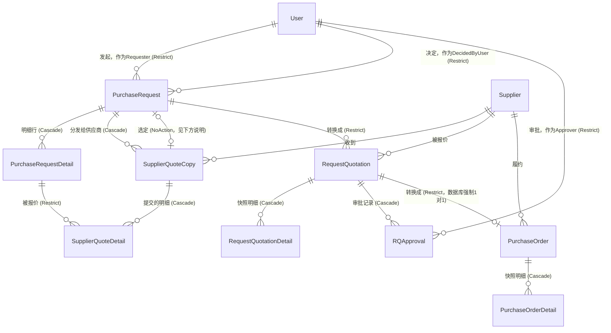

# PFP.Infrastructure

**PFP.Procurement采购系统的Infrastructure层。** 用EF Core 9 + Microsoft SQL Server，实现`PFP.Application`定义的持久化、外部集成、横切服务契约。

| | |
|---|---|
| 项目 | `PFP.Infrastructure` |
| 依赖 | `PFP.Application`（以及间接地，`PFP.Domain`） |
| 被谁依赖 | `PFP.Host`（还没接线） |
| 状态 | 文件夹骨架已完整搭建；约30个文件里只有3个有真实内容 |
| 读者 | 第一次接触这个项目的任何人 |

Application层的架构说明记录在`PFP.Application/Application.zh.md`；Domain实体和枚举记录在`PFP.Domain/Domain.zh.md`；每一个`IEntityTypeConfiguration<T>`的详细设计记录在本项目自己的`Configurations.zh.md`。这份文档是入口——从这里开始看，再跳去对应的详细文档。

---

## 目录

1. [这个项目提供的服务](#1-这个项目提供的服务)
2. [在整体架构中的位置](#2-在整体架构中的位置)
3. [实体关系图](#3-实体关系图)
4. [完整目录结构](#4-完整目录结构)
5. [各文件夹职责](#5-各文件夹职责)
6. [数据库和本地环境](#6-数据库和本地环境)
7. [持久化规范](#7-持久化规范)
8. [实现状态](#8-实现状态)
9. [已知问题](#9-已知问题)
10. [项目依赖](#10-项目依赖)

---

## 1. 这个项目提供的服务

下面每一行都是`PFP.Application`声明的一个能力接口，这个项目负责把它变成真的。想知道"Infrastructure到底给系统其余部分提供了什么"，看这张表最快：

| 能力 | 对应接口（定义在`PFP.Application`） | 在这个项目里的位置 | 具体做什么 |
|---|---|---|---|
| 读写9个聚合根 | `IUserRepository`、`ISupplierRepository`、`IItemRepository`、`IApprovalSettingRepository`、`IPurchaseRequestRepository`、`ISupplierQuoteRepository`、`IRequestQuotationRepository`、`IPurchaseOrderRepository` | `Persistence/Repositories/` | 每个都包一层`ApplicationDbContext`；带子集合的两个实体（`PurchaseRequest`、`RequestQuotation`）对应的Repository用`.Include()`一起查出来。 |
| 把多个Repository的改动原子性地一起提交 | `IUnitOfWork` | `Persistence/UnitOfWork.cs` | 一个`SaveChangesAsync()`，转发给底层`DbContext`。 |
| 数据库schema本身 | — | `Persistence/Database/ApplicationDbContext.cs`、`Persistence/Configurations/` | 14个`DbSet<T>`，每个实体一个`IEntityTypeConfiguration<T>`。完整的逐实体设计见`Configurations.zh.md`。 |
| 系统运行必须的种子数据 | — | `Persistence/Seed/ApplicationDbContextSeed.cs` | 铺两条必须存在的`ApprovalSetting`记录（`L1`、`L2`）。 |
| 跟AutoCount的pull/push对接 | `IAutoCountService` | `Integrations/AutoCount/` | `MockAutoCountService`（现在真正注册使用的）返回假数据；`AutoCountService`（占位）等AutoCount的API文档到手才能真正写。 |
| 发邮件 | `IEmailService` | `Email/SmtpEmailService.cs` | 走SMTP协议发信。服务器账号密码是客户自己在设置页填进去的，不是写死在这里（这个设置页的缺口记录在`Application.zh.md`）。 |
| 知道当前调用者是谁 | `ICurrentUserService` | `Identity/CurrentUserService.cs` | 从当前会话读出`UserId`/`SupplierId`/`Role`/`IsAuthenticated`。 |
| 生成连续的单据编号（`PR-2026-0001`这种） | `IDocumentNumberGenerator` | *尚未建立* | 计划放在`Services/SequentialDocumentNumberGenerator.cs`——见第9节。 |
| 密码哈希 | `IPasswordHasher` | *不在这个项目里* | 实现在`PFP.Application`自己项目里——它是个纯函数，没有I/O，不需要Infrastructure层的隔离。这里提一句是为了不让人跑错项目去找它。 |

---

## 2. 在整体架构中的位置

```
PFP.Host (还没接线)  ->  PFP.Infrastructure  ->  PFP.Application  ->  PFP.Domain
```

`PFP.Infrastructure`是整个解决方案里唯一允许引用EF Core、数据库provider、以及其它任何具体外部系统SDK的项目。它实现`PFP.Application/Abstractions/`和`PFP.Application/Integrations/`下声明的每一个接口，并暴露一个`AddInfrastructureServices()`扩展方法，供`PFP.Host`启动时调用。

---

## 3. 实体关系图

14个实体的完整关系，标注了每个关系设计上该用的删除行为（具体理由见`Configurations.zh.md`）。`ApprovalSetting`和`Counter`不跟任何东西有外键关系，图上省略。



这张图让两件容易被逐个实体看漏的事变得直观：

- **`PurchaseRequest`和`SupplierQuoteCopy`互相引用对方。** `SupplierQuoteCopy.PurchaseRequestId`是"归属于"这个方向（级联）。`PurchaseRequest.SelectedSupplierCopyId`是回指"最终选定了哪一份"的引用，**不能**在同一对表之间也走级联——SQL Server会拒绝在同一对表之间建立第二条级联路径。完整说明见`Configurations.zh.md`第1节。
- **图上画成"1对多"的两条关系，业务上其实该是"1对0或1"**：`PurchaseRequest -> RequestQuotation`和`RequestQuotation -> PurchaseOrder`。现在C#的导航属性类型都是集合；`Configurations.zh.md`在`PurchaseOrder`那一节记录了应对方案（`RequestQuotationId`加唯一索引，不管C#类型对不对，数据库层面强制RQ到PO这条1对1约束），PR到RQ这条目前还是一个待确认的开放问题。不要假设图上每一条`o{`都代表"真的没有上限"——写对应`Configuration`文件之前先去查`Configurations.zh.md`。

---

## 4. 完整目录结构

```
PFP.Infrastructure/
├── PFP.Infrastructure.csproj
├── DependencyInjection.cs                          尚未建立
│
├── Persistence/
│   ├── Database/
│   │   ├── ApplicationDbContext.cs
│   │   └── ApplicationDbContextFactory.cs
│   ├── Seed/
│   │   └── ApplicationDbContextSeed.cs
│   ├── Configurations/
│   │   ├── Commons/
│   │   │   ├── Users/UserConfiguration.cs
│   │   │   └── Suppliers/SupplierConfiguration.cs
│   │   ├── Items/ItemConfiguration.cs
│   │   ├── PurchaseRequests/
│   │   │   ├── PurchaseRequestConfiguration.cs
│   │   │   └── PurchaseRequestDetailConfiguration.cs
│   │   ├── SupplierQuotes/
│   │   │   ├── SupplierQuoteCopyConfiguration.cs
│   │   │   └── SupplierQuoteDetailConfiguration.cs
│   │   ├── RequestQuotations/
│   │   │   ├── RequestQuotationConfiguration.cs
│   │   │   ├── RequestQuotationDetailConfiguration.cs
│   │   │   └── RQApprovalConfiguration.cs
│   │   ├── PurchaseOrders/
│   │   │   ├── PurchaseOrderConfiguration.cs
│   │   │   └── PurchaseOrderDetailConfiguration.cs
│   │   ├── ApprovalSettingConfiguration.cs
│   │   ├── CounterConfiguration.cs
│   │   └── DatabaseValueConverter.cs
│   ├── Repositories/
│   │   ├── UserRepository.cs
│   │   ├── SupplierRepository.cs
│   │   ├── ItemRepository.cs
│   │   ├── ApprovalSettingRepository.cs
│   │   ├── PurchaseRequestRepository.cs
│   │   ├── SupplierQuoteRepository.cs
│   │   ├── RequestQuotationRepository.cs
│   │   └── PurchaseOrderRepository.cs
│   └── UnitOfWork.cs
│
├── Integrations/
│   └── AutoCount/
│       ├── AutoCountService.cs
│       └── MockAutoCountService.cs
│
├── Email/
│   └── SmtpEmailService.cs
│
├── Identity/
│   └── CurrentUserService.cs
│
├── Options/
│   ├── AutoCountApiOptions.cs
│   └── DatabaseOptions.cs
│
└── Properties/
    └── PublishProfiles.cs                          占位文件，见"已知问题"第4条
```

`Services/SequentialDocumentNumberGenerator.cs`和`Migrations/`都还没建立——见第1节和第8节。

---

## 5. 各文件夹职责

### `Persistence/Database/`

- **`ApplicationDbContext.cs`**——EF Core的会话核心。每个实体暴露一个`DbSet<T>`，在`OnModelCreating`里通过`ApplyConfigurationsFromAssembly`接上`Configurations/`下的全部配置。
- **`ApplicationDbContextFactory.cs`**——实现`IDesignTimeDbContextFactory<ApplicationDbContext>`。只有直接在这个项目目录下跑`dotnet ef`、不带`--startup-project ../PFP.Host`参数时才用得上；现在采用的`--startup-project`方式用不上它，留着当备用方案。

### `Persistence/Seed/ApplicationDbContextSeed.cs`

铺两条系统必须存在的`ApprovalSetting`记录（`L1`、`L2`），没有这两条系统跑不起来。必须写成幂等。

### `Persistence/Configurations/`

每个实体一个`IEntityTypeConfiguration<T>`，分组方式照抄`PFP.Domain/Entities/`。每一个的完整设计细节——包括还没写的那些——都在本项目自己的`Configurations.zh.md`里，这里不重复。

### `Persistence/Repositories/`和`Persistence/UnitOfWork.cs`

实现`PFP.Application/Abstractions/Persistence/`里声明的8个Repository接口和`IUnitOfWork`。速览见第1节，哪些Repository需要`.Include()`见第3节。

### `Integrations/AutoCount/`

跟Application层的`Integrations/AutoCount/`一一对应。`MockAutoCountService.cs`是现在真正注册使用的，`AutoCountService.cs`是真实客户端的占位文件。

### `Email/SmtpEmailService.cs`

实现`IEmailService`，走SMTP协议发信。

### `Identity/CurrentUserService.cs`

实现`ICurrentUserService`，具体用Cookie还是Token，等`PFP.WebApi`的认证方案定下来才能确定。

### `Options/`

走.NET的Options Pattern，从`appsettings.json`绑定出强类型的配置类（`IOptions<T>`），不是在代码里到处直接读`IConfiguration`散落的字符串key。

---

## 6. 数据库和本地环境

这个项目用**Microsoft SQL Server**，不是MySQL——这是从早期MySQL/Pomelo方案换过来的（原因见第9节"已知问题"）。选SQL Server的理由：

- 微软自己的`Microsoft.EntityFrameworkCore.SqlServer`provider版本更新永远跟着EF Core本体同步发布，不用像Pomelo那样追第三方进度。
- SQL Server原生有`rowversion`这个列类型，正是EF Core的`.IsRowVersion()`最初设计对应的目标。需要乐观并发控制的三个实体（`PurchaseRequest`、`RequestQuotation`、`PurchaseOrder`）可以直接用`byte[] RowVersion`+`.IsRowVersion()`，不需要任何备用方案。

### 本地开发环境搭建

| 需要什么 | 怎么满足 |
|---|---|
| SQL Server实例 | SQL Server **LocalDB**（`MSSQLLocalDB`），Visual Studio自带。用`sqllocaldb start MSSQLLocalDB`启动。 |
| 连接字符串 | `PFP.Host/appsettings.json` -> `ConnectionStrings:DefaultConnection` -> `Server=(localdb)\MSSQLLocalDB;Database=PFP_Procurement;Trusted_Connection=True;TrustServerCertificate=True;` |
| `dotnet-ef`命令行工具 | 版本必须跟项目的EF Core版本一致：`dotnet tool update -g dotnet-ef --version 9.0.9` |
| 生成迁移 | `dotnet ef migrations add <名字> --startup-project ../PFP.Host`（在本项目目录下跑） |
| 应用迁移 | `dotnet ef database update --startup-project ../PFP.Host` |

目标数据库（`PFP_Procurement`）不需要手动建——第一次跑`dotnet ef database update`时EF Core会自动建出来。

---

## 7. 持久化规范

| 场景 | 规范 | 理由 |
|---|---|---|
| 枚举类型的列 | `.HasConversion<string>()` | 数据库里存的是可读的值，也不怕以后枚举成员顺序变了导致数据错位。 |
| 可空列、但非空值之间要唯一 | 唯一索引加`.HasFilter("[列名] IS NOT NULL")` | SQL Server跟MySQL不一样——唯一索引里出现两个`NULL`会被当成违反约束。 |
| 乐观并发（`PurchaseRequest`、`RequestQuotation`、`PurchaseOrder`） | `byte[] RowVersion`+`.IsRowVersion()` | 直接映射到SQL Server原生的`rowversion`类型。 |
| 删除一个还有关联历史记录的`User`或`Supplier` | `.OnDelete(DeleteBehavior.Restrict)` | 防止一次误删连带把整条采购审计记录级联删掉。 |
| 同一对表之间存在两条关系（比如`PurchaseRequest`<->`SupplierQuoteCopy`） | 只能有一个方向能级联 | 见第3节——SQL Server拒绝在同一对表之间建第二条级联路径。 |
| 聚合根的`GetByIdAsync`带子集合 | `.Include(...)`带出子集合 | Handler期待拿到完整的聚合根。 |

完整的逐实体细节（表名、字段长度、具体索引）在`Configurations.zh.md`。

---

## 8. 实现状态

| 部分 | 状态 |
|---|---|
| `PFP.Infrastructure.csproj` | 已配置：`net11.0`，EF Core 9.0.9（Core、Design、SqlServer），`ProjectReference`指向`PFP.Application` |
| `Persistence/Database/ApplicationDbContext.cs` | 已实现——14个`DbSet<T>`全部暴露，`ApplyConfigurationsFromAssembly`已接好 |
| `Persistence/Database/ApplicationDbContextFactory.cs` | 空壳 |
| `UserConfiguration.cs`、`SupplierConfiguration.cs` | 已实现 |
| 其余12个`Configuration`文件 | 空壳——设计已经在`Configurations.zh.md`里准备好 |
| `Persistence/Repositories/`（8个文件）+`UnitOfWork.cs` | 空壳——设计已经准备好（见本文档第1节） |
| `Persistence/Seed/ApplicationDbContextSeed.cs` | 空壳 |
| `Integrations/AutoCount/*`、`Email/SmtpEmailService.cs`、`Identity/CurrentUserService.cs` | 空壳 |
| `Options/AutoCountApiOptions.cs`、`Options/DatabaseOptions.cs` | 空壳 |
| `DependencyInjection.cs` | 尚未建立 |
| `Services/SequentialDocumentNumberGenerator.cs`（实现`IDocumentNumberGenerator`） | 尚未建立 |
| `Migrations/` | 尚未建立——一次迁移都还没生成 |

**给准备运行这个项目的人的提醒**：目前什么都还没接进DI容器。`DependencyInjection.cs`不存在、也没被`Program.cs`调用之前，`PFP.Host`没法启动持久化这一层。

---

## 9. 已知问题

对照本文档跟真实源码核对时发现的问题。

| 编号 | 位置 | 问题 |
|---|---|---|
| 1 | `ApplicationDbContext.SupplierQuoteCopies`/`PurchaseRequests`/`PurchaseRequestDetails`命名 | 已解决——之前大小写/拼写有问题，现在已经改对。 |
| 2 | `ApplicationDbContext`给全部14个实体都暴露了`DbSet<T>`，包括5个子实体 | `Application.zh.md`记录的设计原则是"每个聚合根一个Repository"，目的就是让子实体只能通过它所属聚合根的Repository被访问。直接暴露子实体的`DbSet<T>`，给以后的代码留了一条绕过这个边界的路——建议明确决定要不要保留这些公开属性，还是改成`internal`。 |
| 3 | `PFP.Infrastructure/DependencyInjection.cs` | 不存在。这个项目里写好的每一个实现，目前`PFP.Host`都碰不到，直到这个文件被建出来并且注册它们。 |
| 4 | `Properties/PublishProfiles.cs` | 一个普通的空类模板，不是文件名和位置暗示的那种`.pubxml`发布配置文件夹。等真的要配置部署时处理。 |
| 5 | `PurchaseRequest.RequestQuotations`的基数 | 见第3节——很可能应该是1对0或1，不是1对多；还没确认。 |

第2条是一个需要在`Features/`里的Handler开始依赖现在这套`DbSet<T>`之前认真决定的架构问题。第3条会导致整个应用起不来。第4条是收尾整理的事。第5条需要业务规则确认。

---

## 10. 项目依赖

- `ProjectReference` -> `PFP.Application`
- NuGet：`Microsoft.EntityFrameworkCore` 9.0.9、`Microsoft.EntityFrameworkCore.Design` 9.0.9、`Microsoft.EntityFrameworkCore.SqlServer` 9.0.9
- 全局工具：`dotnet-ef` 9.0.9（必须跟上面的EF Core包版本保持一致）
