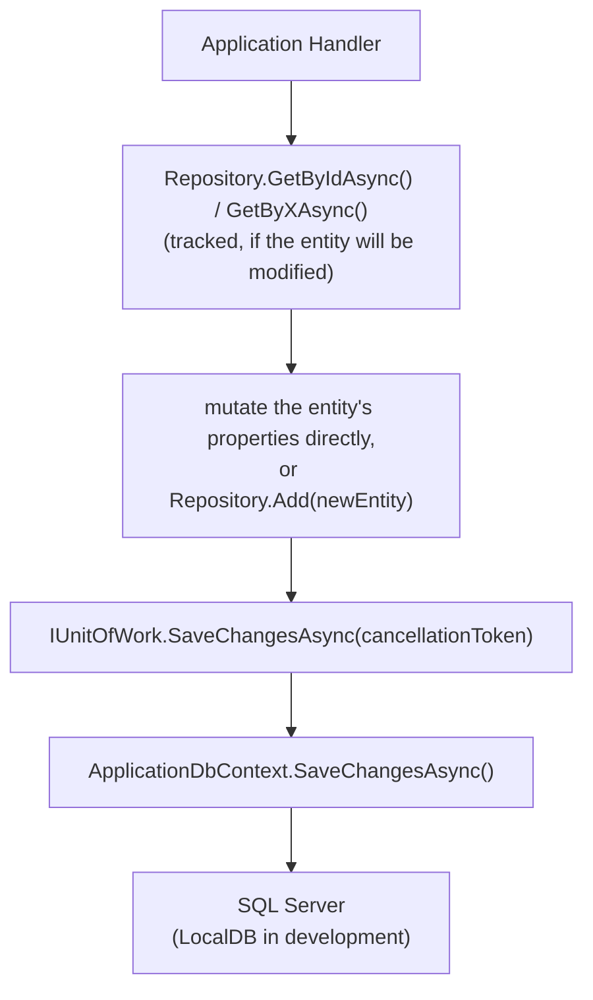
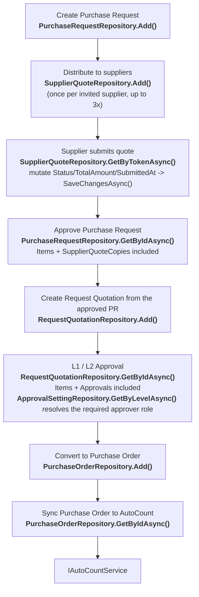

# Repositories — Design Reference

**One section per repository, covering every implementation under `Persistence/Repositories/`.** All eight are implemented and wired into DI (`DependencyInjection.cs`) as of this writing — see `Infrastructure.md` for overall project status. Writing the `Features/` Handler bodies that call them is still open work; the Handler classes referenced throughout this document exist as scaffolds (correct namespace, correct name, empty body) that establish which repository method each one is intended to call.

Each repository implements the interface of the same name declared in `PFP.Application/Abstractions/Persistence/`. This document assumes the conventions below and does not repeat them per repository; only what is specific to each one is called out.

---

## Table of Contents

1. [Conventions Shared By Every Repository](#1-conventions-shared-by-every-repository)
2. [UserRepository](#2-userrepository) — implemented
3. [SupplierRepository](#3-supplierrepository) — implemented
4. [ItemRepository](#4-itemrepository) — implemented
5. [ApprovalSettingRepository](#5-approvalsettingrepository) — implemented
6. [PurchaseRequestRepository](#6-purchaserequestrepository) — implemented
7. [SupplierQuoteRepository](#7-supplierquoterepository) — implemented
8. [RequestQuotationRepository](#8-requestquotationrepository) — implemented
9. [PurchaseOrderRepository](#9-purchaseorderrepository) — implemented
10. [Unit of Work and Transaction Boundary](#10-unit-of-work-and-transaction-boundary)
11. [Repository Design Rule](#11-repository-design-rule)
12. [Repository-to-Use-Case Reference Table](#12-repository-to-use-case-reference-table)
13. [End-to-End Procurement Flow](#13-end-to-end-procurement-flow)

---

## 1. Conventions Shared By Every Repository

| Rule | Why |
|---|---|
| `internal sealed class`, primary constructor over `ApplicationDbContext` | Nothing outside `PFP.Infrastructure` should ever hold a concrete repository type — only the interface, resolved through DI. |
| `CancellationToken` is a required parameter, never `= default` | Every caller is a `Features/` Handler, and `IRequestHandler.Handle` already hands the Handler a real token with no default of its own. Making the repository parameter optional buys no real convenience here and makes it easier to silently drop cancellation on one call. |
| List-returning methods return `Task<IReadOnlyList<T>>`, not `Task<List<T>>` | Signals a read-only view to the caller and does not leak the concrete collection type. |
| No `Update(T entity)` method, on any repository | A `Handler` loads a tracked entity via a `GetByIdAsync`-style method, mutates its properties, and calls `IUnitOfWork.SaveChangesAsync()`. EF Core's change tracker generates the correct `UPDATE` from that alone. An explicit `Update()` is easy to implement as a full-entity overwrite (`DbSet<T>.Update()` marks every column modified, not just the changed ones), which risks clobbering data with a partially-populated object. |
| No `Remove(T entity)` method unless a real use case calls for one | None of the nine `Features/` modules currently has a hard-delete use case — see the per-repository notes below for why, entity by entity. |
| A single-entity lookup used by a mutating Handler stays tracked (no `.AsNoTracking()`) | The Handler needs the tracked instance to mutate and save it without a second round trip. The same tracked lookup is often reused by a read-only detail-view Handler as well — see each section below; sharing one method for both is intentional, not an oversight. |
| A list-returning method used only by Query handlers gets `.AsNoTracking()` and an explicit `.OrderBy(...)` | No tracking overhead for read-only paths; an explicit order keeps the result stable across calls (SQL Server does not guarantee row order without one). |
| `GetByIdAsync` on an aggregate root with child collections adds `.Include(...)` for those collections | The Handler expects the full aggregate; without it, the child collections would silently come back empty. |
| No repository calls `SaveChangesAsync()` itself | Persistence is committed once, at the end of a Handler, through `IUnitOfWork`. See [Section 10](#10-unit-of-work-and-transaction-boundary). |

---

## 2. UserRepository

**Status: implemented.**

| Method | Tracking | Used for |
|---|---|---|
| `GetByIdAsync(int id, ct)` | Tracked | Loading a `User` a Handler is about to mutate (`UpdateUserRoleCommandHandler`, `ActivateUserCommandHandler`, `DeactivateUserCommandHandler`, `ChangePasswordCommandHandler`), or a plain lookup (`GetUserByIdQueryHandler`) |
| `GetByEmailAsync(string email, ct)` | Tracked | `LoginCommandHandler` (credential check) and `CreateUserCommandHandler` (uniqueness check before insert) |
| `GetAllAsync(ct)` | `AsNoTracking`, ordered by `Name` | `GetUsersQueryHandler` |
| `Add(User user)` | — (synchronous, no I/O until `SaveChangesAsync`) | `CreateUserCommandHandler` |

`ChangePasswordCommandHandler` reuses the same tracked `GetByIdAsync` as the role/activation Handlers: it loads the current user, verifies the existing password hash, sets a new one, and saves — no separate repository method is needed for it.

No `Remove`: user accounts are disabled via `DeactivateUserCommandHandler` (`IsActive = false`), never deleted — `UserConfiguration`'s `Restrict` delete behavior on `PurchaseRequests`/`RQApprovals` would reject a hard delete for any user with history anyway, so the method would be unusable for exactly the users someone would want to remove.

---

## 3. SupplierRepository

**Status: implemented.**

| Method | Tracking | Used for |
|---|---|---|
| `GetByIdAsync(int id, ct)` | Tracked | Plain lookup (`GetSupplierByIdQueryHandler`) |
| `GetByEmailAsync(string email, ct)` | Tracked | `LoginCommandHandler` — suppliers authenticate through the same endpoint as internal users; also `InviteSupplierCommandHandler` and `CreateSupplierCommandHandler`, both of which check for an existing account by email before inserting |
| `GetByRegistrationTokenAsync(string token, ct)` | Tracked | `CompleteSupplierRegistrationCommandHandler` — the Handler loads the supplier by token, sets the password hash, flips `AccountStatus` to `Registered`, and clears the token, all on the same tracked instance |
| `GetByCreditorCodeAsync(string creditorCode, ct)` | Tracked | `SyncSuppliersFromAutoCountCommandHandler`'s upsert — this is the sync-matching key described in `Domain.md` |
| `GetAllAsync(ct)` | `AsNoTracking`, ordered by `Name` | `GetSuppliersQueryHandler` |
| `Add(Supplier supplier)` | — | `CreateSupplierCommandHandler`, `InviteSupplierCommandHandler`, `SyncSuppliersFromAutoCountCommandHandler` |

`InviteSupplierCommandHandler` is the front half of the token-based onboarding flow: it creates the `Supplier` row with a generated `RegistrationToken` and an initial `AccountStatus` (e.g. `Invited`), and `CompleteSupplierRegistrationCommandHandler` is the back half that consumes that same token via `GetByRegistrationTokenAsync`. `CreateSupplierCommandHandler` is the separate, direct-creation path (no invitation step) — both write through the same `Add`.

No `Remove`: same reasoning as `User` — a supplier account is suspended (`AccountStatus = Suspended`), never deleted, and would be rejected by the `Restrict` delete behavior on `RequestQuotations`/`PurchaseOrders` for any supplier with history.

---

## 4. ItemRepository

**Status: implemented.**

| Method | Tracking | Used for |
|---|---|---|
| `GetByIdAsync(int id, ct)` | Tracked | Plain lookup (`GetItemByIdQueryHandler`) |
| `GetByCodeAsync(string code, ct)` | Tracked | `SyncItemsFromAutoCountCommandHandler`'s upsert — matches on `Item.Code`, the sync key |
| `GetAllAsync(ct)` | `AsNoTracking`, ordered by `Name` | `GetItemsQueryHandler` — the catalog a Requester picks from when raising a PR |
| `Add(Item item)` | — | Called from inside `SyncItemsFromAutoCountCommandHandler` for codes not seen before |

No `Update`/`Remove` beyond the shared convention note: items are pulled from AutoCount, never hand-edited through this system (Scope Document, clause G) — the upsert inside `SyncItemsFromAutoCount` is a mutate-tracked-entity operation exactly like every other update in this codebase, not a separate repository method.

---

## 5. ApprovalSettingRepository

**Status: implemented.**

| Method | Tracking | Used for |
|---|---|---|
| `GetByLevelAsync(ApprovalLevel level, ct)` | Tracked | `UpdateApprovalSettingsCommandHandler` (load, mutate `MinAmount`/`MaxAmount`/`ApproverRole`, save); also used inside `ApproveRequestQuotationCommandHandler`/`RejectRequestQuotationCommandHandler` to resolve the data-driven `ApproverRole` for the authorization check described in `Application.md`'s Coding Conventions |
| `GetAllAsync(ct)` | `AsNoTracking`, ordered by `Level` | `GetApprovalSettingsQueryHandler` — displays both `L1` and `L2` rows together, in level order |

No `Add`, no `Remove`: exactly two rows (`L1`, `L2`) ever exist, created once by `ApplicationDbContextSeed.cs`. There is deliberately no "create an approval setting" use case.

---

## 6. PurchaseRequestRepository

**Status: implemented.**

| Method | Tracking | Used for |
|---|---|---|
| `GetByIdAsync(int id, ct)` | Tracked, `.Include(x => x.Items).Include(x => x.SupplierQuoteCopies)` | Both `GetPurchaseRequestByIdQueryHandler` (detail view) and the mutating `ApprovePurchaseRequestCommandHandler`/`RejectPurchaseRequestCommandHandler` — approval has to validate that `selectedSupplierCopyId` belongs to this PR and has `Status = Submitted`, which means the `SupplierQuoteCopies` collection must already be loaded, and the detail view needs the same shape to render |
| `GetAllAsync(ct)` | `AsNoTracking`, ordered by `CreatedAt` descending | `GetPurchaseRequestsQueryHandler` — a list view does not need every line item and quote copy loaded for every row; that would be an expensive query for no benefit |
| `Add(PurchaseRequest purchaseRequest)` | — | `CreatePurchaseRequestCommandHandler` |

`GetPurchaseRequestsQueryHandler` returning `Requester`'s own PRs only, versus everyone's, per the API surface's access rule, is filtering logic that belongs in the Query Handler (it depends on `ICurrentUserService`, not on anything this repository should know about) — this repository's `GetAllAsync` returns everything and lets the Handler decide what the caller is allowed to see.

---

## 7. SupplierQuoteRepository

**Status: implemented.**

The repository is named after the use case, `SupplierQuote`, not after the entity it wraps (`SupplierQuoteCopy`) — the interface is `ISupplierQuoteRepository`, the class is `SupplierQuoteRepository`, both operating on `PFP.Domain.Entities.SupplierQuoteCopys.SupplierQuoteCopy`.

| Method | Tracking | Used for |
|---|---|---|
| `GetByTokenAsync(string token, ct)` | Tracked, `.Include(x => x.PurchaseRequest)` | Both `GetSupplierQuoteByTokenQueryHandler` (the no-authentication view endpoint) and `SubmitSupplierQuoteCommandHandler` — the latter mutates `Status`/`TotalAmount`/`SubmittedAt` on this same tracked instance, and both need the parent `PurchaseRequest` loaded to show the supplier what they are quoting on |
| `GetByIdAsync(int id, ct)` | Tracked | Available to `ApprovePurchaseRequestCommandHandler` to re-validate the `selectedSupplierCopyId` directly, for cases where the `PurchaseRequest.SupplierQuoteCopies` collection already loaded by `PurchaseRequestRepository` is not sufficient on its own |
| `GetBySupplierIdAsync(int supplierId, ct)` | `AsNoTracking`, ordered by `SentAt` descending | `GetSupplierQuoteHistoryQueryHandler` (`/suppliers/me/quotes`) |
| `Add(SupplierQuoteCopy supplierQuoteCopy)` | — | Called up to three times inside `CreatePurchaseRequestCommandHandler`, once per supplier the PR is distributed to |

No `GetAllAsync`: there is no use case anywhere in this system for "every quote copy across every supplier" as a single list — see [Section 11](#11-repository-design-rule).

---

## 8. RequestQuotationRepository

**Status: implemented.**

| Method | Tracking | Used for |
|---|---|---|
| `GetByIdAsync(int id, ct)` | Tracked, `.Include(x => x.Items).Include(x => x.Approvals)` | `GetRequestQuotationByIdQueryHandler` (detail view) and the mutating `ApproveRequestQuotationCommandHandler`/`RejectRequestQuotationCommandHandler`/`ConvertToPurchaseOrderCommandHandler` — the latter three need the approval trail loaded to determine the current stage (`PendingL1` vs `PendingL2`) and validate the `level` argument against it |
| `GetAllAsync(ct)` | `AsNoTracking`, ordered by `CreatedAt` descending | `GetRequestQuotationsQueryHandler` |
| `Add(RequestQuotation requestQuotation)` | — | `CreateFromApprovedPRCommandHandler` (internal — triggered by PR approval, not a direct API call) |

---

## 9. PurchaseOrderRepository

**Status: implemented.**

| Method | Tracking | Used for |
|---|---|---|
| `GetByIdAsync(int id, ct)` | Tracked, `.Include(x => x.Items)` | `GetPurchaseOrderByIdQueryHandler` (detail view) and `SyncPurchaseOrderToAutoCountCommandHandler`, which needs the line items to build the `AutoCountPurchaseOrderRequest` payload described in `Application.md`'s Integrations section |
| `GetAllAsync(ct)` | `AsNoTracking`, ordered by `CreatedAt` descending | `GetPurchaseOrdersQueryHandler` |
| `Add(PurchaseOrder purchaseOrder)` | — | `CreateFromRequestQuotationCommandHandler` (internal — triggered by RQ approval, not a direct API call) |

No `Remove`: a `PurchaseOrder` is never deleted once created — a failed AutoCount sync is recorded in-band via `Status`/`SyncError`/`SyncAttempts` (see `Application.md`'s Architectural Decisions for why this is a `Result<T>` case, not an exception), not by removing the row and starting over.

---

## 10. Unit of Work and Transaction Boundary

All nine repositories operate against the same `ApplicationDbContext` instance, scoped per request. A Handler follows one shape:



No repository calls `SaveChangesAsync()` on its own. Committing is the Handler's responsibility, through `IUnitOfWork` (`PFP.Application/Abstractions/Persistence/IUnitOfWork.cs`), implemented in `PFP.Infrastructure` by a thin wrapper over `ApplicationDbContext.SaveChangesAsync()`. This keeps multiple repository calls inside one Handler — e.g. `CreatePurchaseRequestCommandHandler` calling `PurchaseRequestRepository.Add()` once and `SupplierQuoteRepository.Add()` up to three times — inside a single database transaction: either all of it commits, or none of it does.

> **Open note:** `IUnitOfWork.SaveChangesAsync` currently declares `CancellationToken cancellationToken = default`, while every repository method in this document deliberately does not (see [Section 1](#1-conventions-shared-by-every-repository)). Every real caller is a Handler that already has a live token, so the default on `IUnitOfWork` is the one place in the persistence surface that is inconsistent with the rest of the convention — worth tightening to a required parameter at the same time the other cleanup passes happen.

---

## 11. Repository Design Rule

A repository method exists because a real Application use case requires it — this document does not add methods to round out a "complete" CRUD surface. Methods intentionally absent unless a concrete use case introduces them:

```text
Update()
Remove()               (present only where a real hard-delete use case exists — none do today)
ExistsAsync()
GetByStatusAsync()
GetByDateRangeAsync()
GetAllWithEverythingAsync()
```

If a new feature needs one of these, the method should be added together with the Application use case that needs it — not ahead of time.

---

## 12. Repository-to-Use-Case Reference Table

| Repository | Method | Main Use Case |
|---|---|---|
| User | `GetByIdAsync` | Get / Update Role / Activate / Deactivate / Change Password User |
| User | `GetByEmailAsync` | Login / Create User |
| User | `GetAllAsync` | Get Users |
| User | `Add` | Create User |
| Supplier | `GetByIdAsync` | Get Supplier |
| Supplier | `GetByEmailAsync` | Login / Invite Supplier / Create Supplier |
| Supplier | `GetByRegistrationTokenAsync` | Complete Supplier Registration |
| Supplier | `GetByCreditorCodeAsync` | Sync Suppliers from AutoCount |
| Supplier | `GetAllAsync` | Get Suppliers |
| Supplier | `Add` | Create / Invite / Sync Supplier |
| Item | `GetByIdAsync` | Get Item |
| Item | `GetByCodeAsync` | Sync Items from AutoCount |
| Item | `GetAllAsync` | Get Items / Item Selection |
| Item | `Add` | Sync New Item |
| ApprovalSetting | `GetByLevelAsync` | Update Settings / RQ Approval |
| ApprovalSetting | `GetAllAsync` | Get Approval Settings |
| PurchaseRequest | `GetByIdAsync` | Get by Id / Approve / Reject PR |
| PurchaseRequest | `GetAllAsync` | Get Purchase Requests |
| PurchaseRequest | `Add` | Create Purchase Request |
| SupplierQuote | `GetByTokenAsync` | View / Submit Supplier Quote |
| SupplierQuote | `GetByIdAsync` | Supplier Quote Validation (during PR approval) |
| SupplierQuote | `GetBySupplierIdAsync` | Supplier Quote History |
| SupplierQuote | `Add` | Create Supplier Quote Copies |
| RequestQuotation | `GetByIdAsync` | Get by Id / Approve / Reject / Convert RQ |
| RequestQuotation | `GetAllAsync` | Get Request Quotations |
| RequestQuotation | `Add` | Create RQ from Approved PR |
| PurchaseOrder | `GetByIdAsync` | Get by Id / Sync PO to AutoCount |
| PurchaseOrder | `GetAllAsync` | Get Purchase Orders |
| PurchaseOrder | `Add` | Create PO from Approved RQ |

---

## 13. End-to-End Procurement Flow



