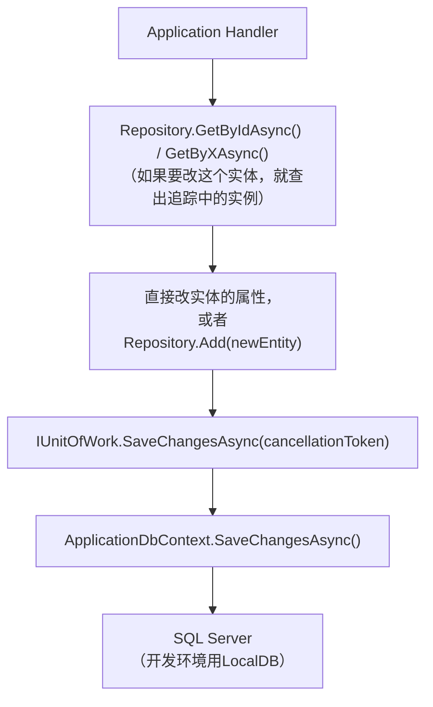
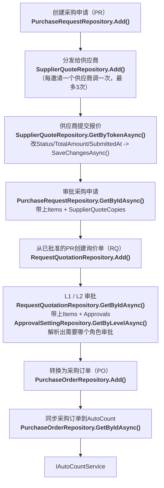

# Repository 设计参考

**每个Repository一节，覆盖`Persistence/Repositories/`下的每一个实现。** 写这份文档的时候，八个Repository全部已经实现、也已经接进DI（`DependencyInjection.cs`）——整个项目的状态见`Infrastructure.zh.md`。把`Features/`里各个Handler的方法体真正写出来，这一块还是尚未完成的工作；本文档里提到的每个Handler类都已经作为脚手架存在（命名空间对、类名对、方法体是空的），它们的存在本身就说明了"这个Repository方法是打算被谁调用的"。

每个Repository都实现`PFP.Application/Abstractions/Persistence/`里同名的接口。本文档假设你已经了解下面这批通用规范，每个Repository那一节不会重复讲一遍，只讲这个Repository特有的东西。

---

## 目录

1. [所有Repository共用的规范](#1-所有repository共用的规范)
2. [UserRepository](#2-userrepository)——已实现
3. [SupplierRepository](#3-supplierrepository)——已实现
4. [ItemRepository](#4-itemrepository)——已实现
5. [ApprovalSettingRepository](#5-approvalsettingrepository)——已实现
6. [PurchaseRequestRepository](#6-purchaserequestrepository)——已实现
7. [SupplierQuoteRepository](#7-supplierquoterepository)——已实现
8. [RequestQuotationRepository](#8-requestquotationrepository)——已实现
9. [PurchaseOrderRepository](#9-purchaseorderrepository)——已实现
10. [Unit of Work与事务边界](#10-unit-of-work与事务边界)
11. [Repository设计原则](#11-repository设计原则)
12. [Repository对应用例参照表](#12-repository对应用例参照表)
13. [端到端采购流程](#13-端到端采购流程)

---

## 1. 所有Repository共用的规范

| 规则 | 为什么 |
|---|---|
| `internal sealed class`，主构造函数接收`ApplicationDbContext` | `PFP.Infrastructure`之外的任何代码都不该拿到具体的Repository类型——只能通过接口，靠DI解析出来。 |
| `CancellationToken`是必填参数，不给`= default` | 每一个调用方都是`Features/`里的Handler，`IRequestHandler.Handle`本身就已经给了Handler一个真实的token，它自己也没有默认值。Repository的参数给可选值，在这个项目里换不来任何真实的便利，反而更容易在某一次调用里悄悄漏传、丢掉取消信号。 |
| 返回列表的方法用`Task<IReadOnlyList<T>>`，不用`Task<List<T>>` | 告诉调用方这是一份只读视图，也不暴露内部具体用的是哪种集合类型。 |
| 任何Repository都没有`Update(T entity)`方法 | Handler通过`GetByIdAsync`这类方法拿到追踪中的实体，直接改属性，调`IUnitOfWork.SaveChangesAsync()`，EF Core的变更追踪单靠这一步就能生成正确的`UPDATE`语句。显式的`Update()`容易被实现成整个实体全字段覆盖（`DbSet<T>.Update()`会把所有列都标记成"已修改"，不只是真的改动过的那些），有用不完整的对象覆盖已有数据的风险。 |
| 没有真实用例需要的话，不加`Remove(T entity)`方法 | 现在九个`Features/`模块里没有一个是"物理删除"的用例——具体到每个实体为什么不需要，见下面各自的小节。 |
| 被某个会修改数据的Handler使用的单条查询，保持追踪状态（不加`.AsNoTracking()`） | Handler需要这个追踪中的实例去改属性、存盘，不需要再多查一次。同一个方法往往也被一个只读的详情页Handler复用——见下面各节；一个方法两边共用是刻意设计，不是漏掉了什么。 |
| 只被Query使用的列表查询，加`.AsNoTracking()`，并且显式加`.OrderBy(...)` | 只读路径不需要追踪开销；显式排序能保证结果顺序稳定（SQL Server在没有`ORDER BY`的情况下不保证行的顺序）。 |
| 聚合根的`GetByIdAsync`如果带子集合，加对应的`.Include(...)` | Handler期待拿到完整的聚合根，不加的话子集合会悄悄变成空的。 |
| 任何Repository自己都不调用`SaveChangesAsync()` | 存盘只在一个Handler的末尾发生一次，通过`IUnitOfWork`统一提交。见[第10节](#10-unit-of-work与事务边界)。 |

---

## 2. UserRepository

**状态：已实现。**

| 方法 | 追踪状态 | 用在哪 |
|---|---|---|
| `GetByIdAsync(int id, ct)` | 追踪 | Handler要修改这个`User`时用（`UpdateUserRoleCommandHandler`、`ActivateUserCommandHandler`、`DeactivateUserCommandHandler`、`ChangePasswordCommandHandler`），或者单纯查询（`GetUserByIdQueryHandler`） |
| `GetByEmailAsync(string email, ct)` | 追踪 | `LoginCommandHandler`（校验凭证）、`CreateUserCommandHandler`（建号前查重） |
| `GetAllAsync(ct)` | `AsNoTracking`，按`Name`排序 | `GetUsersQueryHandler` |
| `Add(User user)` | ——（同步，没有真正的I/O，要等`SaveChangesAsync`） | `CreateUserCommandHandler` |

`ChangePasswordCommandHandler`复用的是跟角色/启停用Handler同一个追踪版`GetByIdAsync`：查出当前用户、校验旧密码哈希、设新密码哈希、存盘——不需要单独为它加一个方法。

没有`Remove`：用户账号是靠`DeactivateUserCommandHandler`（`IsActive = false`）停用的，不会被删除——而且`UserConfiguration`里`PurchaseRequests`/`RQApprovals`两个关系都是`Restrict`删除行为，任何有历史记录的用户如果真的执行物理删除都会被数据库拒绝，这个方法对真正想删除的那批用户反而是用不了的。

---

## 3. SupplierRepository

**状态：已实现。**

| 方法 | 追踪状态 | 用在哪 |
|---|---|---|
| `GetByIdAsync(int id, ct)` | 追踪 | 单纯查询（`GetSupplierByIdQueryHandler`） |
| `GetByEmailAsync(string email, ct)` | 追踪 | `LoginCommandHandler`——供应商跟内部用户走同一个登录端点；`InviteSupplierCommandHandler`和`CreateSupplierCommandHandler`也用它，插入前先查有没有重复账号 |
| `GetByRegistrationTokenAsync(string token, ct)` | 追踪 | `CompleteSupplierRegistrationCommandHandler`——Handler按token查出供应商，在同一个追踪中的实例上设密码哈希、把`AccountStatus`改成`Registered`、清空token |
| `GetByCreditorCodeAsync(string creditorCode, ct)` | 追踪 | `SyncSuppliersFromAutoCountCommandHandler`的upsert——这是`Domain.zh.md`里描述的那个同步匹配键 |
| `GetAllAsync(ct)` | `AsNoTracking`，按`Name`排序 | `GetSuppliersQueryHandler` |
| `Add(Supplier supplier)` | —— | `CreateSupplierCommandHandler`、`InviteSupplierCommandHandler`、`SyncSuppliersFromAutoCountCommandHandler` |

`InviteSupplierCommandHandler`是token注册流程的前半段：建一条`Supplier`记录，带上生成的`RegistrationToken`和初始的`AccountStatus`（比如`Invited`）；`CompleteSupplierRegistrationCommandHandler`是后半段，用同一个token通过`GetByRegistrationTokenAsync`把注册走完。`CreateSupplierCommandHandler`是另一条独立的直接建号路径（不走邀请这一步）——两者都走同一个`Add`。

没有`Remove`：跟`User`同样的道理——供应商账号是被停用（`AccountStatus = Suspended`），不是被删除，任何有`RequestQuotations`/`PurchaseOrders`历史记录的供应商，`Restrict`删除行为也会拒绝物理删除。

---

## 4. ItemRepository

**状态：已实现。**

| 方法 | 追踪状态 | 用在哪 |
|---|---|---|
| `GetByIdAsync(int id, ct)` | 追踪 | 单纯查询（`GetItemByIdQueryHandler`） |
| `GetByCodeAsync(string code, ct)` | 追踪 | `SyncItemsFromAutoCountCommandHandler`的upsert——按`Item.Code`这个同步键匹配 |
| `GetAllAsync(ct)` | `AsNoTracking`，按`Name`排序 | `GetItemsQueryHandler`——Requester建PR时选品用的目录 |
| `Add(Item item)` | —— | 在`SyncItemsFromAutoCountCommandHandler`内部，遇到之前没见过的编码时调用 |

除了通用规范提到的以外，没有`Update`/`Remove`：物料是从AutoCount拉取的，不会在这个系统里手动编辑（Scope文档G条）——`SyncItemsFromAutoCount`内部的upsert本质上跟这个代码库其它任何一次更新一样，是"改追踪中的实体属性再存盘"，不是一个单独的Repository方法。

---

## 5. ApprovalSettingRepository

**状态：已实现。**

| 方法 | 追踪状态 | 用在哪 |
|---|---|---|
| `GetByLevelAsync(ApprovalLevel level, ct)` | 追踪 | `UpdateApprovalSettingsCommandHandler`（查出来、改`MinAmount`/`MaxAmount`/`ApproverRole`、存盘）；也被`ApproveRequestQuotationCommandHandler`/`RejectRequestQuotationCommandHandler`内部用来查出数据驱动的`ApproverRole`，做`Application.zh.md`"编码规范"里说的那种动态权限检查 |
| `GetAllAsync(ct)` | `AsNoTracking`，按`Level`排序 | `GetApprovalSettingsQueryHandler`——按级别顺序把`L1`和`L2`两条一起展示 |

没有`Add`，也没有`Remove`：永远只有两条记录（`L1`、`L2`），由`ApplicationDbContextSeed.cs`一次性建好。这个实体故意没有"新建一条审批设置"这个用例。

---

## 6. PurchaseRequestRepository

**状态：已实现。**

| 方法 | 追踪状态 | 用在哪 |
|---|---|---|
| `GetByIdAsync(int id, ct)` | 追踪，`.Include(x => x.Items).Include(x => x.SupplierQuoteCopies)` | `GetPurchaseRequestByIdQueryHandler`（详情页）和会修改数据的`ApprovePurchaseRequestCommandHandler`/`RejectPurchaseRequestCommandHandler`都用它——审批要校验`selectedSupplierCopyId`确实属于这张PR、而且`Status = Submitted`，这意味着`SupplierQuoteCopies`这个集合必须已经被加载出来，详情页要展示的也是同一份数据形态 |
| `GetAllAsync(ct)` | `AsNoTracking`，按`CreatedAt`倒序 | `GetPurchaseRequestsQueryHandler`——列表页不需要每一行都带上全部明细和报价副本，那样查询代价很高但没有实际好处 |
| `Add(PurchaseRequest purchaseRequest)` | —— | `CreatePurchaseRequestCommandHandler` |

`GetPurchaseRequestsQueryHandler`要不要按"`Requester`只看自己发起的"这条权限规则过滤，这个过滤逻辑该写在Query Handler里（因为它依赖`ICurrentUserService`，跟这个Repository该知道的事情无关）——这个Repository的`GetAllAsync`就是老老实实返回全部，由Handler决定调用者能看到哪些。

---

## 7. SupplierQuoteRepository

**状态：已实现。**

这个Repository是按用例`SupplierQuote`命名的，不是按它包装的实体`SupplierQuoteCopy`命名的——接口是`ISupplierQuoteRepository`，类是`SupplierQuoteRepository`，两者操作的都是`PFP.Domain.Entities.SupplierQuoteCopys.SupplierQuoteCopy`。

| 方法 | 追踪状态 | 用在哪 |
|---|---|---|
| `GetByTokenAsync(string token, ct)` | 追踪，`.Include(x => x.PurchaseRequest)` | `GetSupplierQuoteByTokenQueryHandler`（免登录查看端点）和`SubmitSupplierQuoteCommandHandler`都要用——后者要在同一个追踪中的实例上改`Status`/`TotalAmount`/`SubmittedAt`，两者都需要把父级`PurchaseRequest`一起加载出来，好让供应商看清楚自己在给哪张单子报价 |
| `GetByIdAsync(int id, ct)` | 追踪 | 提供给`ApprovePurchaseRequestCommandHandler`直接二次校验`selectedSupplierCopyId`——用在`PurchaseRequestRepository`已经通过`PurchaseRequest.SupplierQuoteCopies`集合带出来的数据不够用的场景 |
| `GetBySupplierIdAsync(int supplierId, ct)` | `AsNoTracking`，按`SentAt`倒序 | `GetSupplierQuoteHistoryQueryHandler`（`/suppliers/me/quotes`） |
| `Add(SupplierQuoteCopy supplierQuoteCopy)` | —— | 在`CreatePurchaseRequestCommandHandler`内部最多调用三次，一个供应商一次 |

没有`GetAllAsync`：这个系统里没有任何用例需要"查所有供应商的所有报价副本"这种全表列表——见[第11节](#11-repository设计原则)。

---

## 8. RequestQuotationRepository

**状态：已实现。**

| 方法 | 追踪状态 | 用在哪 |
|---|---|---|
| `GetByIdAsync(int id, ct)` | 追踪，`.Include(x => x.Items).Include(x => x.Approvals)` | `GetRequestQuotationByIdQueryHandler`（详情页）和会修改数据的`ApproveRequestQuotationCommandHandler`/`RejectRequestQuotationCommandHandler`/`ConvertToPurchaseOrderCommandHandler`——后三个都需要加载完整的审批记录，才能判断现在处于哪个阶段（`PendingL1`还是`PendingL2`），并且校验传进来的`level`参数对不对 |
| `GetAllAsync(ct)` | `AsNoTracking`，按`CreatedAt`倒序 | `GetRequestQuotationsQueryHandler` |
| `Add(RequestQuotation requestQuotation)` | —— | `CreateFromApprovedPRCommandHandler`（内部专用——由PR审批通过触发，不是一个直接的API调用） |

---

## 9. PurchaseOrderRepository

**状态：已实现。**

| 方法 | 追踪状态 | 用在哪 |
|---|---|---|
| `GetByIdAsync(int id, ct)` | 追踪，`.Include(x => x.Items)` | `GetPurchaseOrderByIdQueryHandler`（详情页）和`SyncPurchaseOrderToAutoCountCommandHandler`——后者需要明细行才能组装`Application.zh.md`"对接集成"那节说的`AutoCountPurchaseOrderRequest`请求体 |
| `GetAllAsync(ct)` | `AsNoTracking`，按`CreatedAt`倒序 | `GetPurchaseOrdersQueryHandler` |
| `Add(PurchaseOrder purchaseOrder)` | —— | `CreateFromRequestQuotationCommandHandler`（内部专用——由RQ审批通过触发，不是一个直接的API调用） |

没有`Remove`：`PurchaseOrder`一旦建出来就不会被删除——AutoCount同步失败是靠`Status`/`SyncError`/`SyncAttempts`原地记录的（`Application.zh.md`"架构决策"那节解释过为什么这是`Result<T>`场景而不是异常），不是删掉这条记录重新来一次。

---

## 10. Unit of Work与事务边界

九个Repository全部共用同一个按请求生命周期创建的`ApplicationDbContext`实例。一个Handler的形状是固定的：



没有任何Repository自己调用`SaveChangesAsync()`。存盘是Handler的责任，通过`IUnitOfWork`（`PFP.Application/Abstractions/Persistence/IUnitOfWork.cs`）完成，在`PFP.Infrastructure`里的实现是一层包在`ApplicationDbContext.SaveChangesAsync()`外面的薄封装。这样能保证一个Handler里对多个Repository的多次调用——比如`CreatePurchaseRequestCommandHandler`调一次`PurchaseRequestRepository.Add()`、最多调三次`SupplierQuoteRepository.Add()`——都落在同一个数据库事务里：要么全部提交，要么全部不提交。

> **待办提醒：** `IUnitOfWork.SaveChangesAsync`目前的签名是`CancellationToken cancellationToken = default`，而本文档里每一个Repository方法都刻意不给默认值（见[第1节](#1-所有repository共用的规范)）。每一个真实调用方都是已经拿着一个活的token的Handler，所以`IUnitOfWork`这里的默认值，是整个持久化层里唯一一处跟这条规范不一致的地方——值得在下一轮清理的时候一起改成必填参数。

---

## 11. Repository设计原则

Repository方法的存在，是因为某个真实的Application用例需要它——本文档不会为了凑出一套"完整"的CRUD而加方法。以下方法在没有具体用例引入之前，是刻意不存在的：

```text
Update()
Remove()               （只在真的有物理删除用例时才加——目前一个都没有）
ExistsAsync()
GetByStatusAsync()
GetByDateRangeAsync()
GetAllWithEverythingAsync()
```

如果哪个新功能真的需要这里面某一个，应该跟需要它的那个Application用例一起加上——而不是提前加好等着用。

---

## 12. Repository对应用例参照表

| Repository | 方法 | 主要用例 |
|---|---|---|
| User | `GetByIdAsync` | 查询 / 改角色 / 启用 / 停用 / 改密码 |
| User | `GetByEmailAsync` | 登录 / 创建用户 |
| User | `GetAllAsync` | 用户列表 |
| User | `Add` | 创建用户 |
| Supplier | `GetByIdAsync` | 查询供应商 |
| Supplier | `GetByEmailAsync` | 登录 / 邀请供应商 / 创建供应商 |
| Supplier | `GetByRegistrationTokenAsync` | 完成供应商注册 |
| Supplier | `GetByCreditorCodeAsync` | AutoCount同步供应商 |
| Supplier | `GetAllAsync` | 供应商列表 |
| Supplier | `Add` | 创建 / 邀请 / 同步供应商 |
| Item | `GetByIdAsync` | 查询物料 |
| Item | `GetByCodeAsync` | AutoCount同步物料 |
| Item | `GetAllAsync` | 物料列表 / 选品 |
| Item | `Add` | 同步新物料 |
| ApprovalSetting | `GetByLevelAsync` | 更新设置 / RQ审批 |
| ApprovalSetting | `GetAllAsync` | 审批设置列表 |
| PurchaseRequest | `GetByIdAsync` | 查询详情 / 审批 / 驳回PR |
| PurchaseRequest | `GetAllAsync` | PR列表 |
| PurchaseRequest | `Add` | 创建PR |
| SupplierQuote | `GetByTokenAsync` | 查看 / 提交供应商报价 |
| SupplierQuote | `GetByIdAsync` | 供应商报价二次校验（PR审批时） |
| SupplierQuote | `GetBySupplierIdAsync` | 供应商报价历史 |
| SupplierQuote | `Add` | 创建报价副本 |
| RequestQuotation | `GetByIdAsync` | 查询详情 / 审批 / 驳回 / 转PO |
| RequestQuotation | `GetAllAsync` | RQ列表 |
| RequestQuotation | `Add` | 从已批准的PR创建RQ |
| PurchaseOrder | `GetByIdAsync` | 查询详情 / 同步到AutoCount |
| PurchaseOrder | `GetAllAsync` | PO列表 |
| PurchaseOrder | `Add` | 从已批准的RQ创建PO |

---

## 13. 端到端采购流程



